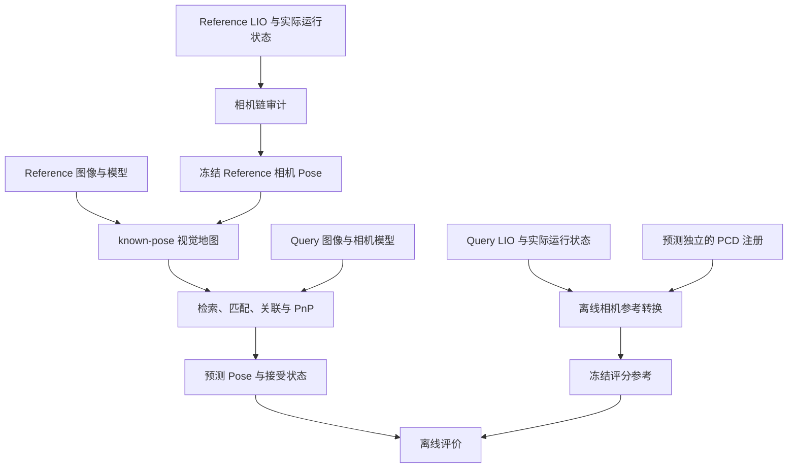

# 从 LIO 轨迹到相机参考位姿

一条 LiDAR–IMU 轨迹不能直接当作相机轨迹。要把它变成视觉地图或定位评分可用的相机参考，必须确认状态原点、实际运行外参、相机安装、时间关联和跨序列世界坐标关系，并为每一段保留可审计身份。

这里的“参考”不等于绝对 ground truth。LIO 可以独立于被测视觉定位模块，但仍是有误差的估计器；独立于 Query 预测也不保证误差小或与地图误差不相关。

关于 LIO/VIO 轨迹与 pseudo ground truth 边界的原论文，见论文总览的[经典 SLAM、VIO 与参考轨迹](../papers/#topic-slam-vio)和[评测协议、数据与参考可信度](../papers/#topic-evaluation)。

本篇回答参考怎样生成；参考生成后，其误差怎样进入测得残差、成功率与方法排名，见[参考误差如何影响算法评估](./参考误差如何影响算法评估.md)。

## 1. 先分清六种产物

| 对象 | 主要内容 | 能解决的问题 | 单独不能证明什么 |
| --- | --- | --- | --- |
| 原始观测 | 图像、点云、IMU | 提供重放与重新处理条件 | 轨迹准确、传感器同步 |
| LIO 轨迹 | 指定状态 frame 相对世界的 Pose | 提供运动估计 | 直接就是相机位姿 |
| LiDAR 点云地图 | 累积到某个世界的点 | 几何覆盖、跨序列注册 | 相机外参、图像关联正确 |
| 相机轨迹 | 图像时刻的相机世界位姿 | known-pose 建图与离线比较 | 来源一定达到 GT 等级 |
| 视觉定位地图 | observation、track、landmark 与特征关联 | 建立 Query 2D–地图 3D 对应 | 是“纯 LiDAR 地图” |
| 评分参考 | 统一坐标和时间下冻结的比较对象 | 定义正确性和误差 | 绝对真实、误差可忽略 |

### 1.1 `final_poses.csv` 是文件接口

同名文件可以保存视觉 SLAM、SfM、LIO adapter 或外部测量系统产生的 Pose。CSV 只描述存储接口，不能推出算法来源、被跟踪 frame 或 GT 等级。

必须另行记录父子 frame、变换方向、单位、四元数顺序、时间语义、生成方法、版本、有效范围和资格标记。`final_poses.csv` 可以是规范的相机参考接口，也可以只是未经认证的候选；文件名不改变证据等级。

### 1.2 LIO 的状态原点需要从实现确认

算法状态可能以 internal IMU 为中心，发布消息可能使用另一个 frame，导出脚本还可能额外转换。即使世界 frame 名字叫 `camera_init`，也不能据此判断轨迹来自相机。

应检查消息定义、状态变量和导出路径。一次已审计工程中，轨迹对应 Livox internal IMU 的世界位姿 $T_{W\leftarrow I}$；这个结论只适用于被审计的 fork、配置和 run，不能由 FAST-LIO 这个项目名推广到其他版本。

## 2. 从状态轨迹到相机 Pose

坐标变换、求逆、整流方向、时钟模型与 SE(3) 插值的完整推导见[多传感器时空标定](../fundamentals/多传感器时空标定.md)。本篇只保留参考 adapter 需要落实的应用链。

令 W 为 LIO 世界，I 为状态 IMU，L 为原生 LiDAR frame，$C_{\mathrm{raw}}$ 为原始左目 optical frame，$C_{\mathrm{rect}}$ 为整流左目 frame。一个可能的链是：

$$
T_{W\leftarrow C_{\mathrm{rect}}}(t_C)
=T_{W\leftarrow I}(t_I)
T_{I\leftarrow L}(t_I)
T_{L\leftarrow C_{\mathrm{raw}}}(t_C)
T_{C_{\mathrm{raw}}\leftarrow C_{\mathrm{rect}}},
$$

其中 $t_I$ 必须由已声明的时钟/测量时间模型与 $t_C$ 对应。每段都要说明来源、方向、是否随时间变化，以及适用的安装和 run。

这条链中：

- $T_{W\leftarrow I}$ 来自轨迹；
- $T_{I\leftarrow L}$ 可能是 LIO 内部在线估计状态；
- $T_{L\leftarrow C_{\mathrm{raw}}}$ 描述外部相机安装，LIO 本身通常观测不到它；
- $T_{C_{\mathrm{raw}}\leftarrow C_{\mathrm{rect}}}$ 来自整流坐标定义，不表示物理相机移动。

内参、畸变和图像尺寸属于投影模型，不是上式中的刚体安装外参。adapter 输出整流相机 Pose 时，下游必须搭配整流后的相机模型。

### 2.1 杆臂与时间不能省略

相机中心可写为：

$$
\mathbf p_{WC}=\mathbf p_{WI}+R_{WI}\mathbf t_{IC}.
$$

旋转会让固定杆臂在世界中的方向变化，因此 IMU 和相机的世界轨迹一般不只差一个常量平移。时间错位又会把运动转换成位置和角度误差；禁止外推、限制插值括号长度、处理重复时间和四元数符号，都是参考 adapter 的有效性规则。

缺 Pose 的图像应保留失败状态，不能从固定 Query 集合中静默删除。具体位置插值与 SLERP 公式不在这里重复，统一引用标定篇。

## 3. 在线外参：配置初值不是实际运行值

若滤波器开启在线外参估计，YAML 中的数值只是初始化候选。至少要区分：

| 值 | 含义 | 使用前要确认 |
| --- | --- | --- |
| 配置初值 | 启动时写入状态的参数 | 后续是否继续估计 |
| 预测状态 | 当前观测更新前的状态 | 对应时刻、是否用于导出 |
| 更新后状态 | 融合当前观测后的 posterior | 与轨迹/地图导出是否同阶段 |
| 最终状态 | 运行结束时的估计 | 是否稳定、能否代表前段 |

预测状态、更新后状态和最终状态不能未经审计互换。稳定尾段值也不表示早期完全相同，更不证明它接近真实物理外参。

### 3.1 “每 bag 不同”有不同解释

“每 bag 的外参不同”可能表示：每段运行的最终估计有差异、同一段内估计在变化，或真实安装在拆装/受力后改变。前两者可能来自可观测性、初值、噪声与收敛，第三种才是物理关系变化。

所以每 bag 估计不同不自动意味着真实安装改变，也不自动构成阻塞。真正的可追溯性问题是：缺少与目标轨迹同 run、阶段含义明确的实际状态。LiDAR–internal IMU 与外部 LiDAR–camera 也必须分开，重跑前者不会估计未被 LIO 观测的相机安装。

### 3.2 `mat_pre`、`mat_out` 与对应 run

一次本地 FAST-LIO fork 审计得到的代码顺序是：IMU propagation → 写 `mat_pre` → LiDAR iterated update → 发布里程计并更新地图 → 按开关写 `mat_out`。

- `mat_pre` 是当前扫描 LiDAR 更新前的预测状态，可检查外参是否离开初值、何时收敛、尾段是否稳定和是否跳变；
- `mat_out` 是当前扫描更新后的 posterior，更适合严格对应同帧发布里程计与地图；
- 默认关闭相应日志时，可能有 `mat_pre` 而没有 `mat_out`。

这些含义来自该 fork 的源码路径，不是所有同名日志的通用定义。`mat_pre[k]` 不能改名为同一帧 post-update 状态；若轨迹导出使用 posterior，严格逐帧复现就需要阶段对齐的历史。

## 4. 原运行与重跑怎样选择

原日志最有价值之处是和现有轨迹、PCD 属于同一次运行。若 `mat_pre` 很早稳定、目标只是工程 Proxy，可以按明确窗口和旋转平均方法冻结 provisional 每 bag 常量，再做敏感性分析。不能对九个旋转矩阵元素直接求平均后当作 SO(3) 结果。

当状态持续漂移、时间无法关联、日志身份不清，或任务明确要求逐帧 posterior 时，才需要建立带完整状态记录的新 run。重跑应整体冻结新轨迹、新外参历史、新 PCD、配置、代码和导出逻辑；不能把新外参与旧轨迹随意拼接，也不能把新 run 冒充原 run 的状态恢复。

重跑不会自动提高精度，也不会解决未被算法观测的外部相机非刚性安装。是否重跑由缺失证据与目标资格决定，不由“新文件看起来更完整”决定。

## 5. 另一条工程路线：双目 VO 与 LIO 手眼关系

若同一 bag 有双目图像和 LIO，可用带米制尺度的双目 VO 运动与 LIO 运动估计常量安装 $X=T_{B\leftarrow C}$。相对运动满足：

$$
A_{ij}X=XB_{ij}.
$$

世界坐标不同不妨碍用相对运动求手眼；绝对轨迹关系还可能包含世界对齐 $Y$：

$$
T_{W_B\leftarrow B_i}X\approx YT_{W_C\leftarrow C_i}.
$$

$X$ 是右侧传感器安装，$Y$ 是左侧世界坐标关系，两者不能混为一个“轨迹对齐”。运动缺少多轴旋转、长期直线或时间模型错误时，某些自由度仍可能弱约束。双目有米制尺度不代表外参自动可观测。

留出段可检查常量关系在未参与拟合的时刻是否仍成立，但留出残差会混合 VO 漂移、LIO 误差、同步、外参和真实安装变化。它不是独立认证的参考误差上界。

## 6. 跨序列 PCD 对齐只解决世界坐标

Reference 与 Query 各自运行 LIO 时，通常得到不同世界 $W_r,W_q$。点云注册可冻结：

$$
G=T_{W_r\leftarrow W_q}.
$$

其中下标 $r$ 和 $q$ 分别表示 Reference 与 Query 序列。Reference 相机参考先展开为：

$$
T^{ref}_{W_r\leftarrow C_{\mathrm{rect},r}}(t)
=T_{W_r\leftarrow I_r}(t)
T_{I_r\leftarrow L_r}(t)
T_{L_r\leftarrow C_{\mathrm{raw},r}}(t)
T_{C_{\mathrm{raw},r}\leftarrow C_{\mathrm{rect},r}}.
$$

Query 相机参考再经世界对齐变换到 $W_r$：

$$
T^{ref}_{W_r\leftarrow C_{\mathrm{rect},q}}(t)
=G\, T_{W_q\leftarrow I_q}(t)
T_{I_q\leftarrow L_q}(t)
T_{L_q\leftarrow C_{\mathrm{raw},q}}(t)
T_{C_{\mathrm{raw},q}\leftarrow C_{\mathrm{rect},q}}.
$$

世界对齐在左边，传感器转换与整流转换在右边。两条链的结果都是各自整流左目坐标系在 $W_r$ 中的 Pose，因此才能与整流图像和相机模型逐项对应。

ICP、粗配准、多候选和双侧重叠等通用原理集中在[点云配准](../fundamentals/点云配准.md)。本参考链只要求 $G$ 的方向和适用范围明确、候选选择独立于被测预测，并保留注册版本与资格。PCD 注册不能替代相机外参、整流和时间链，低点云残差也不是相机 Pose 误差上界。

不得根据某个被测视觉方法的 Query 预测重新拟合 $G$，否则预测误差可能被参考对齐吸收。如何验收并冻结参考、ATE 是否允许对预测轨迹再对齐，属于[定位评估方法](./定位评估方法.md)中的协议问题。

## 7. LIO 辅助视觉地图仍然是视觉地图

Reference 相机 Pose 固定后，可用多视图对应三角化 landmark。固定 Pose 只限制优化变量，不保证外部轨迹准确；视觉前端仍决定 observation、track、landmark 和覆盖。

因此：

$$
\text{LIO-pose-assisted visual map}
\ne
\text{pure LiDAR map}.
$$

同一批相机 Pose 配上不同特征、图对、track 聚合和过滤，仍会产生不同视觉地图。known-pose 建图可优化三维点，但若实验承诺 Reference Pose 固定，就不能通过相机 BA 偷偷改变它。地图对象与 hybrid/full 兼容性见[地图到底存了什么](../fundamentals/地图到底存了什么.md)。

地图验收要看注册图、三角化点、track、正深度、三角化角、重投影残差、覆盖和冲突。相机矩阵构建前后不变只证明固定约束被执行；低重投影误差也可能和错误但自洽的外部位姿同时存在。

## 8. 在线定位与离线参考必须隔离

Query LIO 只用于离线参考和评分，不进入检索、候选排序、匹配、PnP 初始化、接受判断或筛帧。隔离最好由进程接口、制品依赖和读取权限保证，而不只靠文字声明。

Reference 链通过而 Query 链未通过时，可以建图并分析输出、几何支持和性能；不能发布依赖 Query 参考的正确率。独立于被测预测只是参考资格的一部分，不等于独立绝对 GT，也不保证地图与评分误差不相关。

## 9. 截至 2026-10-06 的工程案例与状态

以下结论绑定当时的数据、fork 和处理版本，不是永久事实，也不代表后续审计版本的当前状态。后续世界注册证据按版本记录在[定位评估方法](./定位评估方法.md#_8-2-版本化工程证据)中，不回写改变这份历史快照的含义。

### 9.1 原运行日志缺项

一个跨光照 pair 已准备 102 张 Reference、94 张 Query，其中 101、93 张落在 LIO 时间覆盖内。现有轨迹和 PCD 足以形成 LiDAR/LIO 层输入，但相机链曾因原运行的 `mat_pre` 未打包而阻塞；配置初值不能替代实际状态。

后续确认 `mat_pre` 在原 run 中存在、只是包装遗漏，而 `mat_out` 因默认开关关闭未生成。正确顺序是先补发并审计原 `mat_pre` 的阶段、时间、收敛与身份；若它不足以支持目标资格，再建立带 posterior 日志的新 run，而不是一开始就把重跑当作唯一方案。

外部 OAK–Livox 安装在跨飞行受力后也可能变化。FAST-LIO 不观测 OAK，重跑 LiDAR–IMU 里程计不能补回这段外参。图像 header 确认未被 ROS 发布端 restamp，也只排除发布取时误差；SDK 时间究竟对应曝光哪个事件仍是单独的 unknown。

### 9.2 双目 VO + LIO 候选链

另一处理版本使用每 bag 的 10 Hz 双目与 FAST-LIO2，前 60% 估计常量 camera/body 关系，后 40% 留出检查，再冻结 Reference 相机 Pose。常州 Reference/Query 的留出绝对位置中位约 0.38/0.49 m，Office 003/001 约 1.05/1.67 m。

这些差异已经不能忽略于 0.5 m 档位，但不是经独立认证的真值误差上界。它们只支持把该链标为 provisional，并要求对外参、同步和世界注册做敏感性分析。

### 9.3 地图与世界对齐证据

当时 fixed-pose 地图的最大相机矩阵变化约为 $10^{-15}$，说明实现保持了 Pose 固定约束。C0 三个方向的平均重投影误差约 1.35–1.58 px，P95 约 2.79–2.86 px；这说明地图内部可用且应看分布，不证明相机参考具有同量级的世界精度。

跨序列 PCD 独立正反注册的一致性差约为：常州 0.008 m/0.064°、Office 0.002 m/0.044°。该证据支持世界地图关系的重复性，不能抵消相机链留出中的米级差异。

因此截至该版本：图像与 known-pose 地图可用于工程运行；跨序列参考可作为冻结的 Proxy candidate；严格 camera GT 与紧阈值正式评分仍未获资格。未来补齐证据后状态可以更新，但历史结果仍应保留当时资格标签。

## 10. 参考 adapter 的最小检查表

1. 轨迹 child frame、方向、单位和时间是否明确？
2. 在线估计开启时，是否拿到与目标 run 同阶段的实际状态？
3. 外部相机安装和整流 frame 是否有对应有效范围？
4. 图像时间能否在限制内关联，缺帧是否显式记录？
5. 跨序列 G 是否独立于被测预测并通过几何审计？
6. known-pose 地图是否保持固定 Pose，同时记录视觉 track/landmark 质量？
7. Query LIO 是否只存在于离线评分边界？
8. 输出参考是否带版本、资格、provisional/blocked 原因和输入哈希？

参考误差的评分端敏感性与端到端重建实验见[参考误差如何影响算法评估](./参考误差如何影响算法评估.md)；评分指标、分母和失败处理见[定位评估方法](./定位评估方法.md)；采集运行身份见[数据采集与交付](./数据采集与交付.md)；输入 manifest 与抽样见[数据清洗与实验输入构建](./数据清洗与实验输入构建.md)。
