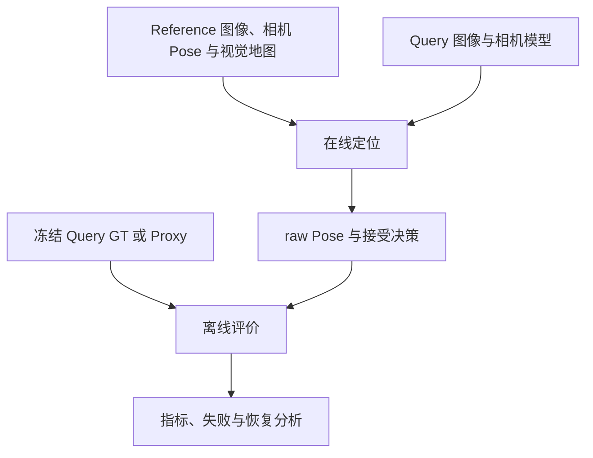
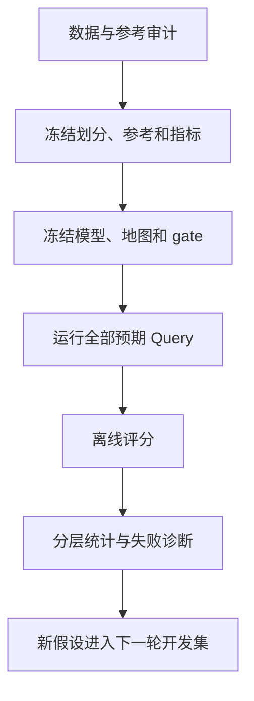

# 定位评估方法

跑通 SLAM 或重定位程序后，画一张轨迹图、算一个 ATE 仍不足以回答“系统是否可靠”。需要先明确评价对象、参考资格、坐标与时间契约，再把输出、接受、正确、失败和延迟放入一致分母。

本文主讲评价方法。相机参考怎样从 LIO、外参和 PCD 世界对齐得到，见[从 LIO 轨迹到相机参考位姿](./从LIO轨迹到相机参考位姿.md)；参考误差怎样改变测量结果及方法排名，见[参考误差如何影响算法评估](./参考误差如何影响算法评估.md)；点云对齐的算法与候选验证见[点云配准](../fundamentals/点云配准.md)；变换和插值推导见[多传感器时空标定](../fundamentals/多传感器时空标定.md)。

轨迹指标、定位 benchmark 与 pseudo ground truth 的原论文入口，见[评测协议、数据与参考可信度](../papers/#topic-evaluation)。

## 1. 先明确评估对象

| 任务 | 核心问题 | 主要观察 |
| --- | --- | --- |
| VO/VIO/LiDAR odometry | 连续运动估计是否准确 | 局部漂移、RPE、跟踪丢失 |
| SLAM | 地图和运动能否长期一致 | ATE、回环、地图一致性、运行稳定性 |
| 地点识别 | 是否找到包含同一地点的参考图 | Recall@K、排名、误检 |
| 视觉重定位 | 能否恢复已有地图中的相机 6DoF Pose | 联合位姿成功、错误接受、恢复时间 |
| 导航定位系统 | 能否持续及时提供可信位置 | 全局质量、连续性、延迟和失效恢复 |

若研究单帧视觉重定位，就不能用融合里程计或全局图优化后的轨迹替代它的原始输出；若研究完整系统，可以包含这些模块，但评价对象随之改变。单帧结果看起来连续，不证明算法使用时序；全局轨迹很好，也不证明每次重定位约束可靠。

### 1.1 输出、接受、正确必须分开

对每帧至少保存：

- **raw pose**：求解器是否给出候选及其数值；
- **decision**：系统是否接受，以及拒绝原因；
- **correctness**：离线相对有资格参考是否满足任务阈值。

Accepted 只表示冻结的工程 gate 通过，不等于 Correct。一个可执行规则可能是“位姿有限，且 RANSAC 后至少有 20 个唯一 Point3D 内点”；它防止同一三维点经多张 Reference 重复计数，却仍不能排除内点集中、重复结构或错误关联形成的一致假解。

因此必须区分：无 solver output、输出后被拒绝、错误接受和正确接受。被拒绝位姿可以不画进接受轨迹，但不能从逐帧记录和统计分母里消失。

## 2. Ground truth、Proxy 与参考等级

Ground truth 是评价参考，不是某种固定文件格式。来源可能是 motion capture、高精度 GNSS/INS、测量控制点、LiDAR SLAM 或另一条视觉轨迹；每一种都要检查范围、时间、杆臂、外参、漂移和失效条件。

使用独立传感器不自动等于独立绝对 GT。LIO 独立于被测视觉预测，只说明没有直接使用该预测；地图和评分仍可能共享标定、外参或系统偏差，Reference/Query 的估计误差也可能相关。

可以把参考分为：

| 等级 | 适合回答 | 不应声称 |
| --- | --- | --- |
| 无 Pose 参考 | 输出率、几何支持、内部残差、耗时 | 定位正确率、绝对精度 |
| 冻结 Proxy | 同一参考下的诊断和相对比较 | 独立绝对 GT 精度 |
| 经验证独立参考 | 声明范围内的正式位置/姿态评价 | 超出覆盖与不确定性范围的结论 |

若参考不确定性约为 10 cm，就不适合据此宣称算法间 1 cm 的真实差异。留出残差、PCD P95 或拟合误差通常不是经过证明的逐帧上界，不能直接代入三角不等式包装成绝对置信区间。

### 2.1 Query 参考只用于离线评价

禁止用 Query 参考筛候选、在多个 PnP 解中选最接近参考的一个、决定是否保留帧或事后调整接受阈值。参考输入最好与在线定位进程隔离，确保 Query LIO 只存在于离线评分边界。

## 3. 先冻结比较契约

预测与参考比较前，至少统一：camera-to-world/world-to-camera 方向、相机光心而非外参矩阵中的裸平移、单位、四元数顺序、raw/rectified frame、时间关联和 eligible mask。

坐标矩阵合法不表示语义正确；TUM 行格式正确也不表示 child frame、时间和 GT 等级正确。可用单位轴、已知点和静止片段手工检查方向，再画各轴随时间变化。

时间关联要声明最近邻或插值、最大时间差和禁止外推规则。resize、crop、padding 和整流必须与相机模型同步，像素阈值要注明所在分辨率。完整公式集中在标定篇，此处把这些条件视为评分器输入契约。

## 4. ATE 与 RPE

### 4.1 ATE：绝对轨迹误差

常见位置形式：

$$
e_i=\|p_i^{pred}-p_i^{ref}\|_2,
\qquad
\mathrm{RMSE}=\sqrt{\frac{1}{N}\sum_i e_i^2}.
$$

ATE 必须说明是否对齐。自由原点的米制轨迹可用 SE(3) 对齐消除整体旋转和平移；存在单目尺度自由度时才考虑 Sim(3)。已知地图中的绝对重定位通常不应再用测试预测拟合一个自由变换，否则全局位置错误会被吸收。

| 对齐方式 | 消除什么 | 典型用途 |
| --- | --- | --- |
| 无对齐 | 不消除全局偏差 | 已知地图绝对重定位 |
| SE(3) | 整体旋转和平移 | 自由世界原点的米制轨迹形状 |
| Sim(3) | 再消除统一尺度 | 有尺度自由度的单目轨迹 |

用完整测试预测拟合对齐，与用独立控制点或 PCD 建立地图关系不是同一种证据。可同时报告无对齐主指标与对齐后形状诊断，但要保存变换、拟合样本和尺度策略。

### 4.2 RPE：相对运动误差

$$
\Delta T_{ij}=T_i^{-1}T_j,
\qquad
E_{ij}=(\Delta T_{ij}^{ref})^{-1}\Delta T_{ij}^{pred}.
$$

平移 RPE 取 $E_{ij}$ 平移范数，旋转 RPE 取旋转角。间隔必须定义为相邻原始帧、固定秒数或固定路程；单位也随之变化。

不能跨输出缺失随意连接两个“相邻可评价帧”。一个历史评分口径要求原始 frame ID 连续且两帧都有 solver output 才构成 RPE pair；它应同时报告潜在 pair、有效 pair 和覆盖率，否则经常断裂的方法可能只剩容易区间。

ATE/RPE 只在有输出样本上描述误差，不能替代失败率和恢复能力。

## 5. 重定位成功、Precision 与危险接受

统一到 camera-to-map 后，位置误差和旋转角误差可写为：

$$
e_t=\|p_{pred}-p_{ref}\|_2,
$$

$$
e_R=\arccos\!\left(
\operatorname{clamp}\!\left(
\frac{\operatorname{tr}(R_{ref}^{\mathsf T}R_{pred})-1}{2},-1,1
\right)\right)\frac{180}{\pi}.
$$

联合阈值要求位置和角度同时通过。阈值取决于任务误差预算；0.25 m/2°、0.5 m/10°、1 m/20° 只能作为某类室内工程示例，不是行业统一标准。

### 5.1 分母先于公式

令：

- $N_{all}$：全部预期 Query；
- $N_{eval}$：具有冻结参考、可以评价正确性的 Query；
- $A_{eval}$：其中被系统接受的数量；
- $C_\tau$：被接受且满足联合阈值 $\tau$ 的数量。

则：

$$
\mathrm{Recall}_\tau=\frac{C_\tau}{N_{eval}},
\qquad
\mathrm{Precision}_\tau=\frac{C_\tau}{A_{eval}}.
$$

$A_{eval}=0$ 时 Precision 未定义，应写 N/A。另报 $A_{all}/N_{all}$ 和 $A_{eval}/N_{eval}$，把“愿意输出”与“输出正确”分开。

有参考的帧即使读图失败、无解或超时，也留在 $N_{eval}$ 中作为失败；缺参考帧不算位姿正确性，却仍属于 $N_{all}$，要参与输入、输出和性能统计。算法不能通过只保留成功帧改变自己的正确性分母。

### 5.2 错误接受的两个分母

设超过预先定义危险边界的已接受结果数为 $N_{danger}$：

$$
\mathrm{FA}_{all}=\frac{N_{danger}}{N_{eval}},
\qquad
\mathrm{FA}_{accepted}=\frac{N_{danger}}{A_{eval}}.
$$

前者是每个可评价输入遇到危险错误的频率，后者是已接受输出中的危险比例；它们不等同于分类学的 FPR。

例如 100 个可评价 Query 接受 80 个，其中 70 个满足严格标准、5 个只落在严格与危险边界之间、5 个超过危险边界：Recall=70%，Precision=87.5%，FA_all=5%，FA_accepted=6.25%。中间 5 个降低严格 Precision，却不是危险 FP，所以不能用 $A_{eval}-C_\tau$ 代替 $N_{danger}$。

## 6. 序列恢复与连续可用性

“序列至少成功一次”只能回答是否恢复过，容易饱和。更完整的观察包括：

| 指标 | 含义 |
| --- | --- |
| 首次 accepted | 第一次愿意输出，可能仍错误 |
| 首次正确 accepted | 第一次真正恢复 |
| TTFR_data | 恢复前经过的数据时间 |
| TTFR_wall | 用户实际等待时间，含计算和排队 |
| 恢复距离 | 首次正确前累计运动距离 |
| 最长连续失败 | 最坏情况下多久无正确输出 |
| 恢复后保持率 | 首次恢复后正确输出比例 |
| 连续错误事件 | 错误接受持续帧数和时间 |

未恢复不能填 0 秒，应标记未恢复并保留在成功分母中。首帧数据时间为 0 也不代表程序零延迟完成。

## 7. 数据不完整时的分层评价

没有严格 GT 不等于所有评价都无意义，但结论必须分层：

1. **无 Pose 参考层**：输出率、匹配/关联数量、唯一 2D–3D 支持、内点、重投影、覆盖、重复运行和资源；不能命名为定位正确率。
2. **冻结 Proxy 层**：用独立于被测预测的几何构造同一参考，比较诊断指标，同时报告资格限制和敏感性。
3. **独立参考层**：在时间、外参、覆盖和不确定性通过审计后，发布声明范围内的正式精度。

跨序列 LIO/PCD Proxy 的具体变换链放在[从 LIO 轨迹到相机参考位姿](./从LIO轨迹到相机参考位姿.md)，这里不重复。参考升级后分数含义随之改变，不能把不同等级结果直接拼成同一榜单。

参考审计至少问：输入是否使用被测预测、算法来源是否独立、共享误差有哪些、外参/时间/G 的敏感性如何，以及资格是否覆盖目标阈值。如何固定预测扰动评分参考，以及何时必须重建 Reference 地图，见[参考误差如何影响算法评估](./参考误差如何影响算法评估.md)。若改变参考参数后重新评分，只能作为敏感性分析，不能挑使某方法得分最高的参数当最终参考。

## 8. 跨序列注册的参考审计

点云配准的目标函数、初始化和局部收敛见[点云配准](../fundamentals/点云配准.md)，这里仅讨论它何时有资格进入评分参考。

错误的公共世界变换 $G$ 会以相同方式进入一组 Query 参考，可能让多种视觉方法出现方向和幅度相近的评分偏差。这种共同模式是启动参考审计的线索，不是“参考一定错误”的证明。方法之间可能共享视觉地图、标定、检索候选或关联偏差；反过来，参考错误也不能靠方法多数投票修正。

候选 $G$ 应在读取被测视觉预测之前冻结。验收可以组合双侧重叠、残差空间覆盖、多初值、独立正反向估计、可辨识局部结构和外部路线/控制点先验。低残差、正反一致或多初值一致都只是证据；候选难以区分时应保留歧义或拒绝冻结，而不是选择让某种方法分数更好的变换。

### 8.1 世界注册、相机参考与评分资格分开判断

点云地图对齐通过，只支持 $W_q$ 与 $W_r$ 之间的刚体关系在声明覆盖内可用。相机参考还要经过状态 frame、实际外参、raw/rectified 转换和时间链；最终评分还要冻结 eligible mask、阈值与失败分母。因此：

1. 注册失败前先检查搜索范围和初始化，不能直接判定数据无重叠；
2. 世界注册通过后仍要单独验证传感器参考链；
3. 参考链达到 Proxy 资格，也不等于得到独立绝对 GT。

### 8.2 版本化工程证据

截至 2026-10-06 的一次历史审计中，较弱初始化曾让部分配准失败。随后对 6 个序列、15 对点云执行独立双方向、每方向 3 个初值共 90 次注册，加强占据初始化和多尺度精化后，原失败 pair 得到约 0.11 m 双向中位残差。它只修正了“点云不能注册”的判断；同一版本的视觉–LiDAR 链尾部仍有米级差异，不能据此发布紧阈值相机评分。

2026-10-08 的后续审计针对另一冻结协议中的三组跨序列共同偏差，确认质心初始化在重复室内结构中进入错误候选。恢复流程用现场路线信息提出粗候选，但最终只依据不读取 HLoc 预测的 PCD 证据冻结世界变换。该版本把限定覆盖内的参考状态更新为 **provisional relative LIO reference**；它仍不是独立绝对 GT，也没有认证相机曝光时间、动态外参或全场 LIO 非刚性形变。

这两个记录绑定各自的数据、配置和日期。后续证据可以发布新参考版本并重新评分，但不能把新状态回写成旧结果当时已经具备的资格。

## 9. 统计、对照与复现

至少保存数据清单、eligible mask、图像哈希、坐标变换、时间关联、模型/代码版本、地图制品、逐候选计数、逐帧 raw output、接受原因和参考版本。

对照实验每次只改变能够归因的变量。看过测试结果再选阈值，只能称探索；新参数应在独立开发集选择，再到新留出数据验证。

同一序列的多个随机种子是求解重复，不是多个独立场景；相邻视频帧也不是独立样本。可同时报告序列等权宏平均、帧等权微平均，以及配对新增成功/退化。分位数、均值、置信区间都要报告样本单位和相关性边界。

## 10. 截至 2026-10-06 的评分案例

以下是当时冻结协议的工程记录，不代表未来版本状态：

- 主 gate 是 finite Pose + 至少 20 个唯一 Point3D PnP 内点；
- 常州曾出现 $10^{14}$–$10^{15}$ m 量级的有限 solver output，因内点不足被拒绝，说明 finite 不等于 accepted；
- 三个方向的 $N_{all}/N_{eval}$ 为 126/125、107/106、130/129；缺参考帧与算法拒绝是不同状态，具体资格原因仍需回到 manifest 和评分记录；
- 同一数据已完成多个 seed，只支持求解稳定性分析，不增加独立场景数量；
- 当时的跨序列参考是冻结的 Proxy candidate，正式 Recall/Precision/FA 与 strict camera GT 仍未获资格，因此已有分数只作 provisional 诊断。

状态与日期绑定，避免把一次 `blocked` 或 `provisional` 写成永久事实。未来参考通过新证据升级时，应发布新 protocol version，而不是回写改变历史指标的含义。

## 11. 常用工具的边界

| 工具 | 主要用途 | 不替你决定 |
| --- | --- | --- |
| [evo](https://github.com/MichaelGrupp/evo) | 时间关联、ATE/RPE、对齐与绘图 | GT 资格、是否应对齐、失败分母 |
| Open3D/PCL | 点云处理、配准与可视化 | 配准是否代表真实世界关系 |
| NumPy/SciPy | 坐标、插值和统计 | 坐标语义和参考资格 |
| Matplotlib/Plotly | 轨迹、误差和时间线 | 样本是否被选择性省略 |
| rosbag2 | 回放输入与记录输出 | 回放负载是否等价部署 |

工具替代实现工作，不替代实验定义。下一步可阅读[如何选择视觉重定位 Pipeline](../hloc/如何选择视觉重定位Pipeline.md)和[效果与性能权衡](../hloc/效果与性能权衡.md)。
