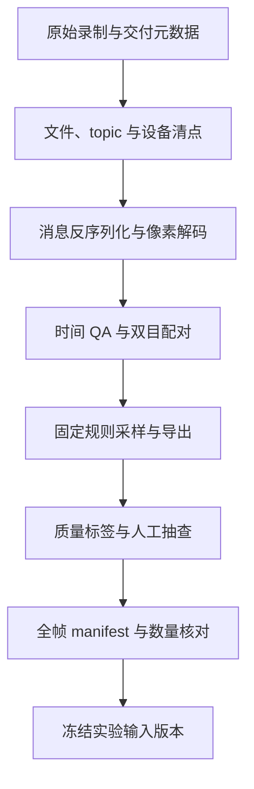

# 数据清洗与实验输入构建

机器人数据清洗不只是删掉坏图、把 bag 导出成 PNG。真正要做的是：验证已有文件的身份和语义，用可复现规则生成派生数据，再把实验实际读取的输入冻结下来。清洗阶段不负责证明相机参考准确，也不应根据某个被测算法的结果挑选容易帧。

采集时应留下哪些身份、安装、时间和运行信息，见[数据采集与交付](./数据采集与交付.md)；坐标、整流和同步的数学基础见[多传感器时空标定](../fundamentals/多传感器时空标定.md)。

## 1. 从已有录制到冻结输入



每一层只声明自己真正验证过的范围。文件可读不等于消息完整；图像能解码不等于相机模型正确；固定输入可复现也不等于具备评分参考。

### 1.1 Raw、derived、runs 分层

| 层级 | 内容 | 处理原则 |
| --- | --- | --- |
| raw | 原始 bag、压缩包、标定与采集元数据 | 只读保留，作为追溯起点 |
| derived | 图像、时间转换、配对表、manifest、质量标签 | 由固定规则生成，可重建 |
| runs | 特征、匹配、地图、预测和评分 | 与算法、配置及输入版本绑定 |
| temp | 解包、缓存和转换中间产物 | 验证后按明确范围清理 |

Reference/Query 是实验角色，不应覆盖原始 sequence 身份。同一 sequence 可以进入多个处理版本，同一派生输入也可以服务多个算法 run。

## 2. ROS bag、DB3 与 MCAP

[rosbag2](https://github.com/ros2/rosbag2) 记录带时间戳的 ROS 消息，不是普通视频。读取通常经过三层：

1. 存储插件从 DB3 或 MCAP 找到消息记录；
2. 根据 ROS 类型反序列化 payload；
3. 根据图像消息字段还原像素。

| 格式 | 基本组织 | 接入关注 |
| --- | --- | --- |
| SQLite3 / DB3 | 数据库中的 topic、时间和消息行 | 索引、查询方式、BLOB 读取和远程 I/O |
| MCAP | 带 schema、chunk、压缩和索引的消息容器 | storage plugin、schema、压缩与消息类型 |

环境里安装 rosbag2 核心，不代表目标 storage backend 可用。最小贯通测试应真正读取一条目标消息、完成反序列化并导出图像；“存储打不开”“消息类型缺失”“像素解码失败”应作为不同失败类型记录。

分包记录还需要顺序、索引与元数据。直接拼接容器文件可能破坏时间或内部结构，不能把文件扩展名相同当作可安全拼接的依据。

## 3. 图像解码与 topic 选择

`sensor_msgs/Image` 常见字段包括 `height`、`width`、`encoding`、`step` 和 `data`。`mono8`、`rgb8`、`bgr8` 的通道和顺序不同；`step` 是每行字节跨度，不保证始终等于宽度乘通道数。深度图还要确认 dtype、单位与无效值。

解码应检查：

- payload 长度、stride、dtype 与通道数；
- 压缩消息是否经过相应 codec，而不是直接 reshape；
- 输出尺寸和哈希是否写回 manifest；
- 文件写出成功是否与消息反序列化成功分开统计。

图像“看起来正常”不能排除 RGB/BGR 互换、行跨度错误或高位深被截断。模型可能在错误输入上正常运行，因此像素语义也是输入契约的一部分。

### 3.1 选择哪个相机 topic

机器人可能同时发布 RGB、左右 mono、raw/rectified 图、深度和多份 CameraInfo。需要核对：

| 问题 | 原因 |
| --- | --- |
| 左目、右目还是 RGB | 对应不同内参、光心与外参 |
| raw 还是 rectified | 像素空间和投影模型不同 |
| 设备 SN 与安装批次 | 同型号设备也不能任意共用标定 |
| `frame_id` 的物理含义 | 名字不自动等于目录或算法中的 frame |
| CameraInfo 是否同源 | RGB 参数不能直接用于 mono 相机 |

CameraInfo 无效时，应回到同设备、同安装有效范围的标定资产；不能补一组“常见焦距”只为让程序继续运行。

## 4. 时间索引与 QA

设备时间、消息 header 时间和 bag log 时间可能分别代表设备时钟、测量事件与记录事件。log time 适合定位存储记录，但不自动等于曝光时刻。

若需要统一时间域，可记录变换：

$$
t_{common}=a\,t_{device}+b.
$$

$b$ 是偏移，$a$ 反映时钟速率差。跨设备重启不能默认共用一个 $b$；长录制也不能未经检查就令 $a=1$。这类时钟坐标转换与传感器测量时间偏移不是同一参数，避免重复补偿。

时间 QA 至少检查单调性、重复时间、回退、采样间隔分布、topic 覆盖、长缺口和时钟重置。manifest 同时保存原始时间、转换后时间与规则版本，不只保留一列“最终 timestamp”。

验证范围必须具体。例如某条 MCAP 链可以对目标 topic 全量反序列化并保存 header/log time 与 payload 哈希，但只对抽样帧做完整像素转换；某条 DB3 链可能全量只索引 row ID 与 log time，抽样后才读取 BLOB。两者都能形成实验入口，却不能用同一句“全量零解码失败”描述。

## 5. 固定采样：减少规模而不挑容易帧

每 N 帧抽样只有在原始帧率稳定时才近似固定频率。更明确的时间规则是先保留首帧，再为边界 $t_0+k\Delta t$ 选择不早于边界的第一帧：

$$
i_k=\min\{i:t_i\ge t_0+k\Delta t\}.
$$

实现还要规定长缺口是否产生空窗口、同一源帧能否重复选中。通常不应为了凑齐数量重复输出同一图像，而应保留空窗口与间隔异常。

采样规则必须在看算法结果之前冻结。不能按匹配数、PnP 内点或预测误差删除帧；暗、过曝、模糊和低纹理更适合先保留并打标签。确实无法解码的记录可以按预先规则排除，但源身份和原因仍留在 manifest。

1 Hz 是离线图像规模选择，不代表 VO/VIO 或参考轨迹生成也应降到 1 Hz。不同派生任务可以从同一 raw 数据生成不同频率的输入，但必须有独立版本身份。

## 6. Manifest：生成、核对与使用

采集篇规定 manifest 必须能回答“这个产物是谁”；清洗阶段负责真正生成逐帧索引并验证字段之间的一致性。一个图像 manifest 可包含：

```text
sequence_id, source_file, source_row_or_message_id,
topic, frame_id, encoding, width, height,
log_timestamp, header_timestamp, common_timestamp,
selected, selection_rule, decode_status,
quality_flags, output_path, output_hash
```

原始消息 ID 应稳定关联源记录。保存全帧清单再用 `selected` 标记，比只输出一份图片列表更容易解释未选、失败和缺失。

### 6.1 三条数量链

1. 源记录数量与全帧 manifest 一致；
2. `selected` 记录与固定抽样规则一致；
3. 成功导出的图像与 `selected && decode_status=ok` 逐项对应。

不仅比较总数，还比较 ID、时间、路径和哈希。两个错误可能抵消成相同总数，所以“数量一样”不是逐项一致。

### 6.2 冻结输入身份

实验不应只引用一个会变化的目录。冻结版本至少记录 manifest 哈希、图像集合哈希规则、相机模型 ID、选择规则、质量标签版本和必要的配对表。算法 run 再引用这个输入版本，而不是自行扫描目录后形成隐式样本集。

若后续修正解码或时间规则，应生成新 processing version，并保留旧版本与差异说明。不要原地覆盖后再声称历史结果仍对应同一输入。

## 7. 视觉 QA：标签不是删帧理由

亮度统计、饱和比例、梯度或 Laplacian 响应可用于标记暗、过曝、模糊和低纹理。它们受场景内容影响：白墙天然低纹理，亮窗可能是正常结构，低 Laplacian 也不唯一对应运动模糊。

阈值应版本化，并配合按固定时间分位生成的 contact sheet 检查路线、朝向、光照、共同结构和动态遮挡。联系图支持“存在可见公共区域”等粗判断，不提供逐 Query 的独立 overlap 真值，也不证明相机位姿准确。

质量标签描述输入，排除规则属于实验协议。若某帧因物理损坏而不具备任务资格，应由所有方法共享的预先规则处理，不能等看到某个模型失败后再决定。

## 8. Raw、rectified 与派生相机模型

清洗阶段可以保存 raw 图，也可以生成 rectified 派生版本，但两条路径必须带各自相机模型：

- raw 图使用对应的原始内参与畸变模型；
- rectified 图记录整流旋转、新内参、输出尺寸、插值方法与有效 ROI。

不能把 raw 图直接当旧整流图，也不能对已 rectified 图再次去畸变。resize、crop 或 padding 后，内参与像素坐标还要同步变换。重投影阈值必须注明作用在哪个像素空间。

一次具体接入中，原图被确认采用 fisheye/equidistant 模型，随后用同 SN 的 provisional Kalibr 参数生成独立 640×480 左目整流版本。raw 资产继续保留；尺寸没变也不表示焦距、主点和有效视场没变。这个案例说明派生图必须绑定新模型，不证明该 provisional 参数已经通过独立验证。

## 9. 双目配对

左右目分别按 bag log time 抽样，可能把不同曝光时刻的图像凑成一对。配对规则应建立在驱动时间语义与同步机制上，并保存左右源 ID、时间差、未配对原因和规则版本。

在一次 Office 数据处理中，候选帧中 003 有 1462/1567 对、001 有 1281/1294 对 header 完全相同，双目 VO 使用 exact-header 交集。这是按采集字段配对，不是按匹配效果挑帧；相同 header 仍只说明该驱动字段一致，不能脱离设备语义宣称物理曝光严格同步。

其他设备可能有经过标定的固定偏移，因此 exact-header 不是所有双目系统的唯一合法规则。时间与插值基础见[多传感器时空标定](../fundamentals/多传感器时空标定.md)。

## 10. NAS 与存储 I/O

大 bag 在网络文件系统上读取时，瓶颈可能是远程延迟、数据库查询和随机 BLOB 访问，而不是图像解码。DB3 若缺少适合 topic/时间条件的索引，全表遍历会产生大量远程 I/O。

可以先建立轻量消息索引，再只读取固定 `selected` payload。任何索引或重组织都应发生在授权派生副本上，不修改唯一原始数据库。

迁移核验比较相对路径、size 与 SHA256。文件数量相同不足以证明复制完整，逻辑文件字节也不等于磁盘实际释放空间；压缩、去重、快照、块分配和延迟回收都会影响物理占用。

原始输入、可复现配置、派生结果和临时缓存价值不同。唯一 raw 资产不能因为“已经导出几张图”就删除；临时抽取则可在哈希和依赖验证后按清单清理。

## 11. 输入就绪是分层状态

| 状态 | 最小含义 | 仍未自动成立 |
| --- | --- | --- |
| image-ready | 图像、选择规则、时间索引和输入身份可复用 | 标定验证、相机位姿、地图关系 |
| paired-ready | 双目或跨传感器配对规则与覆盖已冻结 | 配对代表精确物理同步 |
| map-input-ready | Reference 图像与相机模型可供建图程序读取 | Reference Pose 准确、地图质量合格 |
| score-input-ready | Query 样本和 eligible mask 可被评分器稳定读取 | 参考具备目标精度资格 |

“ready”必须绑定任务与版本。图像入口就绪时可以做特征提取、检索烟雾测试或固定图对匹配；没有三维地图不能完成 map-based PnP，没有合格参考也不能发布正式定位精度。

## 12. 截至 2026-10-06 的输入构建案例

以下数字只描述当时冻结的处理版本，不是永久数据状态：

| 序列 | 原始消息/帧数 | 约 1 Hz 导出帧 | 后续 Reference 注册图数 |
| --- | ---: | ---: | ---: |
| 常州 seg019 人工光 | 3756 | 126 | 125 |
| 常州 seg020 自然光 | 3208 | 107 | 106 |
| Office 003 | 4699 | 157 | 156 |
| Office 001 | 3883 | 130 | 本轮仅作 Query |

导出帧与地图注册帧不是同一计数；每条 Reference 少一张的具体原因必须回到帧级资格记录，不能猜成坏图或算法失败。图像入口仍保留完整固定抽样集合，没有按定位结果重选。

这个案例真正留下的资产是原始输入身份、全帧索引、时间转换、固定采样、raw/rectified 模型、双目配对、质量标签和冻结 manifest。相机参考如何构造见[从 LIO 轨迹到相机参考位姿](./从LIO轨迹到相机参考位姿.md)，指标与失败分母见[定位评估方法](./定位评估方法.md)，具体 HLoc 实验则见[如何选择视觉重定位 Pipeline](../hloc/如何选择视觉重定位Pipeline.md)。
