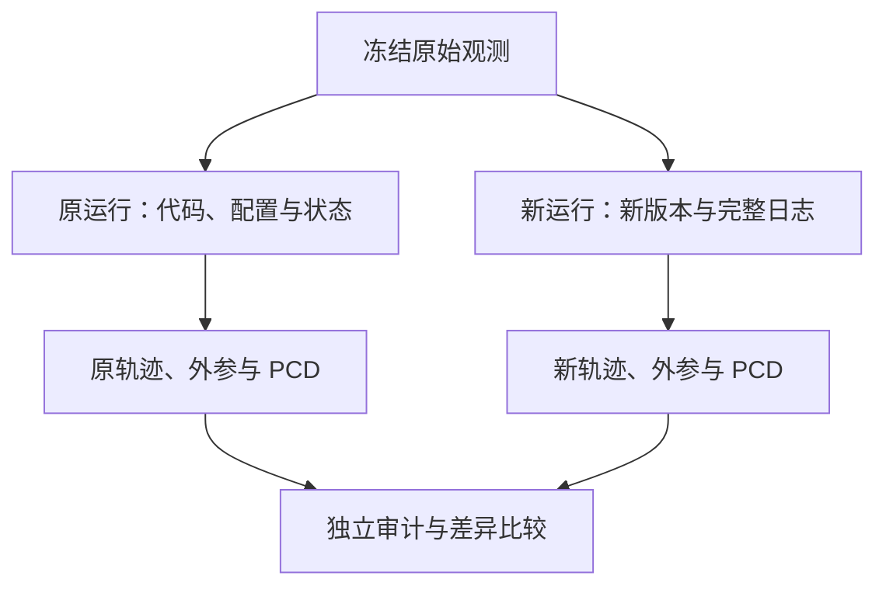

# 数据采集与交付

SLAM 数据集不只是一个录包文件。它还需要说明传感器如何安装、时间戳代表什么、每个坐标系怎样定义、算法使用了哪些配置和状态，以及派生产物怎样从原始观测生成。

后续处理经常遇到“文件都有，但串不起来”：轨迹存在，却不知道是哪个原点；外参存在，却不知道方向和适用安装；图像与 IMU 时间都有，却属于不同时间域。很多缺项只能在采集或运行时记录，事后无法靠洗数据补造。

本文回答“采集和处理时必须留下什么”。已有文件怎样验证、转换和冻结为实验输入，见[数据清洗与实验输入构建](./数据清洗与实验输入构建.md)；如何评价则见[定位评估方法](./定位评估方法.md)。

## 1. 从用途倒推数据需求

首先定义实验要回答什么，再决定需要采集什么。

| 用途 | 除原始观测外的关键要求 |
| --- | --- |
| 跑通 VO／LIO | 可解释的传感器格式、频率、时间、标定 |
| 多传感器标定 | 刚性安装、充分运动激励、合理同步、合适场景 |
| 跨光照重定位 | 真实公共视野、不同外观条件、独立建图与查询序列 |
| 相机定位精度评估 | 相机中心参考 Pose、统一坐标、参考误差说明 |
| 性能评估 | 冻结输入尺寸、候选规模、设备与计时边界 |
| 复现历史算法产物 | 原始数据、代码／二进制身份、配置、动态状态、导出步骤 |

一段数据能跑 LIO，不代表能给相机提供合格参考。一个点云看起来完整，也不代表能恢复每张图像的相机位姿。

### 1.1 采集之前写最小数据契约

至少明确：任务、场景、序列身份、传感器、安装批次、时间规则、坐标规则、原始数据、标定、预期产物与验收方式。

契约不必很长。关键是每个字段有明确含义，未确认项允许写 unknown。明确的 unknown 比默认“应该没问题”更容易管理。

## 2. 数据分层：观测、配置、状态和产物

| 层 | 示例 | 保留目的 |
| --- | --- | --- |
| 原始观测 | MCAP／DB3、原始图像、点云、IMU | 重放与重新处理 |
| 采集元数据 | 设备 SN、安装批次、光照、路线、时间语义 | 解释观测条件 |
| 标定 | K、畸变、外参、时间偏移 | 投影与坐标转换 |
| 静态运行配置 | 滤波噪声、在线外参开关、输入 topic | 解释算法设置 |
| 动态运行状态 | 外参历史、bias、初始化与重置事件 | 解释实际执行过程 |
| 派生产物 | TUM、PCD、整流图、特征、地图 | 下游实验输入 |
| 处理谱系 | 输入校验和、代码版本、命令与输出依赖 | 追踪与复现 |

“配置已归档”不等于“状态已归档”。在线外参、IMU bias、地图更新和重置都是可能变化的运行状态。

### 2.1 两种不可逆损失

第一种是观测损失：丢帧、点云字段被裁掉、原始畸变图被覆盖。第二种是解释信息损失：数据字节仍在，但时间语义、frame、安装和运行状态不再可追溯。

前者影响算法输入，后者影响能否正确使用输入。应同时设计记录策略。

## 3. 传感器安装：刚性是模型假设

### 3.1 安装记录应包含什么

记录设备型号与序列号、支架结构、固定方式、各 frame 示意、测量端点、安装照片、批次 ID，以及碰撞、拆装、松动等事件。

同一相机 SN 只能证明设备身份，不能证明相机与雷达相对安装未变化。不同序列时间接近，也不能代替安装连续性的确认。

### 3.2 刚性与非刚性

刚性模型是假设传感器之间存在固定变换：

$$
T_{A\leftarrow B}(t)=T_{A\leftarrow B}.
$$

若相机与机体之间受振动、支架变形或安装松动影响，真实关系可能随时间变化。每 bag 拟合一个常量，只能近似该段平均关系，不能恢复全部瞬时运动。

“每 bag 外参不同”也可能仅仅是估计噪声，不能直接据此断言真实安装改变。应结合安装记录、运动条件和拟合稳定性判断。

### 3.3 两段外参不能混淆

LiDAR–internal IMU 是雷达内部的传感器关系；LiDAR–camera 是外部安装关系。重跑 LiDAR–IMU 里程计，通常不能估计它没有观测到的相机外参。

结构尺寸测得的平移需要说明从哪个原点到哪个原点、在哪组轴下表达。壳体中心、光心、IMU 测量中心和厂家点云原点不一定一致。

若外部安装明确非刚性，交付契约不应要求数采人员承诺一个并不存在的全局常量。更实际的做法是：记录每次飞行的安装事件和异常，保留两侧原始 IMU／图像／点云，使下游可以估计每 bag 的 provisional 变换，并把无法观测的瞬时变化写入使用边界。一次公共拟合矩阵仍可作为初值或敏感性中心，但不能自动继承到全部 bag。

## 4. 坐标系交付：一个矩阵还不够

采用 $\mathbf p_A=T_{A\leftarrow B}\mathbf p_B$ 的列向量约定。一个完整外参记录至少应包含：

| 字段 | 要求 |
| --- | --- |
| parent／child | 明确 A、B 的物理 frame |
| direction | 从 B 坐标转换到 A 坐标 |
| unit | 平移单位，角度表示单位 |
| axes | optical／body／LiDAR 原生轴定义 |
| representation | 4×4、R+t、四元数或其他形式 |
| quaternion order | xyzw 或 wxyz；不得省略 |
| convention | 主动／被动旋转、列／行向量等适用约定 |
| provenance | 标定、厂家值、测量或算法估计 |
| validity | 设备、安装批次、运行和时间范围 |
| uncertainty | 可用的误差模型；没有则明确未知 |

基本数值检查包括 $R^TR\approx I$、$\det R\approx1$、有限值、合理单位和底行。它们能检查矩阵是否合法，不能证明标定正确。

### 4.1 轨迹也需要 frame 契约

轨迹必须明确世界 frame、被跟踪传感器、位姿方向、时间、四元数顺序和重置事件。TUM 的常见列格式不替用户规定这些物理含义。

累计 PCD 应明确是世界坐标还是局部传感器坐标、是否去畸变、使用哪段轨迹、是否经过后处理和坐标对齐。已经世界化的点云若再套一次位姿，会发生重复变换。

## 5. 时间系统：采样、曝光、传输与记录

### 5.1 常见时间层次

| 时间 | 可能代表什么 |
| --- | --- |
| 设备时间 | 设备内部时钟或开机计时 |
| 测量时间 | 曝光、IMU 采样或 LiDAR 点采样时刻 |
| 消息 header | 驱动填入的测量／设备时间表示 |
| 主机接收时间 | 数据到达主机或节点的时刻 |
| bag 记录时间 | 记录器使用的时间 |

这些时间可能接近，也可能存在常量偏移、延迟和抖动。不能因为都叫 timestamp 就直接相减。

### 5.2 曝光时间语义为什么重要

图像不是理想瞬时测量。曝光开始、中点和结束对应不同时间；运动越快，差异越重要。rolling shutter 还使不同行具有不同采样时间，单个 Pose 是近似。

应记录曝光时长、快门类型、自动曝光设置，以及 header 如何生成。消息规范给出的是接口期望，实际设备驱动还要通过文档、源码或实验确认。

左右目 header 相等可用于检查消息级配对，但只有确认驱动与硬件同步语义后，才能把它解释为同步曝光证据。

“保留原始设备时间”也不等于“曝光语义已经明确”。例如驱动可以把相机 SDK 回调给出的单调 `ts` 原样转换成 ROS `header.stamp`，发布时完全不重新取时；这排除了 ROS 发布延迟混入 header，却仍不能回答 SDK 的 `ts` 对应曝光开始、中点、结束还是内部其他事件。交付时应分别记录时钟来源、驱动是否 restamp，以及测量事件定义；未知项保留 unknown。

### 5.3 同步机制与检查

硬件触发、共享时钟、PTP／PPS、软件时间转换和事后时间偏移估计有不同误差来源。记录使用哪一种、时间原点、频率和校时事件。

检查单调性、时间回退、重复、采样间隔分布、跨传感器覆盖、长间隔和时钟重置。估计时间偏移时，运动激励不足可能使偏移不可观测；短窗口拟合良好也不证明长时间无时钟漂移。

## 6. 采集设计：让数据提供足够约束

### 6.1 标定需要激励，不只是时长

多轴旋转与平移有助于约束外参和时间参数。纯平移、单轴旋转、匀速或长期静止可能无法区分某些未知量。具体动作应满足设备安全、算法模型和目标参数的可观测性要求。

在开始与结束保留适当静止段，有助于检查 IMU bias、时间和初始化状态；但静止不能替代运动激励。相机内参标定需要目标覆盖不同位置、姿态和深度，尤其考虑边缘视场。

### 6.2 重定位采集需要几何重叠和外观差异

跨光照序列要保留相同可见结构，记录灯、窗帘、曝光和路线。自然光更强不代表室内图像更亮：亮窗可能使自动曝光压暗室内区域。

路线相同不等于图像重叠充分。朝向、遮挡、视点和行进方向影响可见区域。建议记录路线、拍摄朝向、停留点和明显动态物体。

若目标是泛化测试，应预先划分 Reference、Query 和用于调参的数据，避免根据定位成功率反复选择 pair 或剔除困难帧。

### 6.3 LiDAR 场景中的退化

长走廊、单一平面、重复结构和低几何变化可能导致某些自由度约束较弱。动态人群、玻璃和反射表面也会影响建图与注册。

因此应同时记录几何场景与外观条件。“图像清楚”和“点云很多”不能替代约束充分性的检查。

## 7. 录包与即时检查

### 7.1 原始字段保真

记录原始 topic、消息类型、编码、分辨率、频率、点云字段、IMU 单位、协方差含义及必要的 TF／CameraInfo。去畸变往往需要点级时间；只保留 xyz 可能失去重新处理条件。

IMU 的加速度一般是比力测量，含 bias 和噪声，不应把静止时约 9.81 m/s² 当作记录错误。具体输出是否已补偿重力、是否变换过 frame 需要设备契约。

### 7.2 记录链路也会丢数据

检查存储吞吐、消息尺寸、记录器日志、ROS2 QoS、连接中断和驱动错误。bag 中 topic 的存在不能证明全段完整；零解码失败也不能证明采集端没有丢帧。

MCAP／DB3 是容器形式，不能替代测量语义。分包记录还需要索引、顺序与元数据；直接拼接文件可能破坏时间或存储结构。

### 7.3 离场前的轻量验收

建议立即查看少量图像和点云、确认双目配对、绘制时间间隔、检查传感器覆盖，验证安装照片与 SN，并确认原始文件可读。

此时发现镜头遮挡、数据断流或安装变化，通常还有补采机会。等算法评估阶段再发现，可能已经无法恢复。

## 8. 算法处理交付：保留运行，而不只是输出

### 8.1 初始化、预测和更新后状态

滤波器以配置初值启动，经过传播形成预测，再融合观测形成更新后的状态。若外参在线估计，这几个阶段的外参可能不同。

输出轨迹和点云实际使用哪种状态，由代码路径决定。交付应同时说明状态记录阶段、时间关联、导出时刻和必要的动态参数。

预测状态、更新后状态和最终状态不能只凭字段名互换。具体日志在算法中的写入位置、时间戳和导出轨迹使用的状态，都要结合对应源码版本审计。FAST-LIO 的 `mat_pre/mat_out` 实例集中记录在[从 LIO 轨迹到相机参考位姿](./从LIO轨迹到相机参考位姿.md)，本篇只规定交付必须保留足以完成这种审计的代码身份、配置和状态日志。

### 8.2 最小运行记录

至少保存：

- 原始输入 ID 与校验和；
- 仓库 commit、未提交修改或源码快照、必要的二进制身份；
- 实际生效配置、启动参数、标定版本；
- 依赖／容器／构建信息与执行命令；
- 时间转换、初始化、重置、异常事件；
- 必要动态状态及字段说明；
- 输出 frame、导出步骤和产物校验和。

打包前还应按“运行声明的产物清单”检查一次实际归档内容。日志在处理机上生成但没有进入交付包，属于包装完整性问题，不等于算法没有生成；这种区别会直接决定是补发小文件还是重跑全流程。

有源码但没有原编译环境，仍可能无法立刻重跑；能重跑也不保证逐字节相同。复现要求可以是数值容差或行为一致，但应提前说明。

### 8.3 原运行和新运行是不同版本



新运行可以成为新参考版本，但不能冒充原运行状态恢复。旧轨迹搭配新外参需要额外证明，不能因为文件格式一致就混用。

## 9. 数据谱系与目录组织

数据谱系（data lineage）描述一个产物由哪些输入、参数和程序生成。关系通常是依赖图，而不是所有文件都扔进一个 sequence 文件夹。

一个可用的目录约定如下。原始数据只读，派生数据分版本：

```text
dataset/
  raw/sequence_id/                  # 原始包与采集元数据
  calibration/calibration_id/      # 标定及有效范围
  runs/run_id/                     # 配置、状态、日志、轨迹与点云
  derived/processing_version/      # 图像、manifest、adapter 输出
  benchmark/protocol_version/      # 固定 pair、地图与评价契约
```

sequence 表示采集身份；run 表示算法处理身份。同一 bag 可以经过多个 run。reference/query 表示实验角色，不建议用它们覆盖原始 sequence 身份。

命名应尽量稳定、唯一且机器可解析；光照等语义写入元数据，文件名只作为辅助。避免多个含义不同的 `final`、`latest` 和手工重命名副本。

### 9.1 manifest 应包含什么

图像 manifest 可记录 source bag、topic、原始行／消息身份、header 与记录时间、导出路径、抽样标记、解码状态和质量标签。处理输出再加入 Pose 覆盖、失败原因、标定及运行版本。

质量标签用于描述数据，是否排除应由预先冻结的规则决定。黑暗、过曝、低匹配数和预测失败不应被混成同一种“坏帧”。

### 9.2 一个元数据示例

以下示例中的值均为占位，不表示已验证事实：

```yaml
schema_version: 1
sequence_id: sequence_example
installation_id: mounting_batch_example
camera_serial: unknown
capture:
  illumination: natural_light
  route: corridor_to_room
  mounting_event: unknown
time:
  camera_clock: device_boot
  header_semantics: unknown
  epoch_conversion_id: conversion_example
calibration:
  camera_model_id: calibration_example
  lidar_camera_id: extrinsic_example
run:
  run_id: lio_run_example
  pose_parent_frame: world_example
  pose_child_frame: imu_example
  pose_direction: child_to_parent
  translation_unit: m
  quaternion_order: xyzw
  online_extrinsic_estimation: true
  extrinsic_history_file: unknown
status:
  image_ready: false
  camera_chain_ready: false
```

字段名和值的枚举应在 schema 中定义。机器能检查字段存在，但 unknown 需要人工或上游证据解阻。

## 10. 完整性与语义正确性要分别验收

### 10.1 size 与 SHA256

文件大小和 SHA256 可以检查复制是否一致。它们不能证明原始文件没丢消息、外参准确、时间正确或轨迹可靠。

建议保留源端校验记录和复制后的校验记录，明确检查对象是整个包、分包还是目录内文件。目录本身没有天然的单一内容哈希，需要明确 manifest 规则。

### 10.2 五层验收

| 层级 | 主要检查 | 通过后的含义 |
| --- | --- | --- |
| 字节完整 | 文件、size、SHA、包结构 | 副本与指定源一致 |
| 数据可读 | 解码、消息类型、字段 | 软件能读取 |
| 语义可解释 | frame、单位、时间、标定身份 | 数据含义清楚 |
| 几何可组合 | 时间关联、外参链、安装有效性 | 可以生成声明等级的相机几何 |
| 实验可评估 | 固定地图、评分参考、数据隔离、协议 | 可以发布声明范围内的评估 |

image-ready、map-ready、score-ready 应分别记录。单一“ready”容易让不同岗位误以为已经完成自己的依赖。

## 11. 缺项分类决定处理方式

| 缺项类型 | 示例 | 处理方向 |
| --- | --- | --- |
| 可补文档 | frame 名称、单位、header 语义 | 查源码、设备文档、原运行记录 |
| 可补原日志 | 在线外参历史、重置记录 | 提取并审计对应 run |
| 可重新处理 | 原始数据与代码在，但导出不完整 | 新 run、新版本、完整状态导出 |
| 物理限制 | 非刚性安装、无同步依据、运动退化 | 降低参考声明、分析不确定性、必要时重采 |
| 观测已丢失 | 未录制点级时间、严重丢包 | 明确不可恢复范围 |

provisional 表示有具体依据但资格受限，不是任意缺项都能暂时跳过。对关键链段没有实际值的情况，应保持阻塞；对有依据的近似，则说明假设和误差分析。

fail-closed 的含义是前置资格不满足时拒绝发布下游“有效”产物。失败状态应可解释，原始输入仍应保留以便复查。

## 12. 缺项请求也应遵循最小充分原则

发现下游链路缺失时，先确定缺的是文档、原运行日志、可重新导出的派生产物，还是采集时已经丢失的物理观测。请求应绑定明确的 `sequence_id`、`run_id`、代码与配置身份，并说明字段阶段和目标用途，避免一句“补一份最终外参”制造新的歧义。

若原运行已有可解释状态，只是未进入交付包，优先补齐并审计原证据；若必须重跑，则把新轨迹、新状态历史和新地图作为一个新 run 冻结，不能拿新状态无依据地覆盖旧轨迹。具体 LIO 案例见[从 LIO 轨迹到相机参考位姿](./从LIO轨迹到相机参考位姿.md)。

这条原则可以概括为：**数据交付的最小单位不是一个孤立文件，而是带身份、语义、依赖和有效范围的产物。**

## 13. 可复用的采集与交付检查表

### 采集前

- 定义任务、Reference／Query 和调参数据边界。
- 确认设备身份、安装批次、坐标定义和标定适用性。
- 确认时钟、header 语义、同步机制和曝光设置。
- 设计运动激励、公共视野、光照条件和静止检查段。
- 检查录包格式、必要字段、带宽、存储和错误日志。

### 采集后、离场前

- 检查消息数量、时间分布、覆盖与断流。
- 实际查看图像、点云，检查双目配对和安装状态。
- 保存场景条件、异常事件、安装照片和原始元数据。
- 验证文件可读，并保留源端校验记录。

### 算法处理与交付

- 保存实际配置、代码身份、运行状态和导出步骤。
- 说明轨迹、点云、标定的 frame、时间和单位。
- 将同一次运行的轨迹、外参历史、PCD 绑定到同一 run_id。
- 对复制副本做 size／SHA 检查，对几何做独立语义检查。
- 列出 ready 状态、unknown、provisional、blocked 和具体原因。
- 重处理生成新版本，不覆盖原始数据和原运行身份。

## 14. 阅读关联

- [多传感器时空标定](../fundamentals/多传感器时空标定.md)：标定模型、可观测性与时间偏移。
- [从 LIO 轨迹到相机参考位姿](./从LIO轨迹到相机参考位姿.md)：怎样把交付物组合成可审计参考。
- [数据清洗与实验输入构建](./数据清洗与实验输入构建.md)：解码、抽样、manifest 核对和实验输入冻结。

采集阶段留下约束和解释信息，处理阶段验证并转换它们，评价阶段根据参考资格限定结论。三者共同决定实验能回答多精确的问题。
