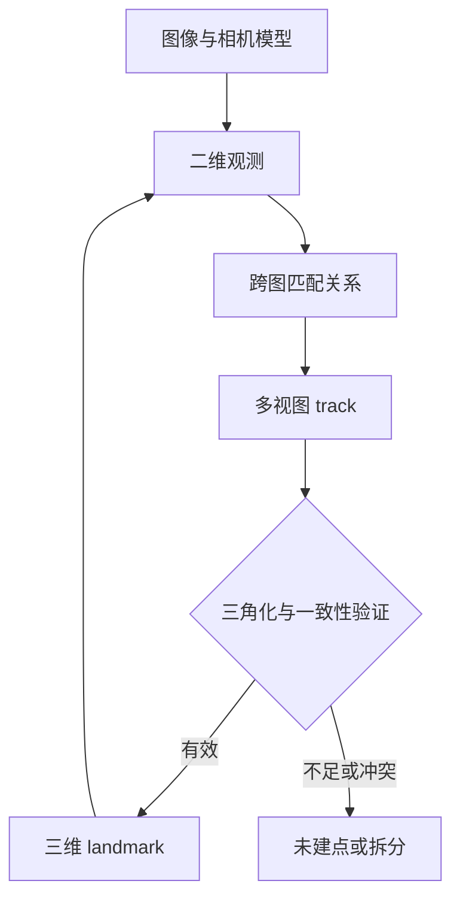

# 地图到底存了什么

地图不是一个统一的数据结构。视觉定位要查“这个图像点对应哪个三维点”，规划要查“这块空间能否通过”，渲染要查“从这里看过去是什么颜色”。同一环境可以同时有几种地图，每种都保留不同的信息。

空间智能的基础之一，是分清几何位置、观测关联、自由空间、外观和语义，知道某种表示支持哪些查询。

从 SfM 地图到特征高斯地图的论文入口，见[结构式定位主线](../papers/#topic-hloc)与[高斯地图与定位交叉](../papers/#topic-gaussian-maps)。

## 1. 地图首先是一个查询接口

| 问题 | 地图必须提供什么 |
| --- | --- |
| 我在哪里 | 可识别观测、三维几何、参考坐标 |
| 到哪里能走 | 占据、自由空间、距离或可通行信息 |
| 这个物体是什么 | 语义、实例及关联 |
| 物体之间是什么关系 | 对象身份、位置和关系 |
| 从新视角看会怎样 | 外观与可见性建模 |

点云没有点的地方可能是自由空间，也可能从未观察，不能从“没有点”直接推出可通行。用于渲染的连续外观也不自动具有可靠的碰撞几何。

## 2. 视觉稀疏地图的四个基本对象

### 2.1 Keyframe：保留了一个观测视角

关键帧一般包含图像身份、时间、相机模型、位姿和局部特征。SLAM 中常按运动、跟踪或信息增益选择关键帧；离线 Reference 集也可以按固定规则选图。

并非所有存储图像都必须称关键帧。固定 1 Hz 抽样是一种数据选择规则，不能因为进了地图就声称使用了 SLAM 的关键帧选择算法。

### 2.2 Observation：一次具体测量

观测是某个三维实体在某个图像中的二维位置，可带尺度、方向、描述子、置信度和协方差：

$$
z_{ij}=\pi(T_{C_i\leftarrow W}P_{W,j})+n_{ij}.
$$

下标 i 指图像，j 指 landmark。它是测量，不是三维点本身。

### 2.3 Track：认为属于同一实体的观测集合

$$
\mathcal T_j=\{(i,k):\text{图像 i 的第 k 个观测属于实体 j}\}.
$$

两两匹配提供候选边，多张图的边连接后形成 track。track 可以在三角化之前存在；也可能因几何不足始终没有三维坐标。

简单 union-find 可以合并连通集合，但错误边会把两个物理点串起来，甚至让一个 track 同时包含同一图像中两个冲突观测。需要冲突检查、多视图几何验证及必要的拆分，不能把传递闭包自动当作真实身份。

### 2.4 Landmark：世界中的持久几何实体

最常见的是三维点，带坐标、观测列表、质量和可选描述子。landmark 也可扩展为线、平面或物体。

**关键点是二维检测结果；landmark 是地图实体。**一个关键点可以没有三维关联，一个 landmark 也能被很多关键帧观测。

## 3. 为什么地图既存三维，也存二维

PnP 需要 Query 的二维观测与地图三维点。Query 首先匹配到 Reference 中的二维点，然后通过数据库关系找到 landmark。只有一份 XYZ 点云，未必知道图像哪个位置看见了哪个点。

一个简化关系表可以是：

| 表 | 主字段 | 用途 |
| --- | --- | --- |
| cameras | camera_id、模型、参数、尺寸 | 定义投影 |
| images | image_id、camera_id、pose、图像身份 | 定义观测视角 |
| observations | image_id、point2D_idx、xy、point3D_id | 图像关联到地图 |
| landmarks | point3D_id、xyz、误差、track | 地图关联回图像 |
| global descriptors | image_id、检索向量 | 先找到候选图像 |
| local features | image_id、二维点、局部描述子 | 建立候选图对对应 |

ID 不一定连续，也不等于数组索引。[COLMAP 的模型格式](https://colmap.github.io/format.html)很好地体现了相机、图像、二维点和三维 track 的区别；接入时尤其要核对图像中的 Point2D 索引与 Point3D ID。

## 4. 地图如何建立

### 4.1 SfM 地图

从图像匹配出发，估计相机位姿、三角化、增量注册或全局求解，再联合 BA。单目 SfM 通常存在全局相似变换自由度，需要尺度和坐标锚定。

### 4.2 Known-pose 地图

相机位姿已给定，匹配建立 track 后，只三角化和允许范围内的点精化。它适合把外部轨迹转换成视觉定位地图，但继承该轨迹误差。

$$
\min_{\{P_j\}}\sum_{(i,j)\in\mathcal O}
\rho\left(\|z_{ij}-\pi(T_iP_j)\|^2\right),
\qquad T_i\text{ 固定}.
$$

“固定”是优化变量的限制，不是物理精度的证明。相机矩阵构建前后只差 $10^{-15}$，说明程序没有修改它，不能证明位姿与真实值差 $10^{-15}$。

### 4.3 离线图对选择也影响地图

全库配对有 $M(M-1)/2$ 对，计算随图像数二次增长。时间近邻、检索近邻、共视及回环候选可减少规模，但可能改变地图覆盖。

三种方法用同一批图像和相机 Pose，仍可能因特征、配对和过滤产生不同地图。地图比较必须说明这些因素，不能把差异全归因于在线 matcher。

## 5. Sparse、semi-dense、dense 地图与匹配密度

这两个“密度”属于不同轴：

- 匹配密度描述图像上哪些位置建立对应。
- 地图密度描述空间里保存多少几何及其覆盖。

稠密 matcher 可以只采样若干对应、经过 track 筛选后建立稀疏 landmark 地图；稀疏前端也可搭配独立深度模块形成稠密表面图。

| 地图 | 常见内容 | 长处 | 缺口 |
| --- | --- | --- | --- |
| Sparse map | 稳定三维点、track、关键帧 | 适合定位与 BA，存储较轻 | 表面和自由空间不完整 |
| Semi-dense map | 有梯度/可观测区域的深度和几何 | 比关键点覆盖更多，保留可靠区域 | 低纹理区域仍可能缺失 |
| Dense map | 广泛的深度、表面或体积 | 重建与空间查询更丰富 | 算力、内存、动态处理更重 |

这些词没有跨系统统一的固定点数门槛。semi-dense 的具体选择规则也随系统不同，不能简单定义为“点数介于两者之间”。

## 6. 地图兼容性：为什么不同前端可能需要各自地图

地图不是只有 XYZ，还包含“什么二维观测与描述子能找到这个点”。SP 地图、RDD 地图的观测位置、描述子空间和 track 可能不同。

不能默认拿 RDD 描述子直接搜索 SP 描述子。维度相同也不代表特征空间兼容。可以设计显式 adapter 或共享关联，但要验证其误差和覆盖。

### 6.1 Hybrid：桥接已有观测

例如 dense matcher 输出 Reference 对应位置，再在该位置附近找已有 SP 地图观测，沿它接到 landmark。

优点是复用成熟地图；局限是桥接半径、SP 观测覆盖和近邻歧义。密集对应正确但附近没有 SP 观测，仍无法形成 2D–3D。

2 px 桥接是位置关联门槛，不等于 PnP 的 2 px 重投影门槛。两个门槛即使数值相同，也作用于不同误差。

### 6.2 Full：用自己的观测与 track 建图

full 路线从该 matcher 的观测构建 track 和 landmark，减少已有稀疏观测对它的覆盖限制。但 detector-free 对应位置在不同图对中未必完全一致，需要聚合、冲突处理和几何筛选。

因此 full 相比 hybrid 改变的是观测、track、landmark 与关联整条链。召回提高不能只写成“换 matcher 更强”；更多地图点也可能增加歧义和错误接受。

## 7. 共视图、位姿图与因子图

| 图 | 节点 | 边/因子 | 表达什么 |
| --- | --- | --- | --- |
| 共视图 | 关键帧 | 共享 landmark 的关系 | 哪些图像看过共同区域 |
| 位姿图 | 位姿 | 相对位姿测量 | 轨迹及回环约束 |
| 因子图 | 位姿、点、偏置等变量 | 观测和先验因子 | 完整估计问题的概率结构 |

“graph”不一定是同一种对象。共视连接多不自动意味着约束独立，位姿图也通常不保留全部像素观测。

## 8. 点云、surfel 与 mesh

点云存空间采样，可带颜色、法向和强度；不天然包含表面拓扑或自由空间。

surfel 用位置、法向、半径/面积、颜色和置信等表示局部表面元素，适合融合局部表面观测。mesh 用顶点和面表达连续表面，便于渲染和几何查询，但重建孔洞、薄物体和动态区域可能有问题。

注册将两份几何放入共同坐标，仍需初值、重叠和退化检查。几何一致性并不补全图像观测关联，也不能替代 camera/body 标定。

## 9. 占据地图：自由、占据和未知

occupancy grid 为体素保存占据概率。用 log-odds：

$$
l_t=\log\frac{p_t}{1-p_t},
$$

在条件独立及逆传感器模型假设下，可增量更新：

$$
l_t=l_{t-1}+\log\frac{p(m\mid z_t)}{1-p(m\mid z_t)}-l_0.
$$

射线经过部分支持自由空间，终点附近支持占据。传感器未覆盖区域保持未知，未知不等于自由。概率饱和、动态物体和相关重复观测会影响置信度。

三维网格存储随分辨率迅速增长；将每个轴体素尺寸减半，同体积的稠密体素数约增至八倍。八叉树、稀疏哈希等用空间结构减少空区域存储。

## 10. TSDF 与 ESDF

TSDF 是截断有符号距离场，常融合深度测量对表面的距离估计。常见投影式 TSDF 在观测射线方向定义距离，并非每个体素都是真正欧氏最近表面距离。

$$
D_{new}=\frac{wD+w_mD_m}{w+w_m},
\qquad w_{new}=w+w_m.
$$

权重通常需要上限和测量质量模型。截断范围外、未观测空间和符号定义必须明确。

ESDF 提供到最近障碍/边界的欧氏距离，常供规划与优化查询。其梯度可引导避障，但插值、未知空间策略、机器人尺寸和地图更新延迟都会影响可通行判断。

TSDF 适合表面融合，ESDF 适合距离查询；不能把两个名字当作同一数组的不同称呼。机器人通常还需要膨胀或自身几何模型，中心点安全不代表整机安全。

## 11. 神经隐式表示与 3D Gaussian Splatting

NeRF 类表示常以神经网络建模位置、视角与密度/颜色，再沿射线渲染。它在场景外观和新视角生成上有价值，但密度不是直接认证的占据概率。

SDF 类神经表示建模有符号距离，零水平集表示表面；几何准确性仍依赖观测、损失和优化。

3DGS 是显式高斯基元表示，常带中心、协方差、不透明度和外观参数，通过投影与混合渲染。它并非典型的纯隐式神经场，也不应把每个高斯当作有确定体积的物理障碍。

这些表示可以扩展到定位和 SLAM，但外观质量、位姿精度、几何可靠性和规划安全是不同指标。选择地图需回到查询需求。

## 12. 从语义标签到对象地图

语义地图回答类别，实例地图区分同类的不同实体。对象地图还要融合多视角身份、几何、位置和不确定性，处理遮挡与动态。

“椅子在桌子旁边”是空间关系；“椅子可以坐”是功能/可供性信息。类别标签并不直接给出可交互状态或碰撞几何。

对定位来说，静态物体关系可能补充低纹理场景；动态对象也可能带来错误锚点。系统应分离稳定结构与短期动态信息。

## 13. 怎样检查地图质量

检查覆盖、观测数、track 分布、三角化角、正深度、重投影分位数、空间异常点、方法外留出验证，以及地图更新后的稳定性。

点数、长 track 和低重投影误差各有价值，但单独不能证明真实精度。错误位姿与错误点可能共同保持投影自洽；重复环路也会增加 track 长度。

本次 B0 地图点数多于 C0，不能据此宣称 B0 更准确。C3-full 相对 hybrid 的召回收益支持地图/关联链有影响，也要同时检查错误接受与在线关联成本。

## 14. 地图生命周期与复现

冻结地图时记录输入、相机模型、位姿来源、坐标/尺度、配对规则、特征/matcher 版本、track 聚合、三角化与过滤参数、优化变量、地图哈希。

全局描述子索引、局部特征缓存与几何地图要版本一致。替换图像或内参后不能继续引用旧二维索引；重建地图后 Point3D ID 也未必稳定。

几何过程见[从图像对应到相机位姿](./从图像对应到相机位姿.md)，表征见[视觉地点识别与图像匹配](./视觉地点识别与图像匹配.md)，标定见[多传感器时空标定](./多传感器时空标定.md)。具体 hybrid/full 地图适配实验见[如何选择视觉重定位 Pipeline](../hloc/如何选择视觉重定位Pipeline.md)。
