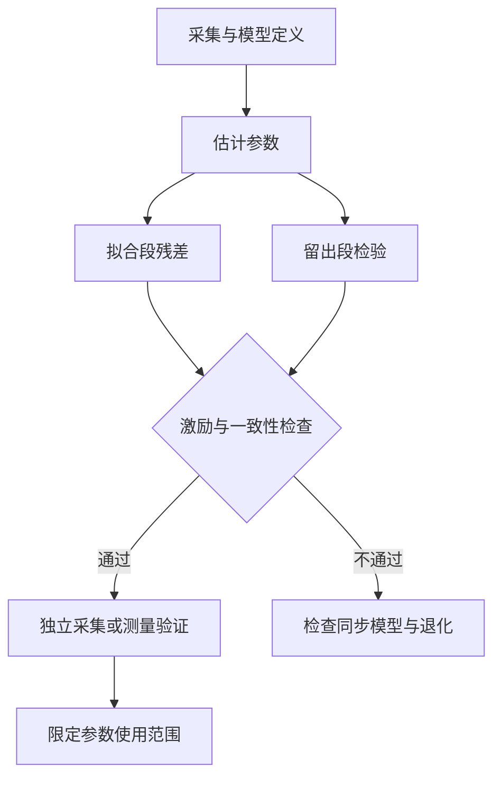

# 多传感器时空标定

多传感器融合的前提是知道“每个传感器在哪、朝哪、何时测量”。误差不仅来自算法，也可能来自坐标方向、安装变化、时间偏移或错误成像模型。标定不是填一份 YAML，而是建立一个有假设、有估计、有验证的测量关系。

采用列向量，$T_{A\leftarrow B}$ 把 B 系点变到 A 系。B 表示 body，C 表示所用相机，I 表示 IMU，L 表示 LiDAR，W 表示世界。body 必须由具体系统定义，不能默认它位于 LiDAR 光心或 IMU 中心。

论文总览中的[经典 SLAM、VIO 与参考轨迹](../papers/#topic-slam-vio)提供惯性状态、外参与时间偏移的延伸阅读；参考链可信度见[评测协议、数据与参考可信度](../papers/#topic-evaluation)。

## 1. 需要标定的四层关系

| 层级 | 参数 | 为什么需要 |
| --- | --- | --- |
| 单相机 | 成像模型、K、畸变 | 像素与空间射线互相转换 |
| 双目 | 左右内参、$T_{C_l\leftarrow C_r}$ | 基线、视差、米制深度 |
| Camera–IMU | 外参、时间偏移、IMU 噪声等 | 将视觉观测接到惯性状态 |
| Camera–LiDAR/body | 安装变换、时间关系 | 将 LIO 运动转换到相机光心 |

相机与自身 IMU 的内部标定，不等于它与机器人 body 的标定。同型号设备不能默认内参相同；同一设备拆装后也不能默认外参不变。

## 2. 刚体变换与链式组合

$$
T_{A\leftarrow B}=\begin{bmatrix}R_{A\leftarrow B}&t_{A\leftarrow B}\\0&1\end{bmatrix},
\qquad P_A=R_{A\leftarrow B}P_B+t_{A\leftarrow B}.
$$

$t_{A\leftarrow B}$ 是 B 原点在 A 中的位置，R 的列是 B 坐标轴在 A 中的方向。

$$
T_{A\leftarrow C}=T_{A\leftarrow B}T_{B\leftarrow C},
\qquad
T_{B\leftarrow A}=\begin{bmatrix}R^{\mathsf T}&-R^{\mathsf T}t\\0&1\end{bmatrix}.
$$

矩阵相乘时，中间坐标名应相消。这个检查比背“先左乘还是右乘”更可靠。

若 LIO 输出 $T_{W\leftarrow B}(t)$，相机刚性安装且 $X=T_{B\leftarrow C}$ 已知：

$$
T_{W\leftarrow C}(t)=T_{W\leftarrow B}(t)X.
$$

相机与 body 原点不重合时，即使 body 只旋转，相机光心也会沿杆臂运动。只修旋转、忽略平移外参并不总是足够。

### 2.1 三个常见方向错误

配置中 `T_cam_imu` 的含义必须查文档，不能只凭字段名决定方向。相机 optical frame 与 ROS body frame 的轴约定可能不同；整流相机还可能相对 raw 相机多一个旋转。

若 $T_{C_{rect}\leftarrow C_{raw}}=[R_{rect},0]$，则：

$$
T_{B\leftarrow C_{rect}}
=T_{B\leftarrow C_{raw}}T_{C_{raw}\leftarrow C_{rect}}.
$$

这里最后一项是整流旋转的逆。整流改变的是射线坐标约定，不是物理相机搬了位置。

## 3. 内参、畸变与整流

针孔投影首先得到 $x=X/Z,y=Y/Z$。常见径向/切向模型再按半径修正它们，例如：

$$
x_d=x(1+k_1r^2+k_2r^4+k_3r^6)+2p_1xy+p_2(r^2+2x^2),
$$

$$
y_d=y(1+k_1r^2+k_2r^4+k_3r^6)+p_1(r^2+2y^2)+2p_2xy,
\qquad r^2=x^2+y^2.
$$

鱼眼模型通常通过入射角映射。例如 equidistant 类型可用 $\theta=\arctan r$ 和角度多项式表示畸变：

$$
\theta_d=\theta(1+k_1\theta^2+k_2\theta^4+k_3\theta^6+k_4\theta^8).
$$

不同模型的参数不能混用。极大视角或其他相机模型还可能采用更一般的射线投影，不应强行用同一套 pinhole 数学处理全部原始像素。

整流通过新射线方向和新内参生成派生图像。保存 raw K/D、整流旋转、新 K、尺寸、插值方法与有效 ROI，避免第二次去畸变。图像宽高不变，不代表新 K 等于旧 K。

### 3.1 标定板为什么要覆盖整个视场

从多次已知几何板的观测联合估计内参和每次板位姿。只在图像中央、单一距离、近似正对相机采集，会让畸变和焦距等参数缺少约束。

需要不同倾角、距离和边缘覆盖；同时保证角点检测清晰，靶标尺寸及单位正确。低平均重投影误差可能掩盖边缘残差或模型过拟合，应看残差空间分布与独立验证数据。

## 4. 时间关系不是一个 timestamp 字段

传感器可能有 device time、header time 和 bag log time。设备开机时间与主机 epoch 不同，记录时间也可能晚于曝光。

统一时钟的模型可写为：

$$
t_{common}=a\,t_{device}+b.
$$

b 为时钟偏移，a 反映速率差。相机与 IMU 的测量时间偏移 $\Delta t$ 还可能描述驱动/测量语义，应避免重复补偿同一偏移。

本文定义相机测量对应的 body 时间为 $t_B=t_C+\Delta t$，则：

$$
T_{W\leftarrow C}(t_C)=T_{W\leftarrow B}(t_C+\Delta t)X.
$$

其他工具可能使用相反符号，必须通过定义或已知运动核实。

### 4.1 为什么毫秒级误差也重要

若速度为 v，一阶位置误差约为 $\|v\|\,|\Delta t|$；若角速度为 $\omega$，角度误差约为 $\|\omega\|\,|\Delta t|$。示意地，90°/s 的旋转配上 20 ms 时间错位，约产生 1.8° 姿态差。

这些式子只解释局部趋势，未包含加速度、曝光积分和杆臂项，但已经说明时间偏移可能被优化器错误吸收到外参中。

### 4.2 配对与插值

左右目分别按 log time 抽样，可能得到不同曝光时刻的两张图。相同 header 是一种可复现配对依据，但其物理同步含义取决于驱动。

轨迹插值不能对旋转矩阵逐元素线性插值。短间隔可采用平移线性插值、四元数 SLERP，或声明模型的 SE(3) 插值：

$$
T(t)=T_i\exp\left(\alpha\log(T_i^{-1}T_j)\right),
\qquad \alpha=\frac{t-t_i}{t_j-t_i}.
$$

两种插值不完全等价，都依赖局部运动假设。长缺口不宜无条件插值，更不能将区间外外推伪装为有效参考。

## 5. 从两条运动轨迹估计手眼外参

假设 camera 和 body 各有一条轨迹，但世界原点不同。定义相对运动：

$$
A_{ij}=T_{W_B\leftarrow B_i}^{-1}T_{W_B\leftarrow B_j},
\qquad
B_{ij}=T_{W_C\leftarrow C_i}^{-1}T_{W_C\leftarrow C_j}.
$$

刚性安装时，由两时刻的传感器链可得：

$$
A_{ij}X=XB_{ij},\qquad X=T_{B\leftarrow C}.
$$

这就是 hand–eye calibration 的基本运动关系。写成旋转和平移两部分：

$$
R_A R_X=R_XR_B,
$$

$$
(R_A-I)t_X=R_Xt_B-t_A.
$$

旋转可先估计，再求平移，也可在 SE(3) 上联合优化。一般非线性残差可以用：

$$
r_{ij}=\log\left((A_{ij}X)^{-1}(XB_{ij})\right)^\vee.
$$

残差包含米与弧度，需要噪声尺度或权重，不能把未经归一化的六个分量随意等权相加。

### 5.1 外参与世界对齐为何是两个变量

绝对轨迹关系一般为：

$$
T_{W_B\leftarrow B_i}X
\approx YT_{W_C\leftarrow C_i},
\qquad Y=T_{W_B\leftarrow W_C}.
$$

X 在传感器链右侧，描述安装；Y 在左侧，描述两个世界坐标的关系。只对相机中心做一次轨迹对齐，通常不能完整辨识这两项。

跨序列 ICP 估计的是世界地图之间的 Y 类变换，不能补回相机/body 缺失的 X。低 PCD 配准误差仅支持点云地图关系。

## 6. 可观测性：哪些运动会让标定变弱

| 运动情况 | 主要问题 |
| --- | --- |
| 长期静止 | 相对运动提供的信息极少 |
| 纯平移 | $R_A-I=0$，平移外参缺少该项约束 |
| 只有一个旋转轴 | 部分自由度可能不可辨识或弱约束 |
| 重复平面运动 | 不同方向的参数精度可能差异很大 |
| 匀速、变化很少 | 时间偏移可能与其他参数耦合 |
| 单目轨迹尺度未知 | 平移关系需同时处理尺度 |

运动激励要求是参数相关的，不能只用“移动距离很长”判断。多方向旋转、平移和速度变化通常更有帮助，但采集还要保证传感器追踪可靠。

优化收敛只表示停止条件满足；病态问题也会收敛。检查信息矩阵的小特征值、不同初值的稳定性、重复采集的一致性与参数相关性。

## 7. IMU：标定不止空间关系

陀螺仪可简化为 $\omega_m=\omega+b_g+n_g$。加速度计测量的是比力，可写成：

$$
a_m=R_{I\leftarrow W}(a_W-g_W)+b_a+n_a.
$$

因此静止时并非读零。偏置、白噪声、随机游走、轴尺度等会影响轨迹与标定。

Allan variance 可以帮助分析静态 IMU 时间序列的噪声特征，但参数估计依赖采样、静态条件与模型；不能只从一小段波形得出完整惯性精度认证。

[Kalibr](https://github.com/ethz-asl/kalibr/wiki)覆盖多相机及视觉惯性时空标定。使用工具时仍需核对相机模型、噪声单位、时间定义和数据激励，不能将 YAML 存在等同于标定验证完成。

## 8. 标定不确定性如何进入定位

对于 $y=f(x)$，局部一阶传播为：

$$
\Sigma_y\approx J\Sigma_xJ^{\mathsf T}.
$$

若变量相关，必须把交叉协方差包含在 $\Sigma_x$ 中。外参、轨迹和世界配准如果共享数据，不能当作完全独立误差简单相加。

小角度旋转误差对空间点的影响约随距离放大，量级为 $r\delta\theta$。5 m 处的 1° 误差约对应 8.7 cm 横向变化。这是局部几何示意，不等同于相机光心位置误差，也不能用来直接认证整条轨迹。

SE(3) 协方差要声明左/右扰动及切空间坐标。坐标变换时需使用相应雅可比或 adjoint，不能只旋转前三维却不处理交叉项。

## 9. 验证：拟合、留出与独立测量

前 60% 拟合、后 40% 检查，是一种时间留出设计。它避免全部数据参与拟合，但后段 VO 漂移也可能更大；残差包含多个误差源。应同时看随时间的趋势、旋转和位置、分段变化、运动类型和有效覆盖。

还可以用不同 bag 重复估计，比较安装是否改变；用独立标定板或可测量结构核对部分参数。多初值收敛到同一解支持数值稳定性，不证明真实值正确。

## 10. 工程经验：粗外参怎样合法使用

粗外参适合初始化、限定合理范围、核对轴方向和排查错误局部最优。作为先验时，应给符合可信度的协方差，而不是强制锁死成精确参数。

不同 bag 之间约 8.5° 的安装差，说明公共外参不能无条件跨录制复用；它不单独证明每个 bag 内都在变化。可以分别建模为逐 bag 常量 $X_k$，再检查 bag 内残差是否支持这一假设。

本次 LIO 辅助相机链使用逐 bag 估计与留出检查，足以让 known-pose 地图实际构建；Office 的留出位置差却达到米级。它说明参考链的资格仍需验证，不应把地图能运行当作 camera GT 已建立。

## 11. 标定资产应该留下什么

保留设备身份、安装状态、raw/rectified 模型、参数方向、单位、时间约定、输入哈希、拟合/留出划分、残差分布、不同初值和重复采集结果，以及限定用途。明确区分原始标定数据、参数解算与独立验证。

传感器链如何应用于既有 LIO 轨迹见[从 LIO 轨迹到相机参考位姿](../data-evaluation/从LIO轨迹到相机参考位姿.md)，误差与可观测性见[状态估计与不确定性](./状态估计与不确定性.md)，地图使用这些参数的方式见[地图到底存了什么](./地图到底存了什么.md)。
