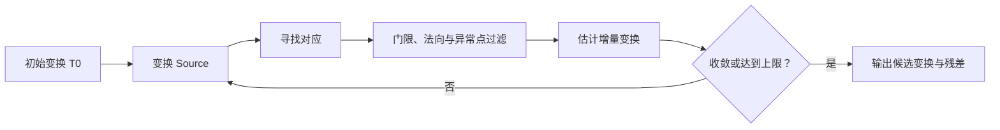
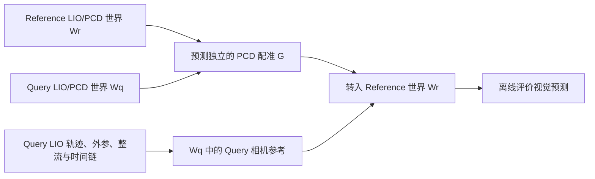

# 点云配准

点云配准要估计两个三维数据集之间的空间关系。它既可以是相邻扫描之间的小运动，也可以是两次独立采集之间的世界坐标对齐。两类问题都叫“配准”，但初值、重叠、外观变化和可用先验往往完全不同。

本文采用列向量。Source 点云记为 $P=\{p_i\}$，Target 点云记为 $Q=\{q_j\}$，待估变换为

$$
T_{T\leftarrow S}=
\begin{bmatrix}
R_{T\leftarrow S} & t_{T\leftarrow S}\\
0 & 1
\end{bmatrix},
\qquad
p_T=R_{T\leftarrow S}p_S+t_{T\leftarrow S}.
$$

也就是说，变换把 Source 中的点送到 Target 坐标系。明确这个方向，才能把算法输出接入后续的轨迹和传感器变换链。

## 1. 配准究竟在求什么

如果已经知道每个 $p_i$ 对应哪个 $q_i$，问题是**已知对应下的刚体估计**：找一个旋转和平移，让这些点对尽量重合。现实中的点云通常没有点级身份，采样也不一致，于是还要同时推断**哪些点可以对应**。未知对应使目标函数不再只是一次最小二乘，也带来了局部最优和重复结构歧义。

配准任务的条件随尺度变化：

| 任务 | 常见先验 | 主要困难 |
| --- | --- | --- |
| 帧到帧 | 相邻时刻运动较小 | 运动畸变、动态物体、几何退化 |
| 帧到地图 | 里程计或预测位姿 | 局部地图覆盖、实时性、错误关联 |
| 跨序列整图配准 | 起点、重力、楼层或粗位置可能已知 | 初值跨度大、覆盖不对称、重复结构、地图形变 |

相邻帧 ICP 能工作，并不意味着同一组参数可以直接解决跨序列整图配准。前者常由连续运动提供良好初值，后者往往先要解决“落在哪个房间、哪个朝向”的搜索问题。

## 2. ICP：交替建立对应与更新变换

Iterative Closest Point（ICP）的核心是交替执行两件事：

1. 用当前变换把 Source 放到 Target 附近，并寻找对应；
2. 固定当前对应，估计一个更好的刚体变换。

若当前绝对变换是 $T_k$，Source 点的最近邻可写为

$$
j(i)=\arg\min_j
\left\|R_kp_i+t_k-q_j\right\|_2.
$$

对应随 $T_k$ 变化，所以 ICP 不是先找一批永远不变的最近邻再一次求解。距离门限、互相最近邻、法向夹角和可见性等条件通常用于减少明显错误对应。

### 2.1 点到点 ICP

点到点目标直接惩罚三维距离：

$$
E_{p2p}(R,t)=
\sum_{i\in\mathcal I}w_i
\left\|Rp_i+t-q_{j(i)}\right\|_2^2.
$$

它不要求法向，含义直观，对稀疏点和各向同性测量较自然；但在平滑表面上，沿切平面的滑动也会产生三维残差，局部收敛可能较慢。

### 2.2 点到面 ICP

若 Target 对应点有可靠单位法向 $n_{j(i)}$，可以只惩罚沿法向的距离：

$$
E_{p2l}(R,t)=
\sum_{i\in\mathcal I}w_i
\left[n_{j(i)}^{\mathsf T}
\left(Rp_i+t-q_{j(i)}\right)\right]^2.
$$

在局部表面近似平面、法向估计稳定且初值已进入正确吸引域时，点到面形式通常更容易沿表面快速贴合。代价是法向半径、方向一致性和边缘处的不稳定都会进入优化；大范围错误对应不会因为改用点到面就自动消失。

### 2.3 已知对应时怎样由 SVD 求刚体变换

对已知点对，先计算加权质心 $\bar p,\bar q$，再中心化：

$$
p_i'=p_i-\bar p,
\qquad
q_i'=q_i-\bar q.
$$

由互协方差构造矩阵 $H=\sum_i w_i p_i'{q_i'}^{\mathsf T}$，对 $H$ 做 SVD。旋转由两个奇异向量矩阵组合，并在需要时修正行列式，避免得到反射；平移随后为

$$
t=\bar q-R\bar p.
$$

这一步解决的是“对应已知后”的最小二乘子问题。ICP 的主要不确定性仍包括当前对应是否正确、重叠区域是否充分，以及目标函数是否把真实关系表示出来。

### 2.4 绝对变换与增量更新

设 $T_k$ 已把原始 Source 变到 Target 附近，局部求解器在 Target 坐标中估计校正 $\Delta T_k$。此时常见更新是

$$
T_{k+1}=\Delta T_k T_k.
$$

左乘表示先用 $T_k$ 变换原始点，再在 Target 侧施加校正。若实现把扰动定义在 Source 或当前局部坐标中，也可能采用右乘；二者不能只交换代码中的乘法顺序而保持相同语义。调试时应写出一个点实际经过矩阵的顺序，而不是只记“增量左乘”这一句话。

### 2.5 预处理和对应过滤分别影响什么

| 处理 | 主要作用 | 不能替代什么 |
| --- | --- | --- |
| 体素下采样 | 控制计算量，降低局部密度偏置 | 恢复被遮挡区域或真实几何 |
| 法向估计 | 支持点到面残差和法向一致性检查 | 在退化平面上凭空增加约束 |
| 最大对应距离 | 限制当前迭代的搜索半径 | 在错误初值下找到远处正确位置 |
| 异常点剔除/trim | 减少动态点、非重叠区和离群对应影响 | 证明剩余对应属于真实同一结构 |
| 鲁棒核 | 降低大残差对局部估计的影响 | 消除重复结构中的一致假解 |

阈值应与点云尺度、体素大小、噪声和初值精度一起解释。门限太小会在初值尚粗时找不到对应，太大则容易跨墙、跨层或跨重复结构配错。

## 3. 初始化决定了 ICP 在哪里寻找答案

ICP 是局部迭代方法。若初值已把 Source 放到错误房间，最近邻和法向约束会围绕错误位置建立；增加迭代次数只会更充分地优化这个局部问题，不能把局部优化变成全局搜索。

### 3.1 质心对齐只是一个假设

点云质心是采样点的均值：

$$
\bar p=\frac{1}{N}\sum_{i=1}^{N}p_i.
$$

用 $\bar q-\bar p$ 初始化平移，隐含假设是两批点的空间覆盖和采样权重大致可比。质心不是固定物理地标：一条路线多看了一个房间、某段被遮挡、近处墙面采样更密或裁剪范围不同，都会移动质心。跨序列覆盖不对称时，质心对齐可能把本来重叠的地图推向错误重复结构。

### 3.2 四类失败不要混成一种

| 情况 | 本质 | 常见迹象 |
| --- | --- | --- |
| 初值不佳 | 正确解存在，但未进入其吸引域 | 换粗先验或扩大候选后可恢复 |
| 重复结构歧义 | 多个位置都产生相似局部几何 | 不同候选残差接近，局部叠图都“像是对的” |
| 几何退化 | 当前几何不能充分约束某些自由度 | 信息矩阵病态，沿走廊或平面方向漂移 |
| 低重叠 | 可建立的真实共同区域太少 | 双侧覆盖低，结果由小片区域主导 |

地图还可能存在非刚性形变：两次 LIO 地图各自在不同区域漂移，单个 SE(3) 无法让全场同时重合。此时局部残差小不代表全局有一个正确刚体变换，应观察残差随空间和路线位置的变化。

### 3.3 三种“成功”不是同一件事

- **算法收敛**：参数变化或目标下降达到停止条件；
- **目标函数较低**：在当前对应、阈值和覆盖下，所定义残差较小；
- **物理配准正确**：变换确实对应两个真实坐标系之间的关系。

前两项是数值事实，第三项是需要更多证据支持的几何结论。重复房间可以让错误候选稳定收敛并取得低残差；非重叠点被门限排除后，单侧指标也可能显得很好。

## 4. 粗配准先找候选，精配准再提高局部精度

跨序列配准常采用“粗到细”流程。粗阶段的目标不是给出最后几毫米，而是把一个或多个合理候选送入局部优化的吸引域。

### 4.1 粗配准可以从哪里来

- **运动或现场先验**：起点、楼层、重力方向、里程计、GNSS 或人工测量可以缩小搜索空间，但要记录精度和来源；
- **人工对应**：少量可辨识的非共线结构能直接给出候选，适合验证或困难数据，不应假装成自动方法；
- **FPFH + RANSAC**：先用局部几何描述子提出对应，再随机采样一致点集估计变换；描述子的可区分性和重叠决定候选质量；
- **Fast Global Registration（FGR）**：对候选对应使用鲁棒目标联合对齐和抑制错误匹配，适合快速产生粗候选；
- **多候选搜索**：对若干位置、朝向或特征假设分别精化，保留竞争解而非过早只选一个。

若重力方向已经由 IMU 可靠对齐，可以只枚举水平 yaw，再为每个角度估计平移和局部精化。这样的 yaw-grid 利用了“roll/pitch 已知”的约束，不是任意 6DoF 刚体问题的完整搜索；重力方向本身错误时，缩小搜索空间反而会排除正确解。

### 4.2 多尺度 ICP 的作用边界

多尺度方法先在较大体素和较宽对应门限上优化，再逐级减小体素与门限。粗层平滑局部细节并扩大一定的数值吸引范围，细层恢复更精确的表面关系。

它仍然围绕给定候选做局部精化。若粗层已对到另一个相似房间，或者正确位置根本不在搜索候选中，继续细化只会得到更精致的错误解。

### 4.3 GICP 与鲁棒核改善了什么

Generalized ICP（GICP）用局部邻域协方差描述点附近的表面结构，可把点到点和点到面的思想放进统一的概率几何形式。它能更合理地处理各向异性表面约束，但仍需要足够重叠和合理初始化。

鲁棒核把平方损失替换为 $\rho(r_i^2)$，让大残差的影响逐渐饱和。它适合降低离群点和部分非重叠的影响；若错误候选在重复结构上形成大量小残差，鲁棒核没有理由自动拒绝它。

“全局配准”通常指不依赖近真值初始位姿、在较大空间产生候选；“全局最优”是相对于某个明确数学目标和搜索域的优化保证；“找到真实对应”则是物理语义。三者不能互换。即使方法对其目标具有全局或可认证保证，错误对应、模型不满足、地图形变和真实场景歧义仍可能让数学最优解不是所需的物理解。

## 5. 配准结果如何验证

配准输出一个 $4\times4$ 矩阵并不表示任务结束。验收要回答：哪些区域真的相互支持、指标如何定义、是否存在同样合理的竞争候选，以及证据是否独立于最终用途。

### 5.1 残差和重叠必须带口径

给定距离门限 $\tau$，Source 到 Target 的单侧覆盖可以写为

$$
o_{S\rightarrow T}(\tau)
=\frac{1}{|P|}
\sum_{p_i\in P}
\mathbf 1\!\left[
\min_{q_j\in Q}\|T_{T\leftarrow S}p_i-q_j\|_2<\tau
\right].
$$

反方向 $o_{T\rightarrow S}$ 使用 Target 点数作分母，并应使用相反方向的变换。两者不同往往反映覆盖不对称。报告 `fitness`、inlier RMSE 或中位距离时，必须同时说明：

- 点到点还是点到面距离；
- 距离阈值与单位；
- 分母是全部 Source、全部 Target，还是过滤后的对应；
- 统计方向、体素大小和裁剪范围。

只报告一个单侧 fitness，可能掩盖“小地图完全落在大地图里，但大地图多数区域没有对应”的情况。

### 5.2 看空间分布，而不只看一个数

除了总体残差，还应观察：

- 双侧重叠以及重叠点在空间中的覆盖；
- 墙角、门框、立柱等局部结构是否在多个方向一致；
- 残差是否随位置系统性增大，提示非刚性漂移；
- 多个候选的分数差距和可辨识区域；
- 与起点、重力、控制点或路线拓扑等独立先验是否一致。

把点云叠在一起可发现明显错层、穿墙和局部错位，但漂亮截图也可能只展示有利视角。数值分布与空间检查应共同保留。

### 5.3 正反一致与多初值一致是什么证据

可以分别运行 Source→Target 和 Target→Source，得到 $T_{T\leftarrow S}^{fwd}$ 与 $T_{S\leftarrow T}^{rev}$，检查

$$
T_{S\leftarrow T}^{rev}T_{T\leftarrow S}^{fwd}\approx I.
$$

只有两次对应搜索和优化彼此独立，这才是数值重复性的证据。直接令 $T_{S\leftarrow T}^{rev}=(T_{T\leftarrow S}^{fwd})^{-1}$，再相乘得到单位阵，只验证了矩阵求逆。

多初值收敛到同一候选、独立正反估计接近、低残差和高重叠都会增加可信度，但任何一项都不能单独证明物理正确。若多个候选在现有证据下难以区分，应保留歧义、扩大独立观测，或拒绝冻结世界变换。

## 6. 点云世界对齐在定位参考链中的位置

两次 LIO 采集通常各有自己的世界坐标 $W_r$ 和 $W_q$。跨序列点云配准估计

$$
G=T_{W_r\leftarrow W_q},
$$

再把 Query 相机参考位姿转入 Reference 世界：

$$
T^{ref}_{W_r\leftarrow C_q}(t)
=G\,T^{ref}_{W_q\leftarrow C_q}(t).
$$

完整的 raw/rectified 相机链见[从 LIO 轨迹到相机参考位姿](../data-evaluation/从LIO轨迹到相机参考位姿.md)，参考资格、接受与正确的区分见[定位评估方法](../data-evaluation/定位评估方法.md)。这里有四条边界必须保持：

1. PCD 配准只估计世界之间的 $G$，不替代相机外参、整流和时间同步；
2. 点云残差混合采样、表面和地图误差，不能直接当作相机位姿误差上界；
3. 不得用被测 HLoc 的 Query 预测选择配准候选或拟合 $G$，否则评分参考会吸收预测信息；
4. LIO-derived reference 仍是带误差的估计，独立于视觉预测也不自动成为独立绝对 GT。

错误的 $G$ 会以公共左乘变换进入所有 Query 参考，因此可能让多种视觉方法表现出相似评分偏差。但“方法之间结果一致”本身不能证明参考一定错误：方法可能共享地图、标定、检索候选或其他系统误差，必须回到独立的点云与参考链证据审计。

## 7. 一个简化的两次室内采集案例

设 Reference 与 Query 是同一建筑内两次独立采集，都生成了 LIO 点云地图。两次路线有真实重叠，但覆盖范围、起点和采样密度不同。

第一次直接用质心平移加单位旋转初始化 ICP。由于 Query 多覆盖了一侧房间，质心发生偏移，最近邻从一开始就落在错误区域，ICP 很快停止且重叠很低。这个失败只说明该初值下的局部注册没有找到解，不能推出两次数据没有重叠。

第二次在重复走廊中给出另一个初值。局部墙面和门洞相似，ICP 收敛、残差也不高，却把 Source 对到了相邻走廊。数值收敛没有消除位置歧义。

更稳妥的处理是利用不读取视觉定位结果的粗先验限制楼层和大致区域，在重力已对齐的前提下提出多个 yaw/平移候选，分别做多尺度 ICP；随后比较双侧重叠、残差的空间覆盖、独立正反估计，并检查可辨识结构和路线拓扑。若一个候选在这些证据上稳定胜出，可以按限定覆盖冻结；若候选仍难区分，就保留歧义，而不是为了得到评分强行选择。

这个例子说明了三个层次：粗搜索负责“不漏掉正确吸引域”，局部 ICP 负责“精化候选”，独立证据负责“判断候选是否有资格代表世界关系”。

## 8. 延伸阅读与实现入口

| 资料 | 适合了解什么 |
| --- | --- |
| Besl 与 McKay，[A Method for Registration of 3-D Shapes](https://doi.org/10.1109/34.121791)，TPAMI 1992 | 经典 ICP 的迭代框架与局部收敛背景 |
| Segal、Haehnel 与 Thrun，[Generalized-ICP](https://www.robots.ox.ac.uk/~avsegal/resources/papers/Generalized_ICP.pdf)，RSS 2009 | 用局部协方差统一点到点与点到面思想 |
| Zhou、Park 与 Koltun，[Fast Global Registration](https://vladlen.info/publications/fast-global-registration/)，ECCV 2016 | 基于候选对应的快速鲁棒粗配准及官方代码入口 |
| Yang 等，[Go-ICP](https://www.cv-foundation.org/openaccess/content_iccv_2013/papers/Yang_Go-ICP_Solving_3D_2013_ICCV_paper.pdf)，ICCV 2013；扩展版 TPAMI 2016 | 分支定界如何在指定 ICP 目标下提供全局最优保证，以及保证的目标边界 |
| Yang、Shi 与 Carlone，[TEASER / TEASER++](https://github.com/MIT-SPARK/TEASER-plusplus)，T-RO 2020 | 高离群对应下的鲁棒、可认证估计及其假设和实现 |
| [Open3D ICP 教程](https://www.open3d.org/docs/release/tutorial/pipelines/icp_registration.html)与[全局配准教程](https://www.open3d.org/docs/release/tutorial/pipelines/global_registration.html) | 复现实用的点到点/点到面 ICP、FPFH、RANSAC、FGR 和局部精化流程 |

“全局最优”与“可认证”都应连同论文定义的目标、噪声模型、对应输入和假设阅读；它们不是对任意传感器数据、地图刚性或真实场景身份的无条件保证。
