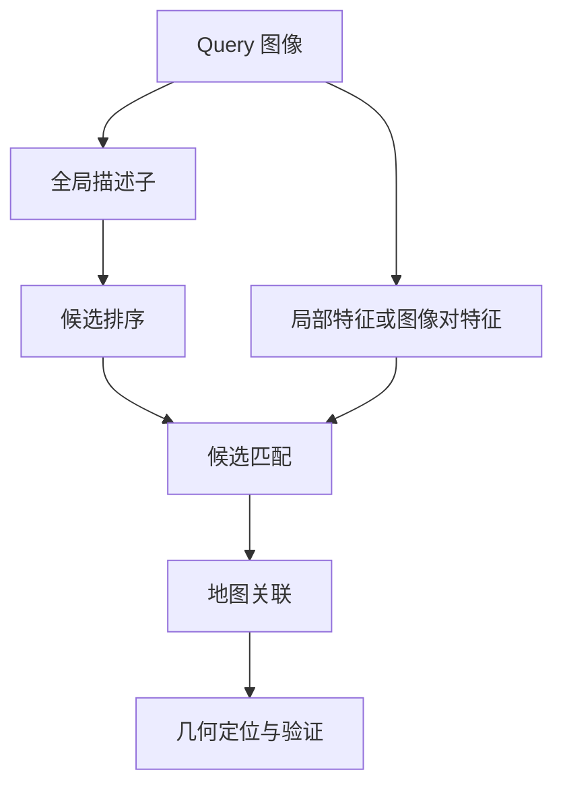

# 视觉地点识别与图像匹配

视觉地点识别回答“这张图像可能在哪里拍摄”，几何定位回答“相机在地图中的六自由度位姿是什么”。两者共享视觉信息，却使用不同输出、标签和评价标准。检索器更强，未必让整条定位流程同幅度提高。

对应的文献路线见论文总览的[检索与视觉地点识别](../papers/#topic-retrieval)和[局部特征与匹配](../papers/#topic-local-features)。本文主讲通用原理，单篇阅读笔记只分析具体论文的设计、训练和证据。

## 1. 三个任务分清楚

| 任务 | 输入 | 输出 | 常见判断 |
| --- | --- | --- | --- |
| 图像检索 | Query 与图像库 | 候选及排序 | 是否检索到符合定义的正样本 |
| 地点识别 | 当前观测与地点库 | 地点身份/候选 | 是否识别同一地点 |
| 几何定位 | Query、相机模型、几何地图 | 相机 SE(3) 位姿 | 位置与旋转是否满足阈值 |

相近拍摄位置未必有共同视野；同一个房间中朝向相反的图像，也可能没有足够对应。反过来，较远相机可能看到同一立面，仍能支持匹配。

因此检索“正样本”必须明确采用空间邻近、视觉重叠、地点身份还是其他定义。不能直接用 PnP 成功反向定义独立检索真值，否则检索指标会混入 matcher 和地图能力。

## 2. 全局与局部描述子

全局描述子把一张图编码为一个向量 $g(I)\in\mathbb R^D$，便于搜索大量图像。局部描述子为不同位置生成 $d_k\in\mathbb R^d$，用于定位具体对应。

全局向量省去了逐点比对，代价是压缩很多空间细节；局部对应保留位置，需要处理遮挡、歧义和几何验证。维度更高不保证更准确，描述子距离也不是米制距离。

## 3. BoW：从局部描述子到视觉词

### 3.1 词典与量化

传统 BoW 把局部描述子分配到视觉词，得到词频直方图。连续描述子可用聚类中心或层次词典量化；二进制描述子通常采用适合 Hamming 空间的词典设计，不能默认直接套同一欧氏 k-means。

词典学习、描述子种类、距离和词频规则一起定义系统。自建词典不自动等价于产品 RTAB-Map 的词典与检索行为。

### 3.2 TF-IDF 与倒排索引

常见的一种权重写法：

$$
w_{k,I}=\operatorname{tf}(k,I)\log\frac{N}{n_k+\epsilon}.
$$

TF 描述词在图中的频率，IDF 降低到处都出现的词的权重。真实实现可能使用不同平滑和归一化，以上是概念公式。

倒排索引按词记录出现它的图像，减少全库扫描。BoW 保留词频，通常不保留完整几何布局，因此相似墙面、重复窗户可能造成混淆；几何验证负责进一步排除。

## 4. VLAD 与 NetVLAD

### 4.1 VLAD 为什么比词频多一点信息

BoW 主要统计“落到哪个词”，VLAD 还聚合描述子相对词中心的残差：

$$
V_k=\sum_{i:\operatorname{assign}(d_i)=k}(d_i-c_k).
$$

把各 $V_k$ 拼接并归一化形成全局向量。它保留对聚类中心的细粒度偏离，但一般仍不显式输出像素对应。

### 4.2 NetVLAD：可学习的软分配

NetVLAD 用可微软分配替代硬分配，和图像特征网络一起训练：

$$
a_k(d_i)=\frac{\exp(w_k^{\mathsf T}d_i+b_k)}
{\sum_{k'}\exp(w_{k'}^{\mathsf T}d_i+b_{k'})},
$$

$$
V_k=\sum_i a_k(d_i)(d_i-c_k).
$$

常见处理包括簇内归一化、拼接后 L2 归一化和可选降维。输出维度取决于簇数、局部维度与投影，并非 NetVLAD 永远只有一个固定维度。

NetVLAD 是聚合层/架构思想；工程里“用 NetVLAD”往往指一个具体 backbone、权重、预处理与降维配置。模型名称相同但权重不同，效果也可以不同。

## 5. MegaLoc 与 NetVLAD 在哪里不同

两者都用于全局检索，不直接解 PnP。MegaLoc 的公开模型使用 DINOv2 风格 ViT 特征及基于最优传输的聚合，最终形成归一化全局向量；官方示例为 8448 维、322×322 输入及 ImageNet normalization。

这与 NetVLAD 的软分配残差聚合不同，也涉及不同训练目标和训练数据。不能简化成“MegaLoc 是维度更大的 NetVLAD”，或“Transformer 必然胜过 CNN”。历史 NetVLAD 配置也不是全部 NetVLAD 设计的性能上界。

最优传输聚合的直观意思是：将 patch 特征分配到聚合槽时同时施加总体分配约束，而不是每个特征完全独立做一次最近中心决策。具体约束、dustbin 和求解迭代取决于网络实现。

[官方实现](https://github.com/gmberton/MegaLoc)适合核对模型输入输出；当前代码或权重更新不代表历史实验版本自动更新，实验必须固定 commit 和权重哈希。

## 6. 度量学习学到的是什么

检索训练希望正样本靠近、负样本远离。典型 triplet loss：

$$
L=\max\left(0,d(g_q,g_+)^2-d(g_q,g_-)^2+m\right).
$$

m 为 margin。对比学习也可用 softmax 形式：

$$
L_q=-\log\frac{\exp(s(q,+)/\tau)}{\sum_j\exp(s(q,j)/\tau)}.
$$

温度 $\tau$ 控制分数尺度，负样本集合与正样本定义决定网络学到的判别规则。难负样本有助于区分相似地点，但标签错误会让网络学错关系。

弱监督地理位置标签便于扩大训练规模，却可能包含无重叠图像。不同任务和训练分布会影响室内、跨光照、重复结构等场景的泛化。

## 7. 向量搜索与候选排序

归一化后：

$$
\|g_q-g_r\|_2^2=2-2g_q^{\mathsf T}g_r.
$$

所以单位向量的 L2 距离与余弦/内积排序等价。未归一化时不成立，索引的度量也必须匹配。

精确扫描复杂度约 $O(MD)$，M 为库图数。ANN 用索引换取速度与存储，但可能丢失真实近邻；模型效果和索引近似误差要分开测。Faiss 是向量索引工具，不是图像描述子模型。

增加 K 给后续匹配更多候选，也增加成对计算和歧义。最终定位不一定单调改善：混入错误对应或地图点可能改变鲁棒求解。是否汇总所有候选、逐候选求解或按分数提前停止，也会影响结果。

## 8. 局部 detector 与 descriptor

### 8.1 Detector：在哪里取点

角点检测常利用图像梯度结构矩阵：

$$
M=\sum_{x\in\Omega}w(x)
\begin{bmatrix}I_x^2&I_xI_y\\I_xI_y&I_y^2\end{bmatrix}.
$$

两特征值都大表示两个方向都存在变化，适合作角点；一个大一个小更像边缘。GFTT/相关角点方法由此选择可追踪位置。

repeatability 表示不同视角下能否检测到同一物理结构，不等于检测分数高，也不等于描述子一定区分得开。

### 8.2 Descriptor：怎样描述点附近

ORB 用局部强度比较形成二进制描述子，常用 Hamming 距离。SIFT 聚合局部梯度方向形成浮点表示。学习式特征从训练数据学习对光照、视角等变化的适应能力。

SuperPoint 联合输出关键点与描述子；XFeat sparse 和 RDD 等也属于学习式局部特征路线。具体维度、检测预算、resize、NMS、权重和 matcher 兼容性需按配置明确。

detector、descriptor、matcher 是三个职责，一个网络可以覆盖多个职责，但名字不能替代接口定义。

## 9. 最近邻、ratio test 与 MNN

nearest neighbor 按距离为点寻找最相似候选。ratio test 用最近与次近距离判断歧义：

$$
\frac{d_1}{d_2}<\tau_r.
$$

比较的是非负距离，不应将余弦相似度直接原样代入。相似度可先转换为适当距离，且零距离/并列候选要有处理规则。

MNN 要求两个方向互为最近邻。这是传统匹配规则，没有训练参数；它减少一部分多对一歧义，但错误重复纹理也可能互为最近邻。

因此 MixVPR + XFeat + MNN 中，前两项使用网络，最后一项是规则。相似度矩阵在 GPU 上计算，不意味着它成为神经网络。

## 10. LightGlue：利用上下文判断对应

独立描述子距离只看两个点，学习 matcher 还可利用点之间的上下文及两图交互。attention 的一般形式是：

$$
\operatorname{Attention}(Q,K,V)
=\operatorname{softmax}\left(\frac{QK^{\mathsf T}}{\sqrt d}\right)V.
$$

self-attention 建立同图上下文，cross-attention 建立跨图信息。上式解释通用运算，不是完整 LightGlue 模型。

LightGlue 自适应调整处理的关键点数量与层数：point pruning 减少后续计算点数，early exit 提前结束计算。它是输入相关的计算裁剪，不是永久删除权重。最终低置信匹配过滤则发生在输出端，不能收回已完成的前向成本。

难图可能需要更多层，也可能较早排除许多点；速度需要结合实际点数、层数和运行模式测量。模型匹配分数也不能直接当位姿正确概率。

## 11. Detector-free、semi-dense 与 dense

detector-free 指不依赖传统的“先独立检测两组稀疏关键点，再匹配”入口，不等于没有特征提取。LoFTR 类一般从粗网格建立交互对应，再精化坐标；RoMa 类预测密集对应映射及可靠性，再按需求采样。

| 表述 | 修饰对象 | 不意味着什么 |
| --- | --- | --- |
| sparse matching | 稀疏选点位置上的对应 | 三维地图必定很小 |
| semi-dense matching | 更广图像区域/网格上的有效对应 | 所有低纹理位置都可靠 |
| dense matching | 稠密位置上的映射预测 | 每个像素都有真实对应 |
| detector-free | 匹配的前置组织方式 | 网络不提取特征 |

最终采样 5000 点，不会把 dense 方法改名成 sparse，也不表示前向只算了 5000 个位置。

### 11.1 Warp 与 flow

$$
W_{A\to B}(u,v)=(u',v'),
\qquad F(u,v)=W(u,v)-(u,v).
$$

W 保存目标位置，F 保存位移。若 $W(100,80)=(120,85)$，flow 为 $(20,5)$。遮挡、出视野或无重叠位置没有可靠的真实对应。

按映射采样 B 得到对齐到 A 网格的图像：

$$
\hat I_A(u,v)=I_B(W_{A\to B}(u,v)).
$$

通常需要插值。这是从 B 拉取像素；不要将坐标场方向和图像采样方向混淆。网络归一化坐标转像素还要核对 `align_corners` 等约定。

## 12. 为什么检索更好未必定位更好

整体成功是多个条件共同成立：候选有足够共同视野，匹配正确，Reference 对应有地图点，几何条件足够，求解与接受通过。

对于一个要求候选存在的标准流程，可用条件概率解释：

$$
P(S)=P(A)P(B\mid A)P(C\mid A,B)P(S\mid A,B,C).
$$

A/B/C 分别代表候选、匹配和地图支持等必要事件；这只是链式法则，没有假设各阶段独立。

检索改善 Top-1，但两套 Top-20 都已有可用候选时，最终成功可能不变。识别了正确房间，但朝向和重叠不足时，PnP 仍失败。地图覆盖差时，正确匹配也无法转成 2D–3D。

检索、匹配和地图支持因此要分层评价。检索模型的受控对照、Top-K 漏斗与具体 HLoc 实验归因见[如何选择视觉重定位 Pipeline](../hloc/如何选择视觉重定位Pipeline.md)；这里不从某次实验的最终成功率反推某个表征模型的普遍能力。

下一步可阅读[从图像对应到相机位姿](./从图像对应到相机位姿.md)。地图如何保存二维观测与三维关联见[地图到底存了什么](./地图到底存了什么.md)。
