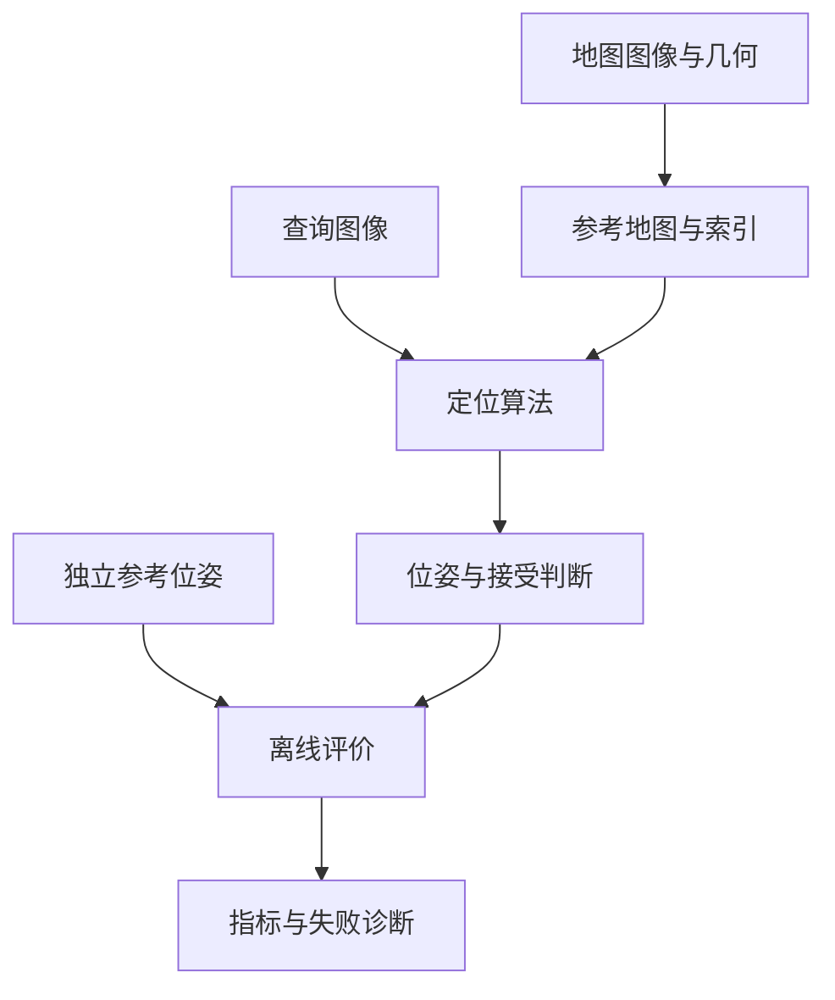
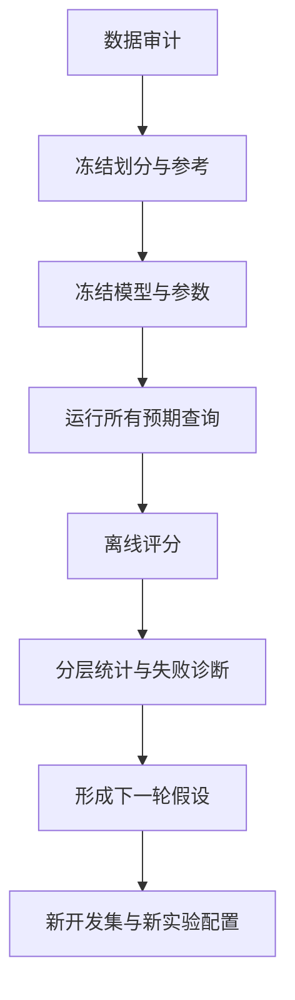

# 如何完成一次评估

跑通一个 SLAM 或重定位算法后，最直接的做法是画轨迹、计算 ATE，再和另一条算法比较。但一个数字往往回答不了真正的问题：算法有没有恢复正确的全局位置？失败帧有没有算进去？轨迹对齐有没有把定位错误消掉？作为“真值”的轨迹本身可靠吗？

评估可以看成一条独立的数据处理链：把任务、参考、坐标与统计规则统一起来，再把算法输出转换成能解释的指标。本篇从这些基础概念展开，最后记录一次点云配准失败带来的工程教训。

## 1. 首先明确：评估的是哪个问题

SLAM、里程计、回环和重定位可能共用不少模块，但不应使用同一套指标回答所有问题。

| 任务 | 核心问题 | 主要观察 |
| --- | --- | --- |
| VO/VIO / LiDAR odometry | 连续运动估计是否准确 | 局部漂移、轨迹误差、跟踪丢失 |
| SLAM | 地图和运动能否长期保持一致 | 轨迹、回环、地图一致性、运行稳定性 |
| 地点识别 | 是否找到包含同一地点的参考图 | Recall@K、检索排名、误检 |
| 视觉重定位 | 能否恢复已有地图中的相机 6DoF 位姿 | 联合位姿成功率、错误接受、恢复时间 |
| 导航定位系统 | 能否持续提供及时可信的位置 | 全局质量、连续性、延迟、失效恢复 |

**6DoF** 是三维平移加三维旋转。评估视觉重定位时，不能用融合里程计或全局图优化后的轨迹，替代想要研究的单帧视觉结果。研究完整系统时则可以包含这些模块，但要承认评估对象变了。

同样，单帧方法输出看起来连续，不表示它使用了时序跟踪；全局轨迹很好，也不表示单次回环或重定位约束可靠。

### 1.1 把“输出”“接受”“正确”拆开

对每帧至少保留三个信息：

- **raw pose**：几何求解器给出的候选位姿。
- **decision**：算法是否接受该结果，以及拒绝原因。
- **correctness**：离线用参考位姿判断是否正确。

求解器返回有限数值，只说明得到了一个数值解。accepted 只说明算法自己的门槛通过了。真正的正确性需要独立评价。

接受规则必须写成可执行条件，而不是一句“PnP 成功”。例如工程中使用过的 `accepted@20` 是：位姿数值有限，且 RANSAC 后至少有 20 个**唯一 Point3D** 内点。这里的“唯一”用于避免同一个地图点经多个参考观测被重复计数。它仍只是几何支持门槛，不是正确性证明；内点空间集中、重复结构或错误 2D–3D 关联仍可能产生错误接受。

这三个层次拆开后，才能区分“根本没有求解成功”“正确结果被拒绝”“错误结果被接受”。

## 2. Ground truth：真值也是一套系统

Ground truth（GT）是用于评价的参考状态。它可能来自运动捕捉、测量控制点、高精度组合导航、经过认证的测量系统，也可能只是另一条 SLAM 轨迹。

| 参考来源 | 优点 | 需要检查 |
| --- | --- | --- |
| Motion capture | 室内可提供高质量连续位姿 | 工作范围、遮挡、刚体与传感器外参 |
| 高精度 GNSS/INS | 大范围独立参考 | 信号环境、固定解状态、杆臂与时间 |
| 测量控制点/人工测量 | 几何可独立验证 | 是否只有位置、覆盖与采样密度 |
| LiDAR SLAM | 可提供丰富空间几何和轨迹 | 漂移、退化、时间、外参与对齐 |
| 视觉 SLAM | 已有数据容易利用 | 与被测视觉方法的相关误差 |

使用独立传感器，不自动等于拥有可靠真值。LiDAR SLAM 也会漂移，地图也可能发生非刚性形变。真值的资格取决于整个链路能否验证，而不是文件名是否写着 `gt`。

### 2.1 参考误差会限制评价的分辨能力

若参考本身有约 10 cm 的不确定性，就很难据此判断两个算法之间 1 cm 的精度差异。即使测得的残差很小，也可能是算法与参考共享了同一种系统误差。

例如地图位姿和评分位姿都来自同一视觉 SLAM，视觉几何误差可能在两边相关。结果可用于同一参考下的相对比较，却不足以证明独立绝对精度。

这类参考通常称 **proxy**：代理参考。它的价值在于让不完整数据仍能回答有限问题，而不是把不确定性变成不存在。

### 2.2 地图几何和 Query 真值是不同角色

地图集的轨迹可以参与建立参考地图；Query 真值不能进入待评价的推理过程。



不要用 Query 真值筛候选、选多个 PnP 解中最好的一个，或调整接受阈值。这些操作会把评价信息注入算法，得到虚高结果。

## 3. 坐标系：先统一含义，再计算误差

约定 $T_{A\leftarrow B}$ 把 B 坐标中的点变到 A 坐标：

$$
p_A=R_{A\leftarrow B}p_B+t_{A\leftarrow B}.
$$

齐次矩阵属于 $SE(3)$：

$$
T=\begin{bmatrix}R&t\\0&1\end{bmatrix},\qquad R^\top R=I,\quad\det R=1.
$$

变换的下标能直接帮助检查乘法：

$$
T_{map\leftarrow camera}=T_{map\leftarrow imu}T_{imu\leftarrow camera}.
$$

中间 imu 对应消去，得到 camera 到 map 的变换。矩阵乘法不交换，乘反通常仍能得到一个形状正确的 4×4 数组，但物理意义已经错了。

### 3.1 world-to-camera 的平移不是相机世界位置

几何库常输出：

$$
p_c=Rp_w+t.
$$

这是 world-to-camera。令相机中心投影到相机原点，得到：

$$
C_w=-R^\top t.
$$

因此不能直接把 t 与参考轨迹中的世界位置相减。比较前最好统一成 camera-to-world/map，再提取相机光心位置。

### 3.2 四元数、单位和参考点

常见错误包括：

- 把 `xyzw` 与 `wxyz` 混用。
- 未归一化四元数，或使用错误的旋转矩阵转换公式。
- 一个文件以毫米记录，另一个以米记录。
- 一个位置是 IMU 原点，另一个是相机光心。
- 原相机、整流相机使用了不同外参，却被当作同一个坐标系。
- 左右手坐标、光学坐标和机体坐标轴约定不一致。

小的旋转外参错误也会通过杆臂影响位置。例如传感器原点之间有固定偏移，机器人转动时两个原点的世界轨迹并不相同。

检查变换时可以选择几个已知点、单位轴和静止帧，手工验证方向，再画 XYZ 随时间变化。数值能跑通不是坐标正确的证据。

## 4. 时间关联：同一位置不代表同一时刻

预测和参考通常不是完全相同频率，必须规定时间关联方法。

### 4.1 最近邻与插值

最近邻关联简单，但要设最大时间差。插值则需要限制两端样本间隔：位置可线性插值，旋转用 SLERP，不直接插值欧拉角。

时间偏移 $\Delta t$ 在局部近似产生：

$$
\Delta p\approx v\Delta t,\qquad\Delta\theta\approx\omega\Delta t.
$$

速度越快，时间错位越容易表现成定位误差。高速旋转时，即使位置变化不大，旋转误差也会明显增加。

注意设备时间、主机接收时间、录包时间和回放调度时间是不同对象。回放时间只控制请求到达，不应重复施加已经补偿过的传感器偏移。

### 4.2 图像预处理也属于几何契约

已整流图像不能重复去畸变；resize、crop、padding 必须同步变换内参和像素坐标。

若横纵尺度分别为 $s_x,s_y$，仅缩放时：

$$
f_x'=s_xf_x,\quad f_y'=s_yf_y,\quad c_x'=s_xc_x,\quad c_y'=s_yc_y.
$$

裁剪还要减去裁剪原点，padding 要加偏移。更精确的像素中心约定也要与图像库一致。

“2 px 重投影阈值”必须说明是模型输入图还是原始图。否则同一数字在不同分辨率下代表不同角度容差，比较并不公平。

## 5. ATE：绝对轨迹误差与坐标对齐

ATE（Absolute Trajectory Error）用于观察预测轨迹相对参考轨迹的误差。常见位置形式是：

$$
e_i=\|p_i^{pred}-p_i^{ref}\|_2,\qquad\mathrm{RMSE}=\sqrt{\frac{1}{N}\sum_i e_i^2}.
$$

ATE 的含义离不开“是否对齐”和“在什么样本上统计”。

### 5.1 为什么 SLAM 常需要对齐

SLAM 地图的原点和朝向通常任意，预测与参考即使形状相同，也可能差一个固定刚体变换。对自由坐标系的轨迹，用 $SE(3)$ 对齐消除这个 gauge freedom 是合理的。

纯单目重建还存在尺度不确定性，可能需要 $Sim(3)$：旋转、平移加统一尺度。

| 对齐 | 消除什么 | 适用问题 |
| --- | --- | --- |
| 无对齐 | 不消除全局偏差 | 已知地图中的绝对重定位 |
| SE(3) | 整体旋转与平移 | 比较自由原点的米制轨迹形状 |
| Sim(3) | 再消除统一尺度 | 存在尺度自由度的单目轨迹 |

双目/VIO/LiDAR 等米制方法若随意使用自由尺度对齐，会掩盖尺度问题。全局重定位已经应输出既定地图坐标，若再次拟合预测轨迹，可能把真正的全局定位错误消掉。

因此可以同时保留无对齐误差和对齐后的形状诊断，但二者要分别解释。

### 5.2 对齐数据也会影响结果

用整条测试预测拟合变换，与用独立控制点确定地图关系，不是同一种证据。前缀拟合、全序列拟合与独立地图对齐也不等价。

对齐不是“让图好看”的绘图步骤，它是一项评价操作，应记录变换、拟合样本和尺度是否固定。

## 6. RPE：比较局部相对运动

RPE（Relative Pose Error）先计算两时刻之间的运动，再比较预测和参考：

$$
\Delta T_{ij}=T_i^{-1}T_j,
$$

$$
E_{ij}=(\Delta T_{ij}^{ref})^{-1}\Delta T_{ij}^{pred}.
$$

平移 RPE 取 E 的平移范数；旋转 RPE 取其旋转角。单位分别是 m/pair、deg/pair。若按时间或距离归一化，要另说明单位。

RPE 对整体左乘一个固定世界变换不敏感，因此能反映局部运动一致性。但“固定间隔”必须定义：相邻帧、1 秒、10 米路径长度会得到不同结果。

配对时不要跨输出缺失随意连接，也不要将缺失当作零误差。此前工程评分采用的口径是：只有原始 frame ID 连续，且两帧都有 solver output，才构成一对 RPE；它不是“把任意相邻可评价帧连起来”。应同时报告潜在配对数、有效配对数和覆盖率，否则轨迹经常断裂的方法可能因为只留下容易段而显得很好。

ATE 与 RPE 是互补诊断。重定位最重要的全局正确性与恢复能力，仍不能只靠两者概括。

## 7. 重定位质量：用联合阈值评价

统一预测和参考的 camera-to-map 后，平移误差：

$$
e_t=\|p_{pred}-p_{ref}\|_2.
$$

旋转误差：

$$
e_R=\arccos\left(\operatorname{clamp}\left(\frac{\operatorname{tr}(R_{ref}^{\top}R_{pred})-1}{2},-1,1\right)\right)\frac{180}{\pi}.
$$

成功要求两者同时过门槛。只评价位置可能漏掉朝向严重错误，直接比较欧拉角差又会受角度周期和奇异性影响。

### 7.1 多档阈值没有统一行业数值

常见做法是报告精细、中等、粗粒度的累计成功率，便于观察不同精度要求。

例如室内工程可设精细 0.25 m/2°、主成功 0.5 m/10°、粗边界 1 m/20°。这只是一个实例；车辆、机器人室内导航和室外地点定位的误差预算不同，不应直接照搬。

先区分两个输入分母：$N_{all}$ 是全部 Query 数，$N_{eval}$ 是具有冻结 GT/Proxy、能够评价正确性的 Query 数。再令 $A_{eval}$ 为其中被接受的数量，$C_\tau$ 为被接受且满足联合阈值 $\tau$ 的数量：

$$
\mathrm{Recall}_\tau=\frac{C_\tau}{N_{eval}},\qquad
\mathrm{Precision}_\tau=\frac{C_\tau}{A_{eval}}.
$$

召回问“所有可评价查询中成功多少”，精度问“被接受且可评价的结果中正确多少”。$A_{eval}=0$ 时 Precision 没有定义，应为 N/A。另行报告 `Acc_all=A_all/N_all` 和 `Acc_eval=A_eval/N_eval`，能避免把“输出得多”误写成“定位得准”。

### 7.2 错误接受有两个常用分母

设超过粗错误边界的已接受、可评价结果数为 FP：

$$
\mathrm{FA}_{all}=\frac{FP}{N_{eval}},\qquad
\mathrm{FA}_{accepted}=\frac{FP}{A_{eval}}.
$$

前者反映每个输入遇到危险错误的频率，后者反映已接受输出中危险错误的占比。这不是分类学的 `FP/(FP+TN)`，不宜混称 FPR。

例：100 个可评价 Query 中接受80帧，70帧满足严格阈值、5帧只落在严格与粗阈值之间、5帧超过粗边界。Recall=70%，Precision=87.5%，FA_all=5%，FA_accepted=6.25%。

只满足粗标准的帧降低严格 Precision，却未必属于粗边界之外的危险 FP。因此 Recall、Precision 和危险接受要并列。

### 7.3 正确性分母由数据决定，不能由算法决定

有参考的帧即使算法读图失败、无解、超时，也保留在 $N_{eval}$ 中计失败。缺参考的帧不计算位姿正确性，但仍属于 $N_{all}$，要统计输入、输出、几何支持和性能。

如果某算法只保留成功输出再算 RMSE，其误差可能很好，实际恢复能力却很差。有限误差、成功率和参考覆盖率必须一起看。

## 8. 序列恢复：从“成功一次”到“持续可用”

Sequence success 可定义为序列至少一次正确接受。它适合判断是否恢复过，但很容易饱和：每个方法都成功一次，就不能区分稳定性。

还要观察：

| 指标 | 含义 |
| --- | --- |
| 首次 accepted | 算法第一次愿意输出可信位置，可能仍然错误 |
| 首次正确 accepted | 首次真正恢复 |
| TTFR_data | 为恢复需要观察多久的数据 |
| TTFR_wall | 用户实际等多久，含计算和排队 |
| 恢复距离 | 到首次正确帧的累计运动路程 |
| 最长连续失败 | 最坏情况下多久没有正确输出 |
| 恢复后保持率 | 首次恢复以后正确输出的比例 |
| 连续错误事件 | 错误接受持续多少帧、多长时间 |

未恢复不填 0 秒，应记录为未恢复，并保留在成功率分母中。数据时间为0，也可能是首帧就能定位，但程序实际花了几秒计算。

## 9. 数据不完整时，怎样做仍有价值的评估

面对旧数据，不必在“拥有完美真值”和“完全不能评估”之间二选一，可以分层回答问题。

### 9.1 第一层：不依赖位姿真值

可观察输出率、匹配数、独立2D–3D支持、内点率、重投影、空间覆盖、重复运行差异、耗时和资源。

它们解释内部行为，但不能直接命名为定位正确率。大量内点也可能支持重复结构上的错误位置。

### 9.2 第二层：固定代理参考

若两条序列各有最终视觉轨迹、LiDAR地图及视觉—LiDAR对齐，可以先独立注册两张点云，建立跨序列关系，再把查询轨迹变换到参考地图。

$$
T_{V_r\leftarrow V_q}=T_{V_r\leftarrow L_r}T_{L_r\leftarrow L_q}(T_{V_q\leftarrow L_q})^{-1},
$$

$$
T_{V_r\leftarrow C_q}^{proxy}=T_{V_r\leftarrow V_q}T_{V_q\leftarrow I_q}T_{I_q\leftarrow C_q}.
$$

V 表示视觉地图，L 表示 LiDAR地图，I 表示 IMU，C 表示相机。链路中的每一段都可能带入误差。

跨序列变换应只用独立几何和已有元数据估计，然后对全部被测算法冻结。不要用被评价预测轨迹拟合出“真值”，否则评价形成循环。

### 9.3 第三层：升级到独立参考

得到更完整的原始传感器数据、可验证外参与同步，以及独立轨迹后，再建立更强的参考。

代理和独立参考的得分不要直接拼在一起。参考改变，分数含义也改变。旧阶段仍有价值：它帮助找瓶颈、验证工具链和提出下一轮问题。

## 10. 点云配准：ICP 为什么经常需要好初值

ICP（Iterative Closest Point，迭代最近点）通常反复做两件事：根据当前变换找对应；固定对应求更好的刚体变换。

点到点目标：

$$
\min_{R,t}\sum_i\|Rp_i+t-q_{\operatorname{NN}(Rp_i+t)}\|^2.
$$

点到平面目标则最小化沿目标法向的残差：

$$
\min_{R,t}\sum_i\left[n_i^\top(Rp_i+t-q_i)\right]^2.
$$

后者常能在初值较好、表面法向可靠时更快精化，但平面或走廊结构也可能约束不足。

### 10.1 ICP 是局部优化，不是全局搜索

初始旋转或平移太远时，最近邻对应可能本来就错；错误对应又将变换拉向错误极小值。低重叠、重复墙面、动态物体和地图形变也会造成问题。

一次 ICP 失败，不能直接推出“两个序列不重叠”。一次低残差，也不能直接推出“配准正确”。

常见流程是：下采样与法向/特征→全局初始化→多尺度局部精化→验证。

| 组件 | 思路 | 注意点 |
| --- | --- | --- |
| FPFH + RANSAC | 局部几何特征建立候选对应、鲁棒估计刚体 | 重复结构、特征质量与搜索预算 |
| Fast Global Registration | 根据特征对应估计全局变换 | 错误对应与几何覆盖 |
| 占据栅格相关搜索 | 用空间占据分布搜索较大范围的对齐 | 栅格分辨率、旋转搜索与重复布局 |
| ICP/GICP | 在局部范围精化配准 | 初始化、协方差/法向与退化 |

[Open3D](https://www.open3d.org/) 适合快速搭建点云配准实验；[PCL](https://pointclouds.org/) 常用于 C++ 点云处理工程。库提供算法实现，不替代数据资格判断。

### 10.2 配准验证至少看四类证据

1. **残差与双侧重叠**：避免“小点云对上大地图的一小块”就被判断为整体成功。
2. **多初始化稳定性**：不同初值是否收敛到同一变换簇。
3. **独立正反向一致性**：分别估计两个方向，检查是否近似互逆；不能拿正向结果求逆冒充独立反向。
4. **空间局部与闭环一致性**：残差是否集中在某区域、多序列图路径是否相互一致。

最后仍要叠图看墙角、结构、覆盖边界和动态干扰。重复结构可能让多个错误变换形成自洽闭环，因此闭环小误差只是支持证据。

### 10.3 一次实际教训：工具失败与数据失败分开

我曾用较弱的初始化注册两条序列，失败后倾向于认为数据不匹配。后来对六个序列做完整审计：15对点云、独立双方向、每方向三个初值，共90次尝试。加强占据初始化并做多尺度精化后，原来失败的一对得到约0.11 m的双向中位残差。

这修正了“点云不可注册”的判断，但没有自动证明该序列可用于定位评分：同一序列的视觉—LiDAR对齐尾部仍达到米级。点云能对齐与相机参考链可靠，是两个不同问题。

我从中得到的通用规则是：先排查搜索范围和初始化，再判断数据；再分别判断跨地图注册、传感器参考链和最终评分资格。无法证实的情况保留“未确定”，不要把工具的一次输出升级成数据结论。

## 11. 常用工具在评估体系里的位置

| 工具 | 主要用途 | 它不替你决定的事情 |
| --- | --- | --- |
| [evo](https://github.com/MichaelGrupp/evo) | 轨迹读取、时间关联、ATE/RPE、对齐与绘图 | 真值资格、任务应否对齐、失败分母 |
| Open3D / PCL | 点云查看、几何处理、配准 | 配准是否代表真实场景关系 |
| NumPy / SciPy | 坐标转换、统计、插值和评分 | 坐标语义是否正确 |
| Matplotlib / Plotly | 轨迹、误差、分布与时间线 | 样本是否被选择性省略 |
| ROS bag / rosbag2 | 回放传感器输入、记录系统输出 | 回放负载是否等价真实部署 |

轨迹导出为TUM格式时，一行通常为：

```text
timestamp tx ty tz qx qy qz qw
```

格式正确仍要检查 frame、单位、原点和时间戳。使用 evo 之前尤其要确定是否启用对齐或尺度校正，不要把默认命令当作实验定义。

## 12. 让一轮评估可复现

可复现不意味着保留所有临时文件，而是让每个指标能够追到输入、配置和逐帧结果。



至少保存数据清单、图像哈希、坐标变换、时间关联、模型与代码版本、地图制品、逐候选计数、逐帧输出和接受原因。

同一序列的多个随机种子是求解重复，不是多个独立场景；视频相邻帧也不是独立样本。汇总时可同时看序列等权宏平均与帧等权微平均，配对统计新增成功/退化，而不是只选择最有利一次。

看过测试结果后提出的新参数，在下一轮开发集上选择，再用新留出数据验证。工程迭代可以频繁，测试结果的独立性仍需要明确维护。

真正有帮助的评价最终会告诉我：能力提升发生在哪里，失败来自哪一层，以及下一次采集或实现最该补什么。

下一篇：[如何选择视觉重定位Pipeline](./如何选择视觉重定位Pipeline.md)。性能评估另见：[效果与性能权衡](./效果与性能权衡.md)。
