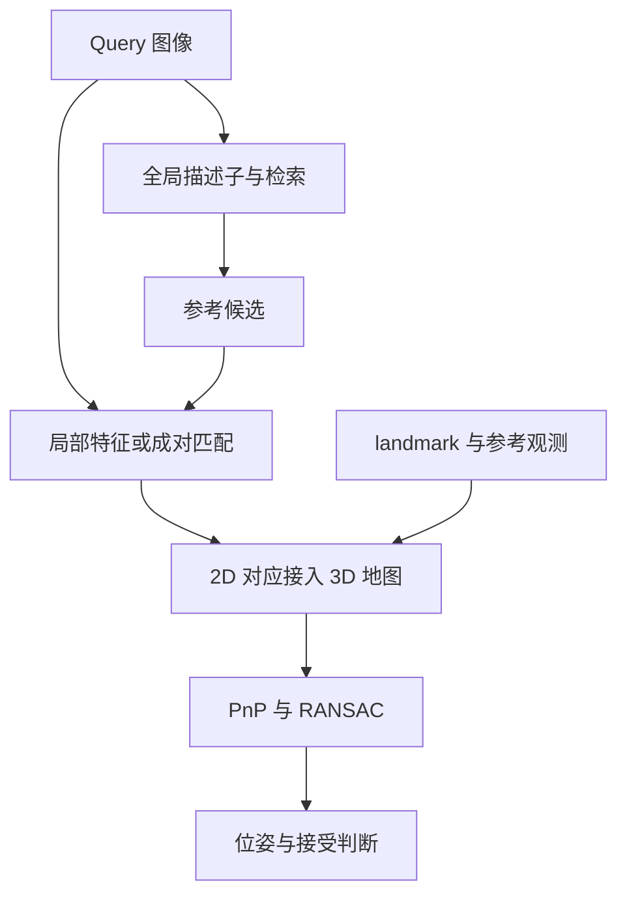
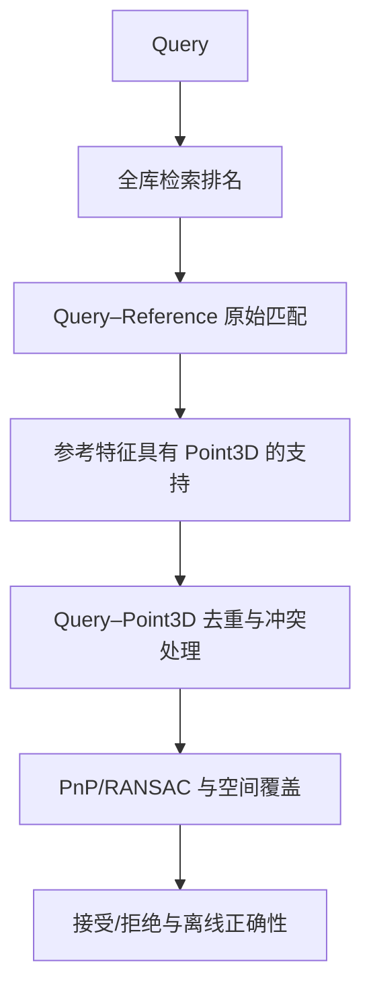

# 如何选择视觉重定位Pipeline

我最初容易把选型理解成“挑一个更强的特征或匹配模型”。实际接入后发现，定位效果由检索候选、图像对应、地图观测和几何验收共同决定。一个图像匹配器输出很多对应，并不表示它已经能输出地图坐标中的相机位姿。

本文将第一阶段 A/B/C 实验连回 SLAM 知识。所有实验数字都是旧 Home/Company 数据上的 Operational Proxy 结果，不能解释成独立 LiDAR GT 精度。原理解释与日志证据分开：有些现象符合预期，但尚不足以证明唯一原因。

## 1. 从 SLAM 到 HLoc：重定位所在的层次

| 概念 | 主要问题 | 典型输出 |
| --- | --- | --- |
| VO/VIO | 我相对于前几帧移动了多少 | 局部连续位姿 |
| SLAM | 一边估计运动一边建立地图 | 位姿、地图、图约束 |
| place recognition | 这张图像像地图里的哪个地方 | 参考图候选及排名 |
| visual relocalization | 我现在处于已知地图的什么 6DoF 位姿 | 全局相机位姿 |
| loop closure | 运行中是否回到之前位置，能否建立闭环约束 | 回环检测、几何约束及后端优化输入 |

重定位和回环都可能使用“检索→匹配→几何验证”，但系统用途不同。识别地点不是完成 6DoF 定位；检索成功也不是回环约束已可靠成立。

HLoc 的价值是将层次化视觉定位的模块和数据接口组织成可复现框架。学习方法负责外观表征和对应，几何部分仍通过 2D–3D、PnP 和 RANSAC确定位姿。这个组合在概念上自然，实际困难在大地图检索、跨外观鲁棒性、可靠关联和成本控制，而不是简单把几个模型名字串起来。

## 2. detector、descriptor 和 matcher 是不同工作

### 2.1 Detector：在哪里取点

检测器选择适合重复定位的图像位置，例如角点、斑点或学习到的关键点，输出像素坐标和置信度。好的点要在视角、光照改变后仍能找到；点多只是预算，不等于可重复性高。

GFTT 基于 Shi–Tomasi 角点思想，对局部梯度结构矩阵考察最小特征值。两个方向都有明显变化的角点比边缘更容易定位。沿一条边移动时观测变化不明显，就是孔径问题的直觉。

NMS 避免在同一区域留下过多相邻点；阈值过滤弱响应；网格预算改善空间分布。这些规则改变点的数量和位置，也会改变匹配、地图与后续几何。

### 2.2 Descriptor：这个点附近长什么样

局部描述子编码关键点邻域，让同一个物理位置在不同图像中可比较。

- ORB 是二进制描述子，标准 256 bit 即 32 byte。通常用 Hamming 距离比较不同位数量。
- SuperPoint、XFeat、RDD 使用学习描述子，通常是浮点向量，需遵循各实现的归一化和匹配接口。
- 全局描述子编码整张图，用于地点检索；局部描述子用于形成具体对应。二者不能互换。

本轮 A 的特定 RTAB-Map 契约将 ORB 按 bit 展开成 256 维 float 后使用 L1/FLANN。二值 bit 向量上的 L1 值等于 bit 差异数，但索引、搜索和调用链仍未必与 BF Hamming 完全等价。不能把常见做法当作产品实际实现。

### 2.3 Matcher：谁和谁对应

对 L2 归一化的描述子，余弦相似度是点积：

$$
s_{ij}=d_i^\top d_j.
$$

精确 MNN（mutual nearest neighbor）要求 i 的最佳 j 同时以 i 为最佳匹配。它没有学习权重，主要依赖描述子的判别性。互检减少一对多歧义，但不能消除重复纹理。

NNDR 比较第一与第二近邻的距离：

$$
\frac{\operatorname{dist}(d_i,d_{j_1})}{\operatorname{dist}(d_i,d_{j_2})}<r.
$$

它检查最优匹配是否足够明确，不等同于 MNN，也不等同于固定相似度阈值。

LightGlue 则学习利用两组关键点的位置和描述子上下文进行匹配与拒配；它有自适应深度、点剪枝等机制，耗时随输入与难度变化。匹配器权重与特征类型要兼容，不能默认 SuperPoint 的权重可以直接处理任意新描述子。[官方实现](https://github.com/cvg/LightGlue)

## 3. sparse、semi-dense、dense：要先问密度修饰什么

### 3.1 图像对应的密度

| 类型 | 大致含义 | 本轮对应 |
| --- | --- | --- |
| sparse matching | 对预先选出的少量关键点做匹配 | ORB、XFeat sparse、SuperPoint/RDD + LightGlue |
| semi-dense matching | 在图像网格或更广区域建立较多对应，再筛选与精化 | EfficientLoFTR |
| dense matching | 预测密集像素对应/warp及可靠性，再按需要采样 | RoMa v2 |

这些是方法与表示的区别，不是固定点数的分类法。RoMa 的密集输出在本轮每对采样 5000 点，最终不是每个像素都进入 PnP；EfficientLoFTR 的有效输出也随重叠与置信过滤变化。

**Detector-free** 指匹配不依赖先独立检测一组关键点的传统前置流程。LoFTR 类直接对图像特征建立粗到细对应；它仍有特征提取、置信选择和坐标精化。不能解释为“没有任何特征”，也不能推出“所有像素均可靠匹配”。[EfficientLoFTR 官方实现](https://github.com/zju3dv/EfficientLoFTR)

RoMa v2 提供密集匹配输出、匹配采样和从归一化坐标转到像素坐标的接口。接入时必须落实坐标转换，不能把 [-1,1] 的匹配坐标直接当原图像素。[RoMa v2 官方实现](https://github.com/Parskatt/RoMaV2)

### 3.2 三维地图的密度

| 地图 | 存什么 | 能做什么 |
| --- | --- | --- |
| sparse landmark map | 离散 3D 点、参考图观测、feature-to-point 关联 | 支持局部对应和 PnP |
| semi-dense geometry | 一部分可可靠恢复深度的像素/区域 | 增加表面几何覆盖 |
| dense map | 稠密点云、深度、网格或其他表面表示 | 表面重建、可见性、距离查询等，依具体表示 |

dense matcher 不自动生成 dense map。图像对应需要可靠多视几何才能变成 3D 点；本轮 C3/C4-full 最终仍是有限数量的 track/landmark 地图。即使 C3 点很多，也不能直接说已经建成完整稠密表面模型。

LiDAR 点云稠密也不意味着所有图像关键点都能关联到 LiDAR 点。投影仍需要外参、时间和相机位姿，还要处理遮挡、深度冲突、动态物体和采样空洞。三维地图密度与视觉可用对应密度分别统计。

## 4. observation、track、landmark：2D–3D 从哪里来

一个 **observation** 是某图像上的一个二维观测；一个 **track** 是多张图像中属于同一物理点的观测集合；一个 **landmark** 是由这些观测支持的三维地图点。SLAM 中 landmark 不等于二维特征点，后者只是它在某帧上的观测。

已知参考相机位姿后，多帧二维观测提供空间射线，三角化求交得到 landmark。射线接近平行、基线太小、误匹配或位姿误差都会导致不稳定深度。

track length 表示每点被多少帧观测；长 track 可以提供更多约束，但错误合并也会造成冲突。平均重投影误差低并不保证地图绝对坐标准确，尤其当相机位姿本身来自同一视觉 SLAM。

本轮做的是 **known-pose triangulation**：Reference 相机位姿固定，只三角化并按需要优化地图点，不让 SfM 或 BA 改写这些相机位姿。它与“先让 COLMAP 自己估计 Reference Pose”是不同实验，也与直接把 LiDAR 点投影成视觉 landmark 不是同一建图方法。

### 4.1 Query 的二维点怎样接到三维点

Query 点 q 匹配到参考图点 r；如果 r 有 feature-to-point 关系，就能得到 q↔P 的 2D–3D 对应。再跨候选合并、去重和处理歧义。

这解释了为什么“2D–2D 匹配很好但 PnP 失败”：匹配的参考位置可能没有 3D landmark，或关联到冲突的多个点，或去重后独立支持不足。

### 4.2 PnP、RANSAC、BA 各做什么

PnP（Perspective-n-Point）使用地图 3D 点和当前图像 2D 投影，求相机位姿。它不是要求 Query 自己也有深度：3D 来自地图，2D 来自 Query。

重投影模型可以写成：

$$
\hat u_i=\pi\left(KT_{camera\leftarrow map}P_i\right),\qquad r_i=u_i-\hat u_i.
$$

RANSAC 从对应中抽样估计位姿、统计一致内点，减轻错误匹配影响；本轮内点门槛为原图 2 px。它依赖正确对应占比及空间几何，无法保证找到真正地点。重复结构上的错误对应也可能形成一致解。

BA 联合优化相机与地图点的重投影误差，或在受限设置下做局部 refinement。本轮冻结 Reference 位姿，不允许 BA 改写它。主分数对应 raw PnP，不把优化后轨迹偷偷混入主结果。

## 5. 比较Pipeline时，先列清模块身份

“A、B、C”只是工程分组名，真正可比较的是每个阶段的明确实现：

| 路线 | Retrieval | Keypoint / descriptor | Matcher | 地图与几何 |
| --- | --- | --- | --- | --- |
| A / A-approx | BoW；近似实现为 TF-IDF BoW、Top-2 | GFTT + ORB | NNDR + mutual / 传统链近似 | ORB fixed-pose map + PnP/RANSAC |
| B0 | MixVPR Top-5 | XFeat sparse，1024 点 | exact cosine MNN | XFeat fixed-pose map + PnP/RANSAC |
| C0 | NetVLAD Top-20 | SuperPoint | LightGlue | SP fixed-pose map + PnP/RANSAC |
| C1 | MegaLoc Top-20 | 与 C0 相同 | 与 C0 相同 | 与 C0 相同；检索受控对照 |
| C2 | MegaLoc Top-20 | RDD | dedicated LightGlue | 独立 RDD map + PnP/RANSAC |
| C3/C4 hybrid | MegaLoc Top-20 | RoMa v2 / EfficientLoFTR | 方法自身的成对匹配 | 在 2 px 邻域桥接到 SP 观测与 landmark |
| C3/C4 full | 与各自 hybrid 相同 | 与各自 hybrid 相同 | 相同 profile | 自有观测聚合、track、landmark 与关联 |

正式 Baseline A 需要可审计的 RTAB-Map 词典、构建参数、版本和 golden sample 等价性证据；现有 A-approx 只是可追溯近似，不能回填成正式 A。B 使用的是 [XFeat](https://github.com/verlab/accelerated_features) 的 sparse 路线，不是它的 semi-dense 接口。C 中的 [MegaLoc](https://github.com/gmberton/MegaLoc) 只替换全局检索，[RDD](https://github.com/xtcpete/rdd) 是 detector + descriptor，[RoMa v2](https://github.com/Parskatt/RoMaV2) 与 [EfficientLoFTR](https://github.com/zju3dv/EfficientLoFTR) 则提供更密的成对对应。

所有这些路线最终仍需得到去重后的 Query 2D–地图 Point3D 对应，再用原图像坐标下 2 px 的 PnP/RANSAC 求解；主接受规则是 finite pose 且唯一 Point3D 内点不少于20。模型名、输入尺寸、归一化、权重、precision、点数和 Top-K 都属于实现身份。

### 5.1 哪些差异可以归因，哪些不能

- **C0 ↔ C1** 固定 SP map、SuperPoint/LightGlue、Top-K、图像尺度、PnP 和接受规则，只替换检索，因此可以讨论检索替换对完整定位链的影响。没有独立 overlap 标签时，仍不能把最终定位差值直接命名为 Retrieval Recall@K 差值。
- **C1 ↔ C2** 同时改变局部特征、matcher 和地图，只能描述完整路线的联合变化，不能把收益单独归因于 RDD。
- **hybrid ↔ full** 固定 Query、检索顺序和 matcher profile，预期变化是地图观测、track、landmark 与关联机制。full 的收益或退化不是“matcher 变强”。
- **A/B/C 横向** 使用各自地图和候选预算，是工程方案比较，不是单模块消融。

## 6. 用漏斗定位瓶颈

看到 PnP 失败时直接说“检索失败”，通常证据不足。更可靠的诊断顺序是：

对应的失败类型可以分为：

1. 地图存在重叠参考图，但它没进入 Top-K：检索漏召回。
2. Top-K 已含真实重叠图，但局部匹配不足：外观、视角或局部表征问题。
3. 2D–2D 匹配存在，但参考观测没有有效 Point3D：地图覆盖或关联问题。
4. 唯一 2D–3D 对应不少，但分布集中、歧义大或重复结构形成假解：几何与拒识问题。
5. 全库仍找不到可用视角：Reference 地图可能没有覆盖 Query，而不一定是某个检索模型失效。

诊断检索时应保存 Query 对**全部 Reference** 的排名与得分，再用同一排名做嵌套的 Top-K 消融。补齐全库匹配可以揭示 Top-K 外是否有关键参考图，但这是离线诊断成本；若再根据全库几何支持重排候选，就不能宣称仍是在线 Top-20 算法。

没有独立正参考标注时，检索 Recall@K 应为 N/A。空间位置近不保证有共同视野；后端定位成功也不能反过来循环定义检索真值。候选联系图宜用固定时间抽样，区分“确认重叠”“外观相似”“明显不同”和“无法判断”。

## 7. 更多对应不等于更可靠

原始匹配、能关联 3D 的匹配、唯一 Point3D、RANSAC 内点是不同数量。跨多个候选时，同一 Query 特征或同一 Point3D 可能反复出现；若不去重，内点数会被人为放大。

拒识至少应同时观察：

- 唯一 Point3D 内点数与内点率；
- 8×6 等固定网格覆盖和内点凸包面积；
- 重投影误差分布；
- 候选来源、重复关联与单点多义性；
- 多个固定随机种子下的解稳定性；
- 有 Proxy/GT 时的危险错误接受。

工程数据中曾出现“超过20个唯一内点、重投影也低，但位置错误”的帧；危险样本的网格/凸包覆盖明显小于正常接受帧。这支持继续检查空间分布和重复关联，但不能仅凭相关性断言具体错误一定是平面退化。提高内点门槛或覆盖门槛可能减少误接受，也可能损失困难真解，必须在开发集制定并冻结。

hybrid/full 的例子也说明地图接口的重要性：dense/semi-dense matcher 找到的参考位置若不在 SP 检测点附近，hybrid 桥接就得不到 Point3D；full 自建观测和 track 后，3D 支持通常增加，但地图规模、在线关联成本和错误接受风险也可能一起增加。

## 8. 怎样做选型

先给出约束，再比较方法：

| 约束 | 需要观察 |
| --- | --- |
| 错误接受代价高 | Precision、FA、连续错误段、空间覆盖，不只看 Recall |
| 需要快速恢复 | TTFR、最长失败段、deadline 前成功率 |
| 地图频繁更新 | Reference 特征、pair graph、track/landmark 重建成本 |
| 算力或显存有限 | 真实 batch=1 时延、峰值显存、CPU 后端和模型共存 |
| 外观变化强 | 检索候选、局部匹配与 3D 支持分别做跨光照诊断 |

旧数据上的一个有限例子是：C3-full 在日→夜 Proxy 上扩大了 Recall，但延迟显著增加；在 Company 的一个反向 provisional pair 上又出现较多危险接受。它说明“困难方向覆盖更高”与“系统更可信”不是同一结论，也不能从一个方向推出普遍排名。

因此，A 更适合传统低成本链路的工程基线，B 是轻量 learned sparse 候选，C0 是 learned HLoc 参照，C2/C3/C4 用于探索更强局部支持或不同地图接口。最终选择仍取决于错误预算、恢复时限、地图规模和硬件；所谓 upper bound 只是高成本参考配置，不是理论上限。

实现时至少冻结数据划分、相机模型、图像尺度、Reference Pose、Top-K、局部 profile、2D–3D 去重、PnP seed/阈值和接受规则。每次只在证据允许的层级归因。

阅读下一篇：[效果与性能权衡](./效果与性能权衡.md)。评估口径见[如何完成一次评估](./如何完成一次评估.md)，数据入口见[洗数据](./洗数据.md)。
