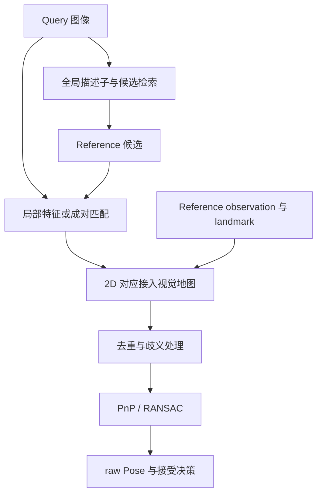
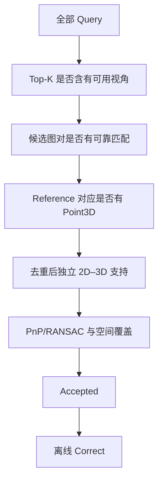

# 如何选择视觉重定位 Pipeline

视觉重定位选型不是挑一个“最强 matcher”，而是选择检索、局部对应、视觉地图、2D–3D 关联、鲁棒几何和接受策略的组合。某一模块输出更多对应，不表示整条链已经得到可靠地图位姿。

本文聚焦系统组合与实验分析。全局/局部描述子、MNN、LightGlue、detector-free 和匹配密度见[视觉地点识别与图像匹配](../fundamentals/视觉地点识别与图像匹配.md)；observation/track/landmark 与 hybrid/full 通用兼容性见[地图到底存了什么](../fundamentals/地图到底存了什么.md)；PnP/RANSAC 见[从图像对应到相机位姿](../fundamentals/从图像对应到相机位姿.md)。

## 1. Pipeline 的共同骨架

HLoc 组织的是层次化定位接口：全局表征先把大库缩成候选，局部前端再建立具体对应，参考观测把二维匹配接到三维地图，最后用 PnP/RANSAC 和工程 gate 输出决策。

地点识别、重定位和回环可能共享这条前端链，但输出用途不同。检索命中相似房间不等于恢复 6DoF Pose，重定位成功也不自动构成可加入后端的可靠回环约束。

每条路线必须明确模型权重、图像预处理、输入尺寸、精度、候选 K、点数/采样、地图版本、坐标空间、去重、求解器 seed/阈值和 gate。模型名字不能替代可复现配置。

## 2. 当前路线如何组合

| 路线 | Retrieval | 局部前端 | 地图与关联 | 几何 |
| --- | --- | --- | --- | --- |
| A / A-approx | BoW；近似链为 TF-IDF、Top-2 | GFTT + ORB，NNDR + mutual | ORB fixed-pose map | PnP/RANSAC |
| B0 | MixVPR Top-5 | XFeat sparse 1024 点 + exact cosine MNN | XFeat fixed-pose map | PnP/RANSAC |
| C0 | NetVLAD Top-20 | SuperPoint + LightGlue | SP fixed-pose map | PnP/RANSAC |
| C1 | MegaLoc Top-20 | 与 C0 相同 | 与 C0 相同 | 与 C0 相同 |
| C2 | MegaLoc Top-20 | RDD + dedicated LightGlue | 独立 RDD map | PnP/RANSAC |
| C3/C4 hybrid | MegaLoc Top-20 | RoMa v2 / EfficientLoFTR | 在邻域桥接 SP observation | PnP/RANSAC |
| C3/C4 full | 同各自 hybrid | 同各自 hybrid | 自有 observation、track、landmark | PnP/RANSAC |

所有路线最终都要形成去重后的 Query 2D–地图 Point3D 对应。当时主协议在整流输入像素空间使用 2 px PnP/RANSAC 阈值，主 gate 为 finite Pose 且唯一 Point3D 内点不少于 20；这些是该协议的版本参数，不是通用常数。

### 2.1 实现身份中容易被名字掩盖的差异

- 正式 Baseline A 需要 RTAB-Map 词典、构建参数、产品版本和 golden sample 等价性；A-approx 只是可追溯近似，不能回填成正式 A。
- A 的特定契约把 256-bit ORB 展成 256 维 float 后走 L1/FLANN。二值 bit 向量的 L1 数值可等于 Hamming 差异数，但索引和调用链不因此与 BF-Hamming 完全等价。
- B 使用 XFeat sparse 路线，不是其 semi-dense 接口。
- C1 只替换全局检索；C2 同时改变局部特征、matcher 和地图；C3/C4 则使用更密的成对对应。
- dense/semi-dense 前端即使最终采样有限点，仍不等于 sparse 方法；它最终形成的视觉地图也不自动成为稠密表面地图。

这些区别决定哪些实验可以归因于单模块，哪些只能称完整路线比较。

## 3. Hybrid 与 full：具体适配问题

通用地图兼容性已经在地图篇定义。放到当前路线中：

- **hybrid**：RoMa/EfficientLoFTR 给出 Reference 对应位置，再在 2 px 邻域寻找已有 SP observation，沿 feature-to-point 关系接到 landmark；
- **full**：用该前端自己的观测聚合、track、三角化和 landmark，避免被 SP 检测位置覆盖限制。

hybrid 的优势是复用成熟地图，代价是正确 dense 对应若附近没有 SP observation，仍无法形成 2D–3D。full 扩大几何支持，却同时改变地图规模、track 冲突、在线关联成本和错误接受风险。

所以 hybrid→full 的变化不是“matcher 变强”，而是 observation、track、landmark 和关联机制整条链改变。比较时应固定 Query、候选排序、matcher profile、Reference Pose、PnP 和 gate，再检查地图与关联差异。

## 4. 哪些对照能支持什么结论

| 对照 | 固定项 | 可解释的变化 | 不能直接声称 |
| --- | --- | --- | --- |
| C0 ↔ C1 | SP map、SP/LG、Top-K、图像尺度、PnP、gate | 检索替换对完整定位链的影响 | 无 overlap 标签时的独立 Retrieval Recall@K |
| C1 ↔ C2 | 检索预算与评分协议 | 完整局部前端 + 地图路线变化 | 收益只来自 RDD 或 LightGlue |
| hybrid ↔ full | Query、候选、matcher、几何协议 | 地图观测和关联链变化 | matcher 本身变强 |
| A/B/C 横向 | 数据划分和任务协议 | 工程方案总体差异 | 单模型消融结论 |

空间位置近不保证共同视野，后端成功也不能循环定义检索正样本。没有独立 overlap 标签时，检索 Recall@K 应写 N/A；可以保存全库排名、固定抽样联系图和几何漏斗做诊断，但不要把诊断标签伪装成独立真值。

调 K、resize、阈值或 gate 应在开发集完成，冻结后到留出数据评价。历史测试集上的搜索仍有工程价值，但应标为探索性，不再用于无偏泛化声明。

## 5. 用漏斗定位瓶颈

逐层记录：

1. 全库排名、实际尝试候选和共同视野证据；
2. raw matches、过滤后 matches 和候选来源；
3. 能关联 Point3D 的数量、缺地图支持的数量；
4. 唯一 Query 点/Point3D、重复和冲突；
5. RANSAC 内点、内点率、网格/凸包覆盖、残差和 seed 稳定性；
6. gate 决策、拒绝原因和离线正确性。

PnP 失败不能直接归因于检索。Top-K 可能含真实重叠图却匹配不足；匹配可能很好却落不到 landmark；2D–3D 足够也可能因分布集中或重复结构产生错误共识。全库仍无可用视角时，还要考虑 Reference 覆盖不足。

补齐全库图对匹配可用于离线定位瓶颈，但若按几何支持重新排序，就不再是原来的在线 Top-K 算法。诊断工具和部署算法要分开命名。

## 6. 更多对应不等于更可靠

raw matches、可关联 3D 的 matches、唯一 Point3D 和 RANSAC 内点是不同数量。跨候选汇总时，同一 Query 点或同一 landmark 可能重复出现；不去重会人为放大支持。

历史数据曾出现“超过 20 个唯一内点、重投影较低，但位置仍错误”的样本，其网格/凸包覆盖比正常接受帧更差。这支持增加空间分布诊断，却不能仅凭相关性把所有错误归因于平面退化。

提高内点数、覆盖或一致性 gate 可能减少错误接受，也可能损失困难真解。gate 必须在开发集与有资格参考上制定，同时报告 Recall、Precision 和危险接受，而不是只保留改善的一条轴。

## 7. 按场景约束选型

| 约束 | 优先观察 |
| --- | --- |
| 错误接受代价高 | Precision、FA、连续错误段、空间覆盖 |
| 需要快速恢复 | TTFR、最长失败段、deadline 前正确率 |
| 地图频繁更新 | Reference 特征、pair graph、track/landmark 重建成本 |
| 算力/显存有限 | batch=1 尾延迟、峰值内存、CPU 后端和模型共存 |
| 外观变化强 | 候选、局部匹配和 3D 支持分层诊断 |

旧数据中 C3-full 在一个日→夜 Proxy 方向扩大了 Recall，却显著增加延迟；在另一个反向 provisional pair 上又出现较多危险接受。这只能说明覆盖、风险与成本需要共同权衡，不能从一个方向推出普遍排名。

A 适合作为传统低成本基线方向，B 是轻量 learned sparse 候选，C0 是 learned HLoc 参照，C2/C3/C4 用于探索更强局部支持和不同地图接口。所谓 upper bound 只是高成本参考配置，不是理论上限。

## 8. 截至 2026-10-06 的实验身份

这一状态只适用于当时的输入、代码和协议：

| 项目 | 当时状态 | 边界 |
| --- | --- | --- |
| A-approx | 已运行 | 可追溯传统近似链，不等于正式 RTAB-Map A |
| 正式 A | blocked | vocabulary、产品 adapter 与 golden equivalence 未齐 |
| B0/C0 | engineering-benchmark-ready | 在线链、失败记录、gate 和性能贯通 |
| C2/C3/C4 | 探索性路线 | 地图/局部前端和成本共同变化 |
| Proxy 质量分数 | provisional | 参考资格仍限制正式精度结论 |

以后补齐 vocabulary 或参考证据时，应生成新的方法/协议版本；不能把新状态反向写成旧实验当时已经具备。

性能边界、paired-composed 合同、P95 和端侧部署见[效果与性能权衡](./效果与性能权衡.md)；指标分母见[定位评估方法](../data-evaluation/定位评估方法.md)。
