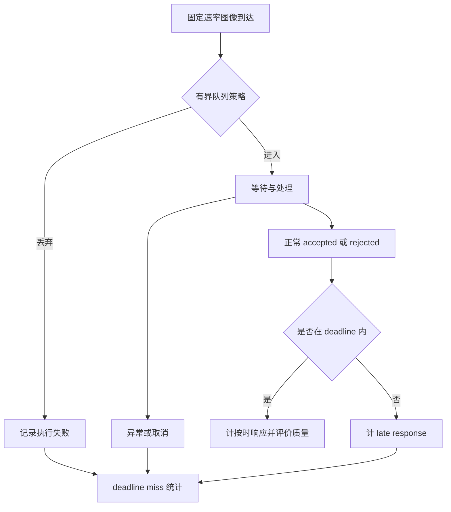

# 效果与性能权衡

第一阶段中，C3-full 在日→夜的 Proxy Recall S 达到 98.2%，但报告 P95 超过 10 秒；B 的覆盖低一些，历史离线耗时却只有几百毫秒。这个差别让我开始把“算法效果”与“系统能否及时提供可靠位置”分开。

对于机器人，定位再准确，返回得太迟也可能无法直接使用；拒绝输出会延迟恢复，错误接受则可能让系统相信错误地点。性能优化因此不是只追求 FPS，而是在明确的错误预算、恢复时限、资源与部署条件下选择和改造 pipeline。

本文的实测硬件是 RTX 4060 Laptop GPU 8 GB；旧数据为 Operational Proxy。截至 2026-10-06，RK3576 仍是未来端侧场景，这批 PC 结果不能写成已完成的 NPU 部署结果。

## 1. 先统一测量边界，否则速度排名没有意义

本轮 C 系列：batch=1、串行 Query、地图和 Reference 特征已加载，无 CPU 模型回退。它反映当前工作站上的热地图回放成本。

| 方法 | 报告计时边界 | 分位数聚合 |
| --- | --- | --- |
| A-approx、B0、B-selected | historical offline sequential pipeline total | 各 run 分位数的均值 |
| C0、C1、C2 | direct process replay | 三 run 的逐帧样本 pooled 分位数 |
| C3/C4 hybrid/full | paired-composed replay | 三 run 的逐帧样本 pooled 分位数 |

paired-composed 表示同一真实检索+matcher 前缀分别接 hybrid/full 后缀，得到逐 Query 组合耗时；它不是两条完整独立部署进程各运行一遍。共享资源窗口也不能拆成两份独立资源测量。

三类都没有完整 arrival、queue、deadline 合同，因此不能直接声称线上 E2E 排名。A/B 与 C 的分位数聚合也不同：

$$
\frac{1}{3}\sum_{r=1}^{3}Q_{0.95}(L_r)\ne Q_{0.95}(L_1\cup L_2\cup L_3)
$$

一般情况下两者不等。表里的数可以说明成本量级，但直接相除不能自动成为同条件产品加速比。

另一个截至 2026-10-06 的构建记录中，主方向 B0/C0 在线 P95 约为 255.6/1461.2 ms，C0 Reference 全库离线配对约 125 s。前两项是单 Query 在线边界，后一项是地图准备成本；它们不能混成“定位一次花费”，也不能与上表不同计时合同直接横比。

## 2. 效果和资源放在同一个决策里

方法比较至少有四条轴：正确恢复覆盖、错误接受风险、单请求时延、内存/地图成本。只把 Recall 和 FPS 排成两列，仍会遗漏最重要的风险约束。

一个有限的工程例子中，日→夜 Proxy 上 B0、C0、C3-full 的 Recall S 依次约为 77.5%、89.8%、98.2%；对应记录的 P95 约为 181 ms、1.21 s、10.65 s。但 B0 是历史离线顺序 pipeline total，C0 是 direct process replay，C3-full 是 paired-composed replay，不能把三者直接相除成同合同加速比。这个例子只说明：提高困难样本覆盖通常会付出计算代价，且代价必须按真实边界重测。

同一批实验还出现过一个更重要的反例：高覆盖方案在另一反向 provisional pair 上产生了较多危险接受。因此不能把“主方向零 FP”理解为风险为零，也不能把单方向 Recall 最高等同于整体最优。

显存和耗时也不一一对应。设备峰值包含模型、激活、workspace、地图缓存和 runtime；一个方法占用更多显存但 kernel 更快，完全可能比显存较小的方法延迟更低。

## 3. 一次查询到底花钱在哪里

可以把串行服务时间概念上写为：

$$
T_{service}\approx T_{pre}+T_{global}+T_{retrieve}+T_{local}+\sum_{j=1}^{K_{actual}}T_{match,j}+T_{assoc}+T_{PnP}+T_{decision}.
$$

只有阶段没有重叠时，这种分解才近似成立；阶段 P95 更不能相加得到总 P95。

### 3.1 全局特征与检索：在线一次、数据库持续增长

Query 的全局表征通常每帧提取一次；Reference 描述子可以离线计算。精确检索对 M 张参考图、D 维描述子，粗略计算量为 $O(MD)$，存储为 $O(MD)$。

本轮 MixVPR 是 4096D，MegaLoc 是 8448D。按 FP32、忽略索引等开销，每张向量分别约 16 KiB、33 KiB。**容量估算示例，不是实测：**十万张参考图时约需 1.53 GiB、3.15 GiB，仅为全局描述子。

小地图里神经网络提取可能主导，大地图里检索、索引和数据访问可能成为瓶颈。可考虑近似索引、向量压缩和分层检索，但必须检查候选召回与几何后端损失，不能只测检索 QPS。

### 3.2 稀疏 MNN：点数翻倍，匹配可能增长四倍

若 Query 有 N 个点，参考有 M 个点，维度 D，精确相似度矩阵计算约为 $O(NMD)$，矩阵存储约 $O(NM)$。

**FP32 示例：**1024×1024 的相似度矩阵约 4 MiB；2048×2048 约 16 MiB。不含特征、workspace 与其他缓存。两边点数都翻倍，匹配部分接近四倍增长，并非整条 pipeline 必然四倍。

这解释了 B 搜索中 Top-K 和点数不能只按最终内点数量选择。点数增加还会改变 Reference 地图、匹配歧义和关联成本；Top-K 增加则增加候选匹配与合并工作。

### 3.3 Learned sparse matcher：难度会影响时间

LightGlue 利用点间上下文和两图交互，常规 attention 的某些部分随点数呈二次增长；实际还有自适应层数、剪枝、优化 kernel 和具体输入差异，不能以一个 $N^2$ 公式预测整帧时间。

更难的图像对可能需要更多层，也可能较早剪除大量点。要记录真实候选数、点数、有效匹配和每候选耗时，才能判断是模型本身慢、点数多，还是候选排序导致工作量变化。[官方实现](https://github.com/cvg/LightGlue)

### 3.4 Semi-dense/dense：图像区域更多，成对计算更重

RoMa/EfficientLoFTR 对图像对计算更广的网格对应或密集匹配，需要图像特征、交互/相关性、粗到细精化及采样。部分特征提取可缓存，但成对匹配并非所有工作都能像独立描述子那样预计算。

复杂度应按具体网络分析。若某阶段显式构造两图全配对相关矩阵，网格点数量为 $n_a,n_b$，该矩阵规模会达 $O(n_an_b)$；局部相关、稀疏化和层次结构能降低实际开销，不能把所有 dense matcher 一概写成同一种复杂度。

提高两边图像的线性尺寸会显著放大 token 与激活。即使每对最终只采样 5000 匹配点，前面的密集推理成本仍已经发生，减少采样点不保证同步降低网络成本。

### 3.5 候选预算：Top-K 不只是召回超参数

候选越多，越可能包含合适参考视角，也增加低质量或重复结构候选。若逐对执行匹配，K 增大使成对推理近似线性增加，还会扩大对应合并、歧义处理和几何输入。

C3 本轮 Top-20，每对采样 5000，对每 Query raw 总数约 100000，去重后 2D–3D 为约 13537。最终进入几何的数量远小于 raw 数，但前端推理和中间处理已经付出成本。

若要优化 Top-K，需要同时记录实际尝试数、早停规则与风险。提前停止若只看内点数，很可能停在一个一致但错误的重复结构上。规则必须用开发集制定并冻结。

## 4. 后端几何也可能吃掉大量时间

### 4.1 RANSAC 受正确对应占比影响

RANSAC 所需采样会随内点比例下降而快速增加，完整概率公式与假设见[从图像对应到相机位姿](../fundamentals/从图像对应到相机位姿.md)。性能上的直接含义是：增加大量低质量对应，可能让绝对内点数增加，却使抽到全内点最小集更困难。

真实实现还会自适应、排序或截断采样，重复、共线和集中分布也破坏理想独立模型。因此不能仅凭 raw match 数预测几何时间，应记录唯一对应、内点率、退化与实际迭代。

每个模型的内点评估通常需要遍历对应。几何输入太大、歧义严重、重复支持未剔除，可能在 CPU PnP/RANSAC 上消耗很多时间。不能看到用了大型 GPU 模型就断言瓶颈一定在 GPU。

### 4.2 数据结构和关联可能是瓶颈

dense/full 接入涉及观测聚合、空间近邻、track/landmark lookup、坐标转换、冲突和去重。Python 循环、重复张量搬运、零散文件读取、临时对象和 CPU/GPU 同步都可能比数学模型本身更显著。

可考虑批量查询、连续数组、预构建 feature-to-point 索引、减少对象分配，以及对确认热点做 C++/向量化改造。先保留输入输出一致性证据，再谈加速；没有 profiling 时这些只是候选优化方向。

### 4.3 地图适配收益也有在线代价

在相同真实前缀的 paired-composed 合同下，D1→N 的 hybrid/full 比较为：

| 家族 | hybrid P95 ms | full P95 ms | hybrid→full Recall S |
| --- | ---: | ---: | --- |
| C3 | 9002.9 | 10646.5 | 93.7%→98.2% |
| C4 | 1939.9 | 2186.5 | 75.4%→91.9% |

full 扩大地图关联与几何支持，也增加后缀处理工作。两个总时延 P95 之差不是“后缀阶段 P95”，因为分位数不可直接相减。该表支持整体额外成本的观察，若要判断具体热点仍须逐阶段 profiling。

## 5. 显存不是只有模型权重

概念账本：

$$
M_{device}=M_{weights}+M_{activations}+M_{workspace}+M_{reference/cache}+M_{outputs}+M_{runtime}.
$$

推理不保存训练优化器状态，但仍有中间激活、attention/相关矩阵、CUDA context、kernel workspace 和缓存。关闭梯度、正确 eval 状态是基础，不代表显存自动很小。

| 统计 | 在看什么 | 局限 |
| --- | --- | --- |
| Torch allocated | 活跃张量分配 | 不覆盖全部设备资源 |
| Torch reserved | 框架 allocator 保留的内存块 | 包含缓存，与 allocated 不同 |
| NVIDIA 设备占用 | 采样时设备内存使用 | 可能包含其他进程；采样可能漏短峰值 |
| 进程 RSS | CPU 驻留内存 | 不是 GPU 显存，进程树共享页需注意重复计数 |

本轮历史 Torch 分阶段 allocated 峰值：MegaLoc 902 MiB、C1 SP/LG 398 MiB、C2 RDD/LG 3605 MiB、C3 RoMa base 3275 MiB、C4 EfficientLoFTR 952 MiB。

阶段峰值不能相加成端到端峰值：各阶段可能错开，模型也可能共存；分阶段分配边界和完整进程边界不同。C2 完整设备峰值 5803 MiB 与分阶段 3605 MiB 不矛盾。

C3/C4 hybrid/full 的 GPU/功耗来自同一个 paired process 窗口，相同值意味着共享测量，不能写成两个独立进程都测到了相同峰值。

8 GB 显卡上接近上限时，加入更大地图、并发、多模型常驻或输入分辨率变化都可能 OOM。应记录硬件、缓存与精度条件下的峰值和余量；不能因当前一次运行没 OOM 就证明扩展安全。

## 6. CPU、功耗和温度怎样解读

D1→N 资源记录：

| 方法 | CPU mean | RSS MiB | max power.draw.average W | max 温度 °C |
| --- | ---: | ---: | ---: | ---: |
| C0 | 792.5% | 2658 | 34.1 | 65 |
| C1 | 798.9% | 2756 | 35.3 | 67 |
| C2 | 178.9% | 2755 | 80.1 | 79 |
| C3-full | 117.6% | 2790 | 76.5 | 77 |
| C4-full | 342.9% | 2735 | 74.0 | 78 |

这里 100% 约等于一个逻辑核满载，CPU 792.5% 不是“不可能超过100%”。它提示 C0/C1 使用较多 CPU 工作；C2/C3 GPU 功耗较高，但功耗和占用率不足以直接判定具体瓶颈。需结合阶段时间、CPU 栈和设备 kernel 证据。

`max power.draw.average` 是采样到的最大平均功耗读数，不是瞬时峰值，不是整机功耗，更不是每帧能耗。每帧 GPU 能耗可在边界明确时近似积分：

$$
E_q\approx\int_{t_{start}}^{t_{done}}P_{GPU}(t)\,dt.
$$

还要处理空闲基线、CPU、共享进程和未覆盖时段。不能用 max W 乘 P95 伪造平均每帧能耗。

历史 C4 paired 采样中出现 590.01 W 异常读数，依据本机限额和硬件范围固定 0–200 W 合理性过滤，丢弃 10/40845 条、原始 CSV 保留。资源审计也需要保留规则与被过滤数量。

温度高不自动证明降频。需同时记录频率、功耗模式、降频事件和长时间运行状态。笔记本短时性能与热稳态不同，同型号 GPU 的实际功耗上限也影响结论。

## 7. 离线地图成本不能忽略

Reference 特征可以提前算，并不表示它们免费。建图决定发布成本、重建频率、磁盘空间、启动加载、CPU/GPU 缓存及多地图并存能力。

报告 Home day 地图：

| 路线 | 参考图数 | 点数 | 观测数 | 平均 track | 平均重投影 px | 地图 MiB |
| --- | ---: | ---: | ---: | ---: | ---: | ---: |
| C0/SP | 115 | 8350 | 36461 | 4.37 | 1.50 | 58 |
| C2/RDD | 115 | 59637 | 209130 | 3.51 | 1.26 | 720 |

这里 MiB 是报告的地图制品大小，不是常驻显存。RDD 提供更多点和观测，也显著扩大地图。更多点不等于自动覆盖所有区域，还要检查可见性、空间分布和错误关联。

地图匹配图也有成本。全配对为 $n(n-1)/2$，115 张参考图对应 6555 对；地图扩大时二次增长。可使用时间邻接、检索和共视选择减少 pair，但必须检查 track 连通与覆盖损失。

报告保留 logged build seconds 用于 provenance，pair 数、缓存命中和 warm state 没统一，因此不能把这些时间直接排成方法建图效率榜。

## 8. 为什么平均 FPS 不能说明实时性

严格性能协议记录：

- `t_arrival`：图像到达评测进程。
- `t_start`：开始处理。
- `t_pose`：raw PnP 完成。
- `t_done`：接受/拒绝/失败结果输出。

$$
L_{queue}=t_{start}-t_{arrival},\quad L_{service}=t_{done}-t_{start},\quad L_{E2E}=t_{done}-t_{arrival}.
$$

离线顺序程序往往处理完一帧才读下一帧，几乎没有真实排队压力。真实相机按固定速率输入，服务能力不足时队列会增长。

**系统原理示例，不是本轮部署结果：**相机每秒输入 5 帧，单 worker 平均每帧处理 0.3 s，最多约 3.33 帧/s；无限队列会积累，最新输出越来越旧。增加队列容量只延迟暴露问题，不能增加处理能力。

可以限频、只保留最新帧、有界队列、丢弃旧帧、并发或按事件触发重定位。策略不同会改变恢复时间与覆盖，因此队列和丢弃政策也是实验参数。

### 8.1 Deadline miss 与定位失败是两条轴

先冻结 deadline D 及起算边界，一般从 arrival 起算。D 来自任务要求，不自动等于相机采样间隔，也不等于程序取消超时。

$$
\text{deadline miss rate}=\frac{N_{miss}}{N_{scheduled}}.
$$

性能分母是全部预期提交请求，包括没有 GT 的帧，不是 N_eval。按时返回正常 rejected 算按时响应，但质量失败；队列丢弃、运行异常、超时取消、未完成及正常结果晚到都计 miss，并用互斥原因分类。

部署质量只把 deadline 前可用的 accepted 计成功。迟到位姿可在离线质量 profile 评分，但不能冒充部署成功。无正式 deadline 的旧回放填 N/A，不能因为每帧最终跑完就填 0% miss。

### 8.2 低频重定位不等于低频飞控

VIO/里程计可持续提供局部运动，重定位用于恢复或纠正全局位置，因此不一定要每帧运行强模型。云端响应也可能通过同期局部相对运动传播到当前时刻，但这引入时间同步、状态历史和融合问题，已超出本轮纯视觉评测。

适合低频/事件触发并不表示 10 秒延迟自然可接受。是否可以接受仍由机器人运动速度、漂移、任务恢复时限和错误预算决定，需要系统实测。

## 9. 性能测量应该怎么做

### 9.1 离线能力与部署节奏分开

| Profile | 执行方式 | 回答什么 |
| --- | --- | --- |
| offline quality | 冻结所有 Query 都处理，不因慢而丢帧 | 算法本身能定位多少 |
| deployment replay | 固定输入速率、队列、并发、丢弃、deadline | 真实节奏下有多少可靠及时输出 |
| cold start | 进程启动到可以接受请求 | 启动/切地图成本 |
| warm batch=1 | 模型和地图就绪，逐请求测量 | 单请求时延 |
| batch throughput | 声明 batch 与负载 | 单位时间处理能力 |

默认预热 10 次，用 map/pilot 图像，不删掉正式 Query 前 10 帧。初始化和第一条正式请求另报。batch 吞吐不能冒充 batch=1 延迟。

### 9.2 GPU 异步会让计时失真

CPU 提交 kernel 后可能很快返回；仅在调用前后读主机时钟，可能测到提交时间而非完成时间。设备阶段可用正确的 CUDA events；整体边界需等设备任务完成或确认输出就绪。

传输、推理和 CPU 后处理若重叠，分别报告服务总时间与阶段贡献，不能把重叠阶段重复累计。保持真实线上缓存行为：只读缓存做质量实验可以标 `cached_quality_only`，不能用缓存结果冒充在线推理成本。

### 9.3 统计和资源边界必须完整

每 Query 报 mean、P50/P95/P99、max 和样本数；成功/失败子集另列。平均低但尾延迟长也可能违反 deadline。P99 小于100样本时要标小样本，视频连续帧也不是独立随机样本。

资源默认 100 ms 采样，说明实际周期和可能漏峰值；保留 CPU/RSS/GPU/NPU、队列、频率、温度、退出码、OOM。CPU 线程、绑核、调度优先级、功耗模式、后台负载、模型精度与地图大小都要冻结。

未开始的请求没有 service latency，未完成请求不能填 0；不能把超时样本丢掉再报漂亮分位数。同时报计时覆盖率。

云端需要分别测服务端和客户端请求往返，后者含编码、上传、网络、排队与返回。不同机器未同步的时钟不能直接相减。

## 10. 从 PC proxy 到 RK3576：模型可转换只是第一步

本轮 B 是端侧候选，尚未提供整条 RK3576 实测。不能从参数量、FLOPs、PC GPU 耗时或芯片 TOPS 直接推出部署延迟。

| 环节 | 端侧必须检查 |
| --- | --- |
| 模型导出 | 算子与形状是否支持，动态输入及自适应流程能否表达 |
| 预处理 | RGB/灰度、归一化、resize、内参和像素坐标保持一致 |
| 数值一致性 | 中间输出、关键点、描述子、排名、对应和位姿是否变化 |
| NPU 执行 | 真正在 NPU 的部分、CPU fallback、布局和内存拷贝 |
| 几何后端 | 检索索引、MNN、关联、去重与 PnP 的 CPU 成本 |
| 系统负载 | 与 OAK、OpenVINS、通信和其他任务共存时的调度与热状态 |
| 部署质量 | deadline 前的 Recall/Precision/FA 和恢复，不只孤立网络延迟 |

稀疏 CNN 特征路线可能更容易工程落地，但全局模型、MNN 与 PnP 未必都由 NPU 承担。attention、deformable sampling、动态剪枝等通常需要具体导出和 runtime 检查；不能未测就判定某模型绝对不可部署。

FP16/INT8 可以减少部分存储与计算，但性能和误差必须实测。匹配任务对排序和细微差异敏感：量化可能改变余弦近邻、置信筛选、关键点位置与几何支持。要按“表征→候选/匹配→2D–3D→最终质量”的链条验证，不能只看网络输出平均误差。

## 11. 我会怎样按场景选择

| 场景 | 可继续探索 | 必须验证的条件 |
| --- | --- | --- |
| 算力紧张、频繁请求 | B 路线与更小候选/特征预算 | 端侧全链路时延、光照鲁棒性与拒识 |
| 工作站 learned 基线 | C0 | 新独立场景、实际 deadline 与地图规模 |
| 更强几何支持 | C2 | 显存、地图成本与危险接受 |
| 困难跨光照、离线分析 | C3-full | 公司反向风险、长尾时延、源链可靠性 |
| semi-dense 对照 | C4-full | 与 C0/C2 的场景差异及实际资源预算 |
| 云端事件触发恢复 | 强模型候选 | 网络、队列、位姿时效和与局部估计的融合 |

Pareto 的含义是：没有其他方案在所有指定目标上不差且至少一项更好。目标至少包括 Recall、FA、时延、内存；先指定风险预算，再讨论前沿。不同计时合同的数据不能直接当严格 Pareto 比较，跨数据方向也不能只挑优势表。

历史 B 参数搜索中，k3_n2048_e2 为 Recall S=82.8%、P95=195.4 ms，历史 selected k10_n1024_e2 为 80.0%、239.9 ms；前者在这两个探索指标上更好，但 Precision S 为99.2%而非100%，且没有独立测试集。它提示应记录选型规则，不支持事后宣称普遍最优。

## 12. 优化顺序：先定位瓶颈，再动实现

1. 核实计时合同、缓存和统计分母，避免优化一个并未真实测量的链路。
2. 给每阶段和每候选计时，关联点数、实际 K、去重损失及失败类型。
3. 热点在 CPU 就看栈、循环、内存访问与数据结构；热点在 GPU 就看 kernel、同步、传输和批量。
4. 先减少重复计算和无效工作，再探索精度、输入尺寸、点数、Top-K 与索引。
5. 每次改动验证对应和位姿一致性；改变算法预算时同时重测质量与 FP。
6. 在固定硬件和独立数据上完成部署节奏测试，报告 deadline miss 和热稳态。

目前证据支持：B 提供较轻的完整路线，C0 是本批次较均衡的 learned HLoc 参照，C3-full 在部分困难方向提供更大覆盖但代价和风险明显。优化目标应是及时返回可相信的位置，而不是把所有请求都变成 accepted。

关联阅读：[如何选择视觉重定位 Pipeline](./如何选择视觉重定位Pipeline.md)、[定位评估方法](../data-evaluation/定位评估方法.md)和[数据清洗与实验输入构建](../data-evaluation/数据清洗与实验输入构建.md)。
