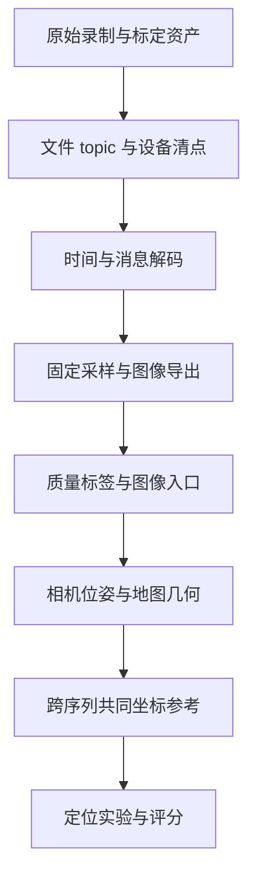

# 洗数据

机器人数据清洗并不只是删掉坏图、把bag导出成PNG。真正的问题是：这些图像来自哪个传感器、处于哪个时刻、使用什么相机模型、能与哪些位姿对应，最终能回答什么实验问题。

我在接入新数据时逐渐发现，“图像能读”“可以建图”和“可以评价定位精度”是三个不同阶段。本篇围绕工作中涉及的ROS数据、时间、采样、标定、参考位姿和存储知识展开，清洗经历只作辅助案例。

## 1. 从原始录制到算法输入

一段机器人录制通常包含图像、IMU、点云、标定信息、TF和算法输出。每一种数据都有消息类型、时间、坐标系和来源。



前面的步骤完成，不自动让后面成立。例如导出了图像和时间戳，仍可能没有合法的相机轨迹；点云能配准，仍可能不能把相机放进统一地图。

### 1.1 Raw、derived、runs分层

| 层级 | 内容 | 处理原则 |
| --- | --- | --- |
| raw | 原始bag、压缩包、设备标定与元数据 | 保留原状，作为可追溯输入 |
| derived | 图像、manifest、时间转换、质量标签 | 由固定规则生成，可重建 |
| runs | 特征、匹配、地图、预测与评分 | 与具体算法和配置绑定 |
| temp | 抽取与转换中间产物 | 验证后按明确范围清理 |

原始资产与派生产物分开，可以在修正解码或时间规则后重新处理，而不需要猜之前删掉了什么。算法预测不要反过来进入数据清洗规则。

## 2. ROS bag、DB3和MCAP是什么

[rosbag2](https://github.com/ros2/rosbag2)记录的是带时间戳的ROS消息，不只是视频。读取时一般有三个层次：

1. **存储读取**：从DB3/MCAP找到消息记录。
2. **消息反序列化**：根据ROS类型将payload还原成消息字段。
3. **图像解码**：按encoding、尺寸、step等字段还原像素。

有文件不代表存储插件可用；读到字节不代表ROS消息可解码；消息能解码也不代表图像语义正确。

| 格式 | 基本组织 | 接入关注 |
| --- | --- | --- |
| SQLite3 / DB3 | 数据库中的topic、时间和消息行 | 索引、查询方式、BLOB读取和远程I/O |
| MCAP | 面向消息日志的容器，可包含chunk、压缩和索引 | storage plugin、schema、压缩与消息类型 |

rosbag2通过存储插件处理不同格式。环境中安装了rosbag2核心，不代表每种storage backend已经可用。确认插件后，还要用实际数据贯通读一条目标消息、反序列化和图像导出。

这类读取问题属于工具链接入，不是SLAM算法失败。应将“存储打不开”“消息类型缺失”“像素解码失败”分别记录。

## 3. 图像编码：尺寸正确还不够

ROS `sensor_msgs/Image`常见字段包括height、width、encoding、step和data。

- `mono8`通常是每像素8bit单通道灰度。
- `rgb8`与`bgr8`通道顺序不同。
- `step`描述每行字节跨度，不能默认始终等于宽度×通道数。
- 深度图可能是整数深度或浮点深度，单位与无效值规则需要确认。

解码时要检查数据长度、stride、dtype和通道，不只检查能否写成PNG。读错通道或误用dtype，有时图像仍然“看起来有内容”，模型却面对错误输入。

`CompressedImage`又有另一层图像压缩格式，不能当原始像素直接reshape。

### 3.1 哪个topic才是需要的相机

机器人可能同时有RGB、左右mono、整流左右图、深度图及不同CameraInfo。选择topic时要核对：

| 问题 | 为什么重要 |
| --- | --- |
| 左目、右目还是RGB | 不同内参、光心与外参 |
| raw还是rectified | 相机模型与像素坐标不同 |
| 设备SN是否一致 | 同型号设备也不能任意共用标定 |
| frame_id对应什么 | 不等于文件所在目录的坐标名 |
| 图像与CameraInfo是否匹配 | RGB信息不能直接用于mono相机 |

若CameraInfo无效，应回到同设备的标定资产，不要补一组“常见焦距”让程序继续运行。能运行和几何有效是不同要求。

## 4. 时间戳：header time、log time和设备时间

### 4.1 三种常见时间

| 时间 | 常见含义 | 风险 |
| --- | --- | --- |
| 设备时间 | 传感器自身时钟，可能从开机计时 | 与主机epoch不同，重启后变化 |
| 消息header时间 | 数据源/驱动给消息附加的时间 | 要确认是否代表曝光或采样时刻 |
| bag log时间 | 记录端用于存储排序的时间 | 可能受传输、排队和记录方式影响 |

log time有用，但不自动等于曝光时刻。相机与IMU关联时，这个区别直接影响运动补偿和定位误差。

### 4.2 单次偏移与时钟漂移

若仅需将开机时间映射到epoch，可以近似使用：

$$
t_{epoch}=t_{device}+b.
$$

更一般的时钟映射是：

$$
t_{common}=a\,t_{device}+b.
$$

b表示偏移，a包含时钟速率差。跨多次开机不应默认共用一个b；长录制也不能未经检查就认定a=1。

时钟映射与相机—IMU标定时间偏移不是同一个概念。前者统一时钟坐标，后者解释传感器测量的相对时间关系，处理时要避免重复补偿。

### 4.3 时间QA应该检查什么

检查时间回退、重复时间、异常间隔、覆盖区间与跨topic差异。对每帧保存原始时间、转换时间与转换规则，不只保存一列“处理后的timestamp”。

如果只解码了部分消息的header，就只能对该子集声明header时间质量。全量log时间单调，不能自动推出全量header时间单调。

一个工程案例是：MCAP 链对目标 topic 的每条消息做了反序列化，保存全帧 header/log time、结构字段和 payload 哈希，并按每段录制的 boot epoch 建立统一时间；只有固定抽样帧进一步转成图像并计算质量标签。DB3 因远程 BLOB 读取较重，全帧只查询 row ID 与 log time，固定抽样后才读取 payload、header 并导出图像。两者都能组织图像入口，但证据覆盖不同，manifest 必须如实区分。

## 5. 固定采样：怎样减少数据又不偷偷挑容易帧

### 5.1 按时间采样与每N帧采样

固定每30帧取一帧，只有原始帧率稳定时才近似1Hz。丢帧、曝光变化或录制抖动会让采样时间不均匀。

按时间定义更明确：先保留首帧，再对$t_0+k\Delta t$边界选择该边界之后的第一帧。

$$
i_k=\min\{i:t_i\ge t_0+k\Delta t\}.
$$

实际实现还需规定长缺帧时是否跳过空窗口、同一源帧能否被重复选中。通常不应为补齐1Hz数量重复输出同一图像，而应保留空窗口和间隔异常。

1Hz是减少离线图像规模的选择，不表示SLAM/VIO原始输入也应降到1Hz。用于生成相机轨迹时，通常还需要原始频率的图像、双目与IMU。

### 5.2 先定规则，再看算法结果

采样不能根据匹配数、PnP内点或预测误差决定。否则困难帧被删除，算法看起来更强，数据划分也依赖某个被测方法。

暗、过曝、模糊或低纹理帧，最好先保留并标标签。若确实损坏、不能解码，可以依预先规则排除，但要保留记录与原因。

工程上“清洗”更接近把问题显式标出，而不总是把问题帧删除。

## 6. Manifest：数据清洗最重要的索引

图像目录只告诉我有哪些输出，不告诉我每张图来自哪里、还有哪些源帧没被选。

帧级manifest可保存：

```text
sequence_id, source_file, source_row_or_message_id,
topic, frame_id, encoding, width, height,
log_timestamp, header_timestamp, common_timestamp,
selected, selection_rule, decode_status,
quality_flags, output_path, output_hash
```

原始消息ID应稳定关联到源记录。全帧清单加selected字段，比只保留导出帧列表更容易审计。

### 6.1 数量核对的三条链

1. 源记录数量与全帧manifest一致。
2. selected记录与抽样规则一致。
3. 成功导出图像与selected成功解码记录逐项对应。

不仅比总数，还比ID、时间和路径。两个错误可以抵消到同一个总数。

### 6.2 “零解码失败”的范围

“解码”要拆成消息反序列化、结构验证、像素数组转换和文件写出。DB3 路线只对 selected 帧读取 payload，因此零失败只说明抽样子集贯通；全帧数据库索引不表示每一行图像都经过验证。当前 MCAP 路线覆盖了全帧消息/header 与结构校验，但完整像素转换、质量指标和 PNG 写出仍只发生在 selected 帧。两条路线的“零失败”不能用同一句话扩大成“全部原始图像均完成视觉 QA”。

这不是流程不完整，而是性能与证据范围的选择：先以较低I/O成本构建可复用入口，再按需要扩展全量检查。表述时不能把局部验证扩大成全量认证。

## 7. 视觉QA：质量标签与重叠检查

### 7.1 自动指标是标签，不是真实场景理解

可以用亮度统计、饱和比例、梯度或Laplacian响应给暗、过曝、模糊、低纹理打标签。

这些指标都受场景内容影响。白墙可能天然低纹理，亮窗口可能是场景正常部分；Laplacian小也不一定是运动模糊。因此阈值应固定、保留原图，自动标签再配合联系图检查。

### 7.2 联系图能证明什么

固定时间分位或固定采样的contact sheet适合检查：路线、朝向、光照、相同结构与动态遮挡。

看到公共客厅、走廊或办公室，支持“这个pair有共同视野”；不能证明精确相机位姿，也不等于建立了逐Query独立overlap标签。

抽图应按时间等可复现规则，不按最佳匹配结果挑。联系图是QA入口，不替代全量计数和几何验证。

## 8. 标定：设备匹配不等于参数已验证

### 8.1 分清几个层级

| 层级 | 参数 | 作用 |
| --- | --- | --- |
| 单相机 | K与畸变D | 像素到成像射线 |
| 双目 | 左右相机外参 | 基线、整流与双目几何 |
| Camera–IMU | 相机与自身IMU外参、时间偏移 | 视觉惯性状态与相机转换 |
| Camera–LiDAR/body | 相机与外部机体/激光系统关系 | 从LIO状态得到相机轨迹 |

[Kalibr](https://github.com/ethz-asl/kalibr)可以帮助完成多相机和视觉惯性标定。拥有Kalibr结果，是有参数估计与求解记录；仍需检查数据激励、残差、坐标方向、设备对应和独立验证。

同一SN说明资产匹配更可信，但不保证参数已经validated。出厂标定、离线估计和独立验证是不同状态。

还要区分 **raw calibration data、calibration solution、calibration validation**。AprilGrid/checkerboard bag 只是原始观测；YAML 或优化日志是一次解算结果；重复采集、独立数据残差、设备身份和安装复核才属于验证。文件名里出现 `calib`，不能自动把状态升级成 verified。

### 8.2 Raw distorted与rectified必须选一条合法路径

这次保留原始畸变像素，后续可以：

- 用对应raw内参和畸变模型进行几何处理。
- 依据可靠标定整流/去畸变一次，保存新的相机模型和变换。

不能把raw图像直接当旧整流图，沿用旧K而忽略D；也不能对已经rectified的图像重复整流。

若PnP前使用去畸变关键点，要明确它们是归一化相机坐标还是新K下像素。重投影门槛的单位和像素空间必须同步。

“清洗阶段没有增强或resize”只是保护原始输入，不代表后续几何无需相机模型。

## 9. 为什么LiDAR/body轨迹不能直接当相机轨迹

若相机刚性固定在body上，且外参已知：

$$
T_{W\leftarrow C}(t)=T_{W\leftarrow B}(t)T_{B\leftarrow C}.
$$

因此LIO轨迹并非绝对不能使用；关键是状态原点、外参、时间和估计质量都要明确。

若相机与body关系在录制中变化，则应写成：

$$
T_{W\leftarrow C}(t)=T_{W\leftarrow B}(t)T_{B\leftarrow C}(t).
$$

缺少这个随时间的关系，无法通过一个固定外参恢复相机轨迹。

在已经审计的 OAK 7-31 采集 rig 中，硬件安装信息明确指出相机模块相对 robot/body 不满足 strict GT 所要求的稳定刚体条件，因此不能用一个固定外参把 FAST-LIO2 body 轨迹升级成严格相机真值。这是该 rig 的物理边界，不是从轨迹残差自动推断出来的结论，也不能无证据推广到所有 Company、Danhua 或 Spectra 序列。

对于其他数据，若只有“外参缺失或未认证”，正确状态应是 **UNKNOWN / unverified**，而不是直接写成“安装一定随时间变化”。相机与自身 IMU 的内部标定也不等于相机与外部 LiDAR/body 的安装关系。

### 9.1 跨序列PCD配准解决的是另一件事

点云注册估计两个地图之间的固定变换：

$$
T_{W_r\leftarrow W_q}.
$$

它将一个世界地图变到另一个世界地图，不能恢复序列内部缺失的$T_{B\leftarrow C}(t)$。这是左边的地图坐标关系与右边的传感器安装关系，作用位置和物理问题都不同。

所以“已有FAST-LIO2轨迹，再做一次ICP”不足以自动获得合法相机参考。

## 10. Image-ready、map-ready和benchmark-ready

| 状态 | 最小含义 | 仍可能缺什么 |
| --- | --- | --- |
| image-ready | 图像、选择规则、时间索引和输入身份可复用 | 标定验证、相机位姿、地图关系 |
| known-pose map-ready | Reference相机位姿和相机模型可用于可靠三角化 | Query共同坐标参考 |
| proxy-score-ready | Query相机参考可放入Reference地图，并已冻结 | 独立绝对GT与运行结果 |
| benchmark-ready | 针对声明的任务，输入、几何、评分与运行协议均可执行 | 仍须真正运行实验才能有分数 |

“ready”必须相对某个任务定义。同一图像集可以为图像读取、检索烟雾测试或局部匹配诊断就绪，却为 known-pose 6DoF 定位与 Proxy 评分阻塞。不要把一个总开关代替所有层次。

### 10.1 没有3D地图时仍可以做什么

图像读取、特征提取、候选检索和固定图对匹配通常可以开展，用于验证接入和成本。它们不天然依赖Query GT。

没有独立重叠标签，正式检索Recall仍不能随意计算；没有3D地图，不能完成这条map-based PnP链；没有合法Query参考，不能计算位置/旋转Recall、Precision、危险接受或ATE/RPE。

这些烟雾测试要明确命名，不能把“有很多匹配”当“定位成功”。当前阶段尚未实际运行这些模型时，也不能写成已测结论。

## 11. 存储与NAS：少做远程随机I/O

大bag经过网络文件系统读取，瓶颈可能是网络延迟、服务器文件系统和查询方式，而不是CPU解码。

DB3若缺少适合topic/时间条件的索引，遍历大BLOB可能产生大量远程I/O。先建立消息索引，再只读取固定selected payload，能减少初期处理量。

这是访问策略，不是允许修改公司原始数据库。需要索引或重组织时，可在授权的派生副本完成。

### 11.1 验证迁移与删除

迁移核验可比较相对路径、大小和SHA256。仅文件数量相同不足以证明完整复制，大小相同也不足以证明内容相同。

逻辑文件字节与磁盘可用空间变化不一定相等：块分配、压缩、去重、快照与延迟回收都可能影响物理空间。清理时不要把逻辑字节直接说成释放了同样大小的设备空间。

原始输入、可复现配置、派生结果和运行证据的保留价值不同。临时抽取可在验证后清理，唯一原始资产不应因为“已有几张导出图”就删除。

## 12. 一个阶段案例：完成清洗，但几何链仍未就绪

固定时间抽样后，四条序列形成以下入口：

| 序列 | 原始消息/帧数 | 约1Hz导出帧 |
| --- | ---: | ---: |
| 跨光照序列：灯光 | 3756 | 126 |
| 跨光照序列：自然光 | 3208 | 107 |
| 办公室Reference候选 | 4699 | 157 |
| 办公室Query候选 | 3883 | 130 |

自然光序列中若干暗/过曝帧被标记而保留，没有根据Pose、匹配或预测挑选。跨光照两个方向和办公室一个方向已冻结，联系图支持公共视野。

这已经足以总结清洗工具链、时间组织、采样和QA知识；但 Reference 相机最终位姿与跨序列相机 Proxy 仍缺失。四段数据是 image-ready；对当前 fixed-pose HLoc 任务，known-pose map-ready、proxy-score-ready 和完整 benchmark-ready 仍是 blocked。尚未实际运行的检索或匹配烟雾测试也不能写成已测结果。

数据质量更好，可以体现在原始来源、时间可追溯性、设备匹配、真实光照变化和清楚的清洗规则上。它不自动保证算法更准确，也不等于比旧半加工数据更快进入benchmark：旧数据可能已经带可用相机轨迹，新数据仍需要生成与审计。

## 13. 怎样解除几何阻塞

对当前known-pose地图路线，至少补两项独立于被测定位输出的链路：

1. **各序列相机轨迹**：用可追溯的视觉/双目SLAM或可靠传感器变换，获得图像时刻的最终相机位姿，审计坐标、尺度、标定和覆盖。
2. **跨序列共同坐标**：为Query和Reference建立独立、冻结的相机地图关系，并验证它的误差范围。

如果引入视觉/双目SLAM生成轨迹，需要原始频率、正确相机模型和适当输入，而不是把本篇1Hz抽样直接当完整VIO数据。已有图像入口和原始bag可以复用，但新增SLAM系统是新的实现与验证工作。

视觉轨迹也不自动升级成独立真值。若地图和评分都依赖视觉估计，应继续明确为proxy；若希望独立LiDAR参考，则还必须解决传感器安装关系与同步等链路。

也可以改用SfM等其他建图设计，但那改变了实验对象，需要重新定义比较规则。不能为了让ready状态变绿，悄悄替换几何来源。

## 14. 清洗阶段真正留下什么

我最应该保留的是：原始输入身份、帧级索引、时间转换、固定采样规则、图像模型、质量标签和几何资格。

清洗不是承诺所有数据都能进入所有实验，而是将数据能够支持的问题与缺口都表达清楚。这样后续接入新地图生成器或补齐参考时，可以继续使用同一图像划分，不必按算法结果重新挑帧。

评价知识见[如何完成一次评估](./如何完成一次评估.md)，地图与对应关系见[如何选择视觉重定位Pipeline](./如何选择视觉重定位Pipeline.md)，处理和部署成本见[效果与性能权衡](./效果与性能权衡.md)。
