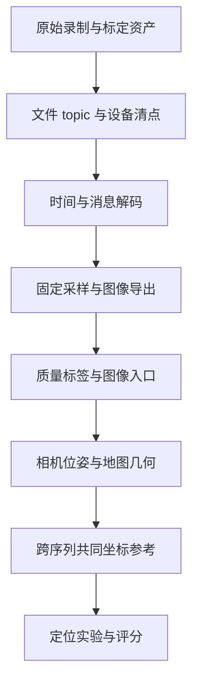

# 洗数据

机器人数据清洗并不只是删掉坏图、把bag导出成PNG。真正的问题是：这些图像来自哪个传感器、处于哪个时刻、使用什么相机模型、能与哪些位姿对应，最终能回答什么实验问题。

我在接入新数据时逐渐发现，“图像能读”“可以建图”和“可以评价定位精度”是三个不同阶段。本篇围绕工作中涉及的ROS数据、时间、采样、标定、参考位姿和存储知识展开，清洗经历只作辅助案例。

## 1. 从原始录制到算法输入

一段机器人录制通常包含图像、IMU、点云、标定信息、TF和算法输出。每一种数据都有消息类型、时间、坐标系和来源。



前面的步骤完成，不自动让后面成立。例如导出了图像和时间戳，仍可能没有合法的相机轨迹；点云能配准，仍可能不能把相机放进统一地图。

### 1.1 Raw、derived、runs分层

| 层级 | 内容 | 处理原则 |
| --- | --- | --- |
| raw | 原始bag、压缩包、设备标定与元数据 | 保留原状，作为可追溯输入 |
| derived | 图像、manifest、时间转换、质量标签 | 由固定规则生成，可重建 |
| runs | 特征、匹配、地图、预测与评分 | 与具体算法和配置绑定 |
| temp | 抽取与转换中间产物 | 验证后按明确范围清理 |

原始资产与派生产物分开，可以在修正解码或时间规则后重新处理，而不需要猜之前删掉了什么。算法预测不要反过来进入数据清洗规则。

## 2. ROS bag、DB3和MCAP是什么

[rosbag2](https://github.com/ros2/rosbag2)记录的是带时间戳的ROS消息，不只是视频。读取时一般有三个层次：

1. **存储读取**：从DB3/MCAP找到消息记录。
2. **消息反序列化**：根据ROS类型将payload还原成消息字段。
3. **图像解码**：按encoding、尺寸、step等字段还原像素。

有文件不代表存储插件可用；读到字节不代表ROS消息可解码；消息能解码也不代表图像语义正确。

| 格式 | 基本组织 | 接入关注 |
| --- | --- | --- |
| SQLite3 / DB3 | 数据库中的topic、时间和消息行 | 索引、查询方式、BLOB读取和远程I/O |
| MCAP | 面向消息日志的容器，可包含chunk、压缩和索引 | storage plugin、schema、压缩与消息类型 |

rosbag2通过存储插件处理不同格式。环境中安装了rosbag2核心，不代表每种storage backend已经可用。确认插件后，还要用实际数据贯通读一条目标消息、反序列化和图像导出。

这类读取问题属于工具链接入，不是SLAM算法失败。应将“存储打不开”“消息类型缺失”“像素解码失败”分别记录。

## 3. 图像编码：尺寸正确还不够

ROS `sensor_msgs/Image`常见字段包括height、width、encoding、step和data。

- `mono8`通常是每像素8bit单通道灰度。
- `rgb8`与`bgr8`通道顺序不同。
- `step`描述每行字节跨度，不能默认始终等于宽度×通道数。
- 深度图可能是整数深度或浮点深度，单位与无效值规则需要确认。

解码时要检查数据长度、stride、dtype和通道，不只检查能否写成PNG。读错通道或误用dtype，有时图像仍然“看起来有内容”，模型却面对错误输入。

`CompressedImage`又有另一层图像压缩格式，不能当原始像素直接reshape。

### 3.1 哪个topic才是需要的相机

机器人可能同时有RGB、左右mono、整流左右图、深度图及不同CameraInfo。选择topic时要核对：

| 问题 | 为什么重要 |
| --- | --- |
| 左目、右目还是RGB | 不同内参、光心与外参 |
| raw还是rectified | 相机模型与像素坐标不同 |
| 设备SN是否一致 | 同型号设备也不能任意共用标定 |
| frame_id对应什么 | 不等于文件所在目录的坐标名 |
| 图像与CameraInfo是否匹配 | RGB信息不能直接用于mono相机 |

若CameraInfo无效，应回到同设备的标定资产，不要补一组“常见焦距”让程序继续运行。能运行和几何有效是不同要求。

## 4. 时间戳：header time、log time和设备时间

### 4.1 三种常见时间

| 时间 | 常见含义 | 风险 |
| --- | --- | --- |
| 设备时间 | 传感器自身时钟，可能从开机计时 | 与主机epoch不同，重启后变化 |
| 消息header时间 | 数据源/驱动给消息附加的时间 | 要确认是否代表曝光或采样时刻 |
| bag log时间 | 记录端用于存储排序的时间 | 可能受传输、排队和记录方式影响 |

log time有用，但不自动等于曝光时刻。相机与IMU关联时，这个区别直接影响运动补偿和定位误差。

### 4.2 单次偏移与时钟漂移

若仅需将开机时间映射到epoch，可以近似使用：

$$
t_{epoch}=t_{device}+b.
$$

更一般的时钟映射是：

$$
t_{common}=a\,t_{device}+b.
$$

b表示偏移，a包含时钟速率差。跨多次开机不应默认共用一个b；长录制也不能未经检查就认定a=1。

时钟映射与相机—IMU标定时间偏移不是同一个概念。前者统一时钟坐标，后者解释传感器测量的相对时间关系，处理时要避免重复补偿。

### 4.3 时间QA应该检查什么

检查时间回退、重复时间、异常间隔、覆盖区间与跨topic差异。对每帧保存原始时间、转换时间与转换规则，不只保存一列“处理后的timestamp”。

如果只解码了部分消息的header，就只能对该子集声明header时间质量。全量log时间单调，不能自动推出全量header时间单调。

一个工程案例是：MCAP 链对目标 topic 的每条消息做了反序列化，保存全帧 header/log time、结构字段和 payload 哈希，并按每段录制的 boot epoch 建立统一时间；只有固定抽样帧进一步转成图像并计算质量标签。DB3 因远程 BLOB 读取较重，全帧只查询 row ID 与 log time，固定抽样后才读取 payload、header 并导出图像。两者都能组织图像入口，但证据覆盖不同，manifest 必须如实区分。

## 5. 固定采样：怎样减少数据又不偷偷挑容易帧

### 5.1 按时间采样与每N帧采样

固定每30帧取一帧，只有原始帧率稳定时才近似1Hz。丢帧、曝光变化或录制抖动会让采样时间不均匀。

按时间定义更明确：先保留首帧，再对$t_0+k\Delta t$边界选择该边界之后的第一帧。

$$
i_k=\min\{i:t_i\ge t_0+k\Delta t\}.
$$

实际实现还需规定长缺帧时是否跳过空窗口、同一源帧能否被重复选中。通常不应为补齐1Hz数量重复输出同一图像，而应保留空窗口和间隔异常。

1Hz是减少离线图像规模的选择，不表示SLAM/VIO原始输入也应降到1Hz。用于生成相机轨迹时，通常还需要原始频率的图像、双目与IMU。

### 5.2 先定规则，再看算法结果

采样不能根据匹配数、PnP内点或预测误差决定。否则困难帧被删除，算法看起来更强，数据划分也依赖某个被测方法。

暗、过曝、模糊或低纹理帧，最好先保留并标标签。若确实损坏、不能解码，可以依预先规则排除，但要保留记录与原因。

工程上“清洗”更接近把问题显式标出，而不总是把问题帧删除。

## 6. Manifest：数据清洗最重要的索引

图像目录只告诉我有哪些输出，不告诉我每张图来自哪里、还有哪些源帧没被选。

帧级manifest可保存：

```text
sequence_id, source_file, source_row_or_message_id,
topic, frame_id, encoding, width, height,
log_timestamp, header_timestamp, common_timestamp,
selected, selection_rule, decode_status,
quality_flags, output_path, output_hash
```

原始消息ID应稳定关联到源记录。全帧清单加selected字段，比只保留导出帧列表更容易审计。

### 6.1 数量核对的三条链

1. 源记录数量与全帧manifest一致。
2. selected记录与抽样规则一致。
3. 成功导出图像与selected成功解码记录逐项对应。

不仅比总数，还比ID、时间和路径。两个错误可以抵消到同一个总数。

### 6.2 “零解码失败”的范围

“解码”要拆成消息反序列化、结构验证、像素数组转换和文件写出。DB3 路线只对 selected 帧读取 payload，因此零失败只说明抽样子集贯通；全帧数据库索引不表示每一行图像都经过验证。当前 MCAP 路线覆盖了全帧消息/header 与结构校验，但完整像素转换、质量指标和 PNG 写出仍只发生在 selected 帧。两条路线的“零失败”不能用同一句话扩大成“全部原始图像均完成视觉 QA”。

这不是流程不完整，而是性能与证据范围的选择：先以较低I/O成本构建可复用入口，再按需要扩展全量检查。表述时不能把局部验证扩大成全量认证。

## 7. 视觉QA：质量标签与重叠检查

### 7.1 自动指标是标签，不是真实场景理解

可以用亮度统计、饱和比例、梯度或Laplacian响应给暗、过曝、模糊、低纹理打标签。

这些指标都受场景内容影响。白墙可能天然低纹理，亮窗口可能是场景正常部分；Laplacian小也不一定是运动模糊。因此阈值应固定、保留原图，自动标签再配合联系图检查。

### 7.2 联系图能证明什么

固定时间分位或固定采样的contact sheet适合检查：路线、朝向、光照、相同结构与动态遮挡。

看到公共客厅、走廊或办公室，支持“这个pair有共同视野”；不能证明精确相机位姿，也不等于建立了逐Query独立overlap标签。

抽图应按时间等可复现规则，不按最佳匹配结果挑。联系图是QA入口，不替代全量计数和几何验证。

## 8. 标定：设备匹配不等于参数已验证

### 8.1 分清几个层级

| 层级 | 参数 | 作用 |
| --- | --- | --- |
| 单相机 | K与畸变D | 像素到成像射线 |
| 双目 | 左右相机外参 | 基线、整流与双目几何 |
| Camera–IMU | 相机与自身IMU外参、时间偏移 | 视觉惯性状态与相机转换 |
| Camera–LiDAR/body | 相机与外部机体/激光系统关系 | 从LIO状态得到相机轨迹 |

[Kalibr](https://github.com/ethz-asl/kalibr)可以帮助完成多相机和视觉惯性标定。拥有Kalibr结果，是有参数估计与求解记录；仍需检查数据激励、残差、坐标方向、设备对应和独立验证。

同一SN说明资产匹配更可信，但不保证参数已经validated。出厂标定、离线估计和独立验证是不同状态。

还要区分 **raw calibration data、calibration solution、calibration validation**。AprilGrid/checkerboard bag 只是原始观测；YAML 或优化日志是一次解算结果；重复采集、独立数据残差、设备身份和安装复核才属于验证。文件名里出现 `calib`，不能自动把状态升级成 verified。

### 8.2 Raw distorted与rectified必须选一条合法路径

最初清洗产物保留原始畸变像素。后续几何入口有两条合法路径：

- 用对应raw内参和畸变模型进行几何处理。
- 依据可靠标定整流/去畸变一次，保存新的相机模型和变换。

不能把raw图像直接当旧整流图，沿用旧K而忽略D；也不能对已经rectified的图像重复整流。

若PnP前使用去畸变关键点，要明确它们是归一化相机坐标还是新K下像素。重投影门槛的单位和像素空间必须同步。

“清洗阶段没有增强或resize”只是保护原始输入，不代表后续几何无需相机模型。

本次后续接入识别出原图使用 fisheye/equidistant 模型，并以同 SN 的 provisional Kalibr 参数生成独立的 640×480 左目整流版本。raw 资产继续保留，算法入口改用整流图及对应的新相机模型。这是新增派生阶段，不是原图曾经已经整流。

整流后尺寸仍是 640×480，不代表焦距、主点或有效视场没有改变。需要保存整流旋转、新 K、输出尺寸及有效区域；PnP 的 2 px 明确作用于这个整流像素空间。图像尺寸一致本身不能证明几何模型一致。

## 9. 为什么LiDAR/body轨迹不能直接当相机轨迹

若相机刚性固定在body上，且外参已知：

$$
T_{W\leftarrow C}(t)=T_{W\leftarrow B}(t)T_{B\leftarrow C}.
$$

因此LIO轨迹并非绝对不能使用；关键是状态原点、外参、时间和估计质量都要明确。

若相机与body关系在录制中变化，则应写成：

$$
T_{W\leftarrow C}(t)=T_{W\leftarrow B}(t)T_{B\leftarrow C}(t).
$$

缺少这个随时间的关系，无法通过一个固定外参恢复相机轨迹。

已有安装反馈指出，部分 OAK 采集在前后几个 bag 之间存在约 8.5° 的旋转差，只能提供粗略外参。这说明不能未经验证跨 bag 共用一组精确固定外参；它本身不能证明每个 bag 内部始终在发生相对运动。应分别检查“bag 间外参变化”和“bag 内是否近似刚性”，也不能推广到所有设备和序列。

对于其他数据，若只有“外参缺失或未认证”，正确状态应是 **UNKNOWN / unverified**，而不是直接写成“安装一定随时间变化”。相机与自身 IMU 的内部标定也不等于相机与外部 LiDAR/body 的安装关系。

### 9.1 跨序列PCD配准解决的是另一件事

点云注册估计两个地图之间的固定变换：

$$
T_{W_r\leftarrow W_q}.
$$

它将一个世界地图变到另一个世界地图，不能恢复序列内部缺失的$T_{B\leftarrow C}(t)$。这是左边的地图坐标关系与右边的传感器安装关系，作用位置和物理问题都不同。

所以“已有FAST-LIO2轨迹，再做一次ICP”不足以自动获得合法相机参考。

### 9.2 用双目 VO 与 LIO 估计相机链

缺少可靠相机轨迹时，一种工程路线是：在同一 bag 中运行双目 VO，获得带米制尺度的相机运动；再结合 LIO body 运动，估计相机与 body 的常量关系。

定义 $X=T_{B\leftarrow C}$，相邻两个时刻的 body、camera 相对运动分别为：

$$
A_{ij}=T_{W_B\leftarrow B_i}^{-1}T_{W_B\leftarrow B_j},
\qquad
B_{ij}=T_{W_C\leftarrow C_i}^{-1}T_{W_C\leftarrow C_j}.
$$

若安装刚性且时间正确，它们满足手眼标定关系：

$$
A_{ij}X=XB_{ij}.
$$

两个轨迹的世界坐标可以不同，因为相对运动消去了世界坐标关系。绝对轨迹关联时还可能需要一个世界坐标变换 $Y$：

$$
T_{W_B\leftarrow B_i}X
\approx
Y T_{W_C\leftarrow C_i}.
$$

这两式解释的是通用估计模型，并不意味着本次代码一定采用某种手眼求解器；实际求解参数与约束要从实现核实。

**可观测性比“能优化出一个矩阵”更重要。**运动缺少多轴旋转、几乎直线平移或长期平面运动时，部分外参自由度可能约束很弱。双目有米制尺度，也不自动保证运动足以标定外参。

本次工程使用各 bag 自身的 10 Hz 双目与 FAST-LIO2，前 60% 估计常量相机/body 关系，后 40% 做留出检查，再冻结 Reference 相机 Pose 供各方法三角化。它解除的是地图输入阻塞；相机 Pose 仍来自估计链，不是直接测得的严格真值。

### 9.3 留出检查验证什么

拟合段残差小，可能只是模型适应了该段数据。留出段能够检验常量关系和轨迹组合在未参与拟合的时刻是否继续成立。

位置残差可写为：

$$
e_t(i)=\left\|\operatorname{trans}(T_i^{pred})-
\operatorname{trans}(T_i^{check})\right\|_2.
$$

同时检查旋转误差、误差随时间的趋势、分段残差和运动覆盖。单个中位数不能区分持续漂移、少数跳变和固定偏移。

留出差异可能混合 VO 漂移、LIO 误差、时间关联误差、外参估计误差和真实安装变化，不能全部归因于“外参不准”。本次记录中，常州 Reference/Query 的留出绝对位置中位约 0.38/0.49 m，Office 003/001 约 1.05/1.67 m。该量级已经不能忽略于 0.5 m 的 S 档阈值，但它不是经过独立认证的真值误差上界。

### 9.4 双目同步：抽样必须保留图对关系

左右目分别按 bag log time 抽样，可能把不同曝光时刻的图像凑成一对。运动时左右时刻差会破坏“同一时刻、固定基线”的双目几何。

本次 Office 左右目候选中，003 有 1462/1567 对、001 有 1281/1294 对 header 完全相同；双目 VO 使用 exact-header 交集。这是按采集时间配对，不是按匹配效果挑帧。

相同 header 只证明在该驱动语义下时间字段一致，不自动证明物理曝光严格同步。其他设备可能存在经标定的固定时间偏移，不能把 exact-header 相等推广为所有双目的唯一配对规则。配对索引、时差、未配对帧和驱动时间语义都应保存。

## 10. Image-ready、map-ready和benchmark-ready

| 状态 | 最小含义 | 仍可能缺什么 |
| --- | --- | --- |
| image-ready | 图像、选择规则、时间索引和输入身份可复用 | 标定验证、相机位姿、地图关系 |
| known-pose map-ready | Reference相机位姿和相机模型可用于可靠三角化 | Query共同坐标参考 |
| proxy-score-ready | Query相机参考可放入Reference地图，并已冻结 | 独立绝对GT与运行结果 |
| engineering-benchmark-ready | 输入、方法地图、在线运行、gate、逐帧记录与计时边界贯通 | 正式 A 身份、参考认证、正式质量评分 |
| quality-score-ready | 对声明的精度档位，评分参考的不确定性与资格已经审查 | 运行结果与任务覆盖 |
| benchmark-ready | 必须附带任务和资格范围，不能作为无条件总状态 | 超出范围的结论仍可能不可支持 |

“ready”必须相对某个任务定义。同一图像集可以为图像读取、检索烟雾测试或局部匹配诊断就绪，却为 known-pose 6DoF 定位与 Proxy 评分阻塞。不要把一个总开关代替所有层次。

### 10.1 没有3D地图时仍可以做什么

图像读取、特征提取、候选检索和固定图对匹配通常可以开展，用于验证接入和成本。它们不天然依赖Query GT。

没有独立重叠标签，正式检索Recall仍不能随意计算；没有3D地图，不能完成这条map-based PnP链；没有合格Query参考，就不能给出正式位置/旋转Recall、Precision、危险接受或ATE/RPE声明。若有明确标注为 provisional 的参考候选，可以计算诊断值，但不能把这些数值当认证精度。

这些烟雾测试要明确命名，不能把“有很多匹配”当“定位成功”。运行记录、几何接受和参考判断是不同证据。

## 11. 存储与NAS：少做远程随机I/O

大bag经过网络文件系统读取，瓶颈可能是网络延迟、服务器文件系统和查询方式，而不是CPU解码。

DB3若缺少适合topic/时间条件的索引，遍历大BLOB可能产生大量远程I/O。先建立消息索引，再只读取固定selected payload，能减少初期处理量。

这是访问策略，不是允许修改公司原始数据库。需要索引或重组织时，可在授权的派生副本完成。

### 11.1 验证迁移与删除

迁移核验可比较相对路径、大小和SHA256。仅文件数量相同不足以证明完整复制，大小相同也不足以证明内容相同。

逻辑文件字节与磁盘可用空间变化不一定相等：块分配、压缩、去重、快照与延迟回收都可能影响物理空间。清理时不要把逻辑字节直接说成释放了同样大小的设备空间。

原始输入、可复现配置、派生结果和运行证据的保留价值不同。临时抽取可在验证后清理，唯一原始资产不应因为“已有几张导出图”就删除。

## 12. 从清洗入口到工程地图：阶段案例

固定时间抽样后的入口，继续生成整流图、相机链和方法地图：

| 序列 | 原始消息/帧数 | 约 1 Hz 导出帧 | 后续作为 Reference 的注册图数 |
| --- | ---: | ---: | ---: |
| 常州 seg019 人工光 | 3756 | 126 | 125 |
| 常州 seg020 自然光 | 3208 | 107 | 106 |
| Office 003 | 4699 | 157 | 156 |
| Office 001 | 3883 | 130 | 本轮仅作为 Query |

导出帧与地图注册帧不是同一个计数；本轮每条 Reference 比导出帧少一张。原因需要帧级资格记录解释，不能自行猜为坏图或算法失败。图像入口仍保留完整抽样集合，不按算法结果重新挑帧。

三方向已完成 A-approx、B0、C0 全量 seed 0/1/2。常州正反向复用同两条序列，Office 是独立来源；三 seed 只检查求解随机性，不等于三份独立采集。

| 项目 | 当前资格 | 能说明什么 |
| --- | --- | --- |
| 图像与抽样索引 | 完成 | 原始身份、选择规则与像素入口可追溯 |
| Reference 相机几何和方法地图 | 完成工程构建 | 可实际运行 known-pose 定位 |
| B0/C0 | engineering-benchmark-ready | 在线链、失败记录、接受规则、性能已贯通 |
| A-approx | 已运行 | 一个明确命名的传统近似链 |
| 正式 RTAB-Map A | blocked | vocabulary、产品 adapter 与 golden equivalence 未齐 |
| 跨序列 Proxy candidate | 已建立、冻结 | 可做 provisional 诊断 |
| 正式 Recall/Precision/FA、strict camera GT | 未获资格 | 仍需参考链不确定性评审和独立验证 |

这里更新了原先“缺相机 Pose、尚未运行”的状态：几何输入已经通过 LIO 辅助估计链补齐，模型也实际运行了。剩余问题从“程序没有输入”转为“参考足以支持什么精度结论”。

## 13. 地图 QA 与评分资格是两项检查

### 13.1 固定相机 Pose 的地图怎样检查

各方法允许使用自己的局部特征、匹配和 landmark，因此地图质量不能只比较 Point3D 数量。

| 检查项 | 作用 | 不能自动推出什么 |
| --- | --- | --- |
| 固定 Pose 构建前后的矩阵差 | 检查建图有没有改相机位姿 | Pose 本身接近真实值 |
| 注册图数、有效观测覆盖 | 检查是否有无支持或弱支持区域 | 注册图都有充分可靠几何 |
| track 长度与重复观测 | 检查多视图支持 | 长 track 一定对应同一物理点 |
| 重投影误差中位/P95及空间分布 | 检查图像观测与地图的自洽程度 | 地图具有绝对物理精度 |
| 正深度、三角化角和深度范围 | 检查弱基线、远点和退化 | 全部几何误差已排除 |
| 留出图像的几何验证 | 检查对未参与建图图像的支持 | 独立世界坐标真值已经成立 |

本轮固定 Pose 最大矩阵差处于 $10^{-15}$ 量级，说明实现维持了固定 Pose 约束。C0 三方向平均重投影误差约 1.35–1.58 px，P95 约 2.79–2.86 px。这说明需要看误差分布；PnP 的 2 px 内点门槛与建图统计是不同环节，不能要求所有地图观测都天然小于该在线门槛。

Office 较长 track 可以来自重复环路与全库配对；低重投影误差也可能与系统性位姿偏差共同存在。自洽地图和独立真值是不同目标。

### 13.2 Solver output、accepted 与 correct

三个状态必须分别记录：

1. **solver output**：求解器给出了数值有限的位姿。
2. **accepted**：通过预先冻结的工程门槛。
3. **correct under reference**：在有资格的参考下满足位置和旋转阈值。

本轮主接受规则为 finite pose + 唯一 Point3D PnP 内点不少于 20。对同一三维点的重复关联，不能当作多个独立 landmark 增加计数。

常州 raw solver 曾产生 $10^{14}$–$10^{15}$ m 量级的有限退化位置，但内点不足 20，被 gate 拒绝。这说明有限数值不是有效定位。被拒绝位姿可以不进入接受轨迹图，但必须留在逐帧记录中；接受率分母也不能仅限于有输出的帧。

三方向 $N_{all}/N_{eval}$ 为 126/125、107/106、130/129。评价参考缺一帧与算法拒绝不是同一类事件，应单列 eligible mask、原因和 $N_{all}$/$N_{eval}$ 分母。该报告没有给出这三帧的具体资格原因，完整审计还需要回到 manifest 与评分记录。

### 13.3 为什么预测独立的 Proxy 仍可能不够准确

Query 在线阶段只读图像、相机模型和 Reference map；Query 双目、LIO、PCD 用于评价端构造共同坐标参考。这使评分链可以独立于被测预测，避免用预测去拟合参考。

但独立于被测算法，不等于误差小。地图与评分还可能共享标定和传感器估计的系统偏差。参考冻结后应统一用于所有方法，不按某个方法误差挑变换；若做算法选择，应在独立验证集选，再用冻结测试集评价。

跨序列 PCD 正反注册一致，也只验证世界地图关系。常州约 0.008 m/0.064°、Office 约 0.002 m/0.044° 的正反一致性差，不能抵消前述相机链的米级留出偏差。

因此，本轮 F 档未获资格，S/C 档也仍待不确定性评审。报告中的 Recall、Precision、FA 与轨迹误差是 provisional 诊断值。FA 为零不能推出危险误接受不存在；FA 的错误阈值还必须与 Precision 的正确阈值分别说明，二者不能默认互为补集。

### 13.4 在线计时与离线建图分开

在线处理包含 Query 特征、检索、候选匹配、地图关联和 PnP/gate。Reference 特征预计算、图对匹配和三角化属于离线地图准备。

本轮主方向 B0/C0 的在线 P95 约 255.6/1461.2 ms；C0 Reference 全库配对约 125 s。前者是单 Query 运行成本，后者是地图准备成本，不能混成“定位一次花了多久”。runner 是否包含解码、NAS 读取、GPU 同步、冷启动与缓存，要从计时边界核对；不同计时协议的 P95 不直接横比。

功率应说明采样窗口与传感器范围。平均 GPU 功率不能独立代表整机能耗；若要比较单 Query 能量，应在相同边界内积分：

$$
E_{query}=\int_{t_{start}}^{t_{end}}P(t)\,dt.
$$

以上地图 QA、接受率和性能已经能支撑工程交付。正式精度验收仍需要参考链资格，增加 C2/C3-full 不会自动修好参考链。

## 14. 清洗阶段真正留下什么

我最应该保留的是：原始输入身份、帧级索引、时间转换、固定采样规则、raw/rectified 相机模型、双目配对、质量标签、外参估计与留出记录，以及地图和评分各自的资格。

清洗不是承诺所有数据都能进入所有实验，而是将数据能够支持的问题与缺口都表达清楚。这样后续接入新地图生成器或补齐参考时，可以继续使用同一图像划分，不必按算法结果重新挑帧。

评价知识见[如何完成一次评估](./如何完成一次评估.md)，地图与对应关系见[如何选择视觉重定位Pipeline](./如何选择视觉重定位Pipeline.md)，处理和部署成本见[效果与性能权衡](./效果与性能权衡.md)。