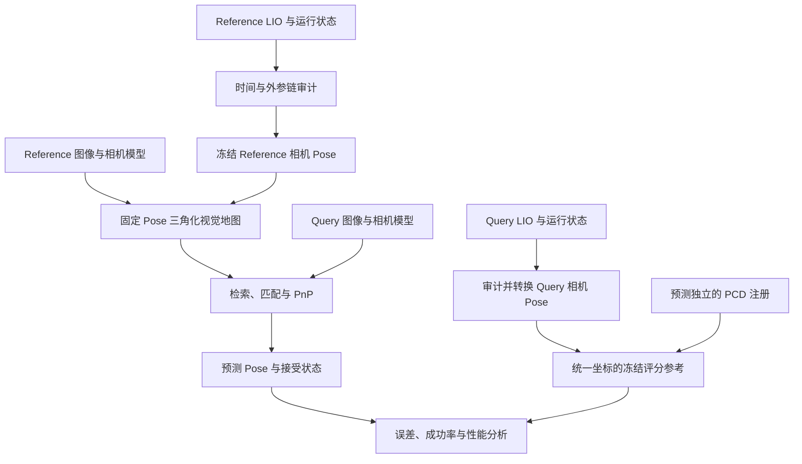

# 从 LIO 轨迹到视觉定位评估参考

评估视觉重定位时，最容易混淆的几个词是轨迹、相机位姿、地图、参考和真值。它们经常以几个 CSV、TUM、PCD 文件交付，但文件存在不代表这些产物已经能组成一个完整的评估系统。

本文讨论一种常见路线：用独立于被测视觉定位模块的 LiDAR–IMU 里程计提供相机几何，固定 Reference 相机位姿建立视觉地图；Query 在线只使用图像定位，离线再与 LIO 派生的相机参考比较。

这里的独立性指参考构建过程不使用被测 Query 预测。LIO 自身仍然是有误差的估计器，因此最终结果是相对指定 LIO 参考的定位表现，不能自动称为绝对 GT 精度。

## 1. 六种产物：先辨清对象，再讨论可信度

| 对象 | 主要内容 | 能解决的问题 | 单独不能证明什么 |
| --- | --- | --- | --- |
| 原始观测 | 图像、点云、IMU 测量 | 提供算法输入和复现条件 | 轨迹准确、传感器同步 |
| LIO 轨迹 | 指定状态 frame 相对世界的位姿 | 提供运动估计 | 直接就是相机位姿 |
| LiDAR 点云地图 | 已投影或累计到某个世界的点 | 几何覆盖、跨序列注册 | 图像对应、相机外参准确 |
| 相机轨迹 | 图像时刻的相机世界位姿 | 已知 Pose 建图、相机 Pose 评分 | 来源一定是 GT |
| 视觉定位地图 | landmark、track、图像观测与特征关联 | 2D–3D 对应、PnP 定位 | 与视觉前端完全无关 |
| 评分参考 | 在统一坐标和时间下冻结的比较对象 | 定义误差和成功条件 | 绝对真实、误差可忽略 |

### 1.1 `final_poses.csv` 是接口，不是方法

同一个文件名可能存放视觉 SLAM、SfM、LIO adapter 或外部测量系统产生的 Pose。必须另行记录：父子 frame、变换方向、时间语义、单位、四元数顺序、生成方法、版本、有效性标记。

“经典 SLAM 的 final_poses”说的是**位姿来源**；“CSV”说的是**存储接口**；“相机世界位姿”说的是**几何含义**；“可用于评分”说的是**参考资格**。这四个层面不能由文件名互相推导。

### 1.2 LIO 也不一定输出 LiDAR 原点的轨迹

算法状态可能以 IMU 为中心，驱动消息可能发布另一个 frame，导出脚本还可能进行额外转换。即使父 frame 名字叫 `camera_init`，也不能仅凭名称判断数据来自相机。

应查消息定义、状态变量和导出代码。本次工程审计确认轨迹为 Livox internal IMU 的世界位姿，记为 \(T_{W\leftarrow I}\)。这一结论只适用于被审计的运行与导出版本。

## 2. 坐标链：把“轨迹可用”变成“相机几何可用”

全文使用列向量和以下约定：

\[
\mathbf p_A=T_{A\leftarrow B}\mathbf p_B,
\qquad
T_{A\leftarrow B}=
\begin{bmatrix}R_{A\leftarrow B}&\mathbf t_{A\leftarrow B}\\0&1\end{bmatrix}.
\]

平移 \(\mathbf t_{A\leftarrow B}\) 是 B 原点在 A 中的坐标。它不是不带方向的“两个传感器距离”。

### 2.1 组合与求逆

\[
T_{A\leftarrow C}=T_{A\leftarrow B}T_{B\leftarrow C},
\qquad
T_{B\leftarrow A}=
\begin{bmatrix}R^T&-R^T\mathbf t\\0&1\end{bmatrix}.
\]

检查组合时，让相邻下标相消：右侧输入坐标最终必须变成左侧输出坐标。求逆不只是平移取负，必须同时旋转平移。

### 2.2 从 internal IMU 到整流相机

定义：W 为 LIO 世界，I 为 LIO 状态 IMU，L 为原生 LiDAR 点云 frame，\(C_{raw}\) 为原始左目 optical frame，\(C_{rect}\) 为整流左目 frame。

\[
\boxed{
T_{W\leftarrow C_{rect}}(t)
=T_{W\leftarrow I}(t)
T_{I\leftarrow L}(t)
T_{L\leftarrow C_{raw}}(t)
T_{C_{raw}\leftarrow C_{rect}}
}
\]

每一段都要解释来源和有效范围。跨传感器安装若刚性，可把 \(T_{L\leftarrow C_{raw}}\) 建模为常量；存在相对运动时，真实变换可能随时间变化，常量近似必须说明限制。

若交付矩阵是 \(T_{C_{raw}\leftarrow L}\)，需要取逆。若整流定义为 \(\mathbf p_{rect}=R_0\mathbf p_{raw}\)，则这里需要的是 \(R_0^T\)，不是直接代入 \(R_0\)。常见虚拟相机整流保持原点、只改变朝向；具体软件是否引入其他 frame 转换仍需核实。

内参 K、畸变参数和图像尺寸属于投影模型，不是这条刚体变换链中的外参。整流后的图像应使用整流后的相机模型。

### 2.3 为什么“几厘米杆臂”也值得记录

相机中心位置满足：

\[
\mathbf p_{WC}=\mathbf p_{WI}+R_{WI}\mathbf t_{IC}.
\]

即使两个原点相距不远，旋转也会使杆臂在世界中的方向改变。直接把 IMU 位置当相机位置，会引入与运动姿态相关的误差，不能靠一次固定世界平移完整补偿。

旋转外参错误还会直接进入相机朝向。对远处目标，角度误差可造成明显投影偏移，因此“位置看起来接近”不代表可用于像素级几何。

## 3. 时间关联也是坐标链的一部分

LIO 位姿在某些采样时刻存在，图像在另外一些时刻曝光。转换前必须把两个时间放到同一时钟域。

常见模型是：

\[
t_{LIO}=a\,t_{camera}+b.
\]

其中 a 表示时钟速率差，b 表示时间原点与偏移。短序列有时采用 \(a=1\) 的近似，但要有依据。把设备 boot 时间加上 epoch 偏移，只解决时钟表示问题，不自动证明曝光与 IMU 同步。

### 3.1 Pose 插值

对满足 \(t_0\le t\le t_1\) 的样本，令 \(\alpha=(t-t_0)/(t_1-t_0)\)：

\[
\mathbf p(t)=(1-\alpha)\mathbf p_0+\alpha\mathbf p_1,
\qquad
q(t)=\operatorname{SLERP}(q_0,q_1,\alpha).
\]

四元数应归一化，并处理 q 与 −q 表示同一旋转的符号问题。不要直接线性插值欧拉角。位置线性加旋转 SLERP 是工程近似，不是完整运动模型；快速机动和大采样间隔可能需要更好的插值方式。

adapter 应限制插值括号长度、处理重复与倒退时间，并禁止未经授权的外推。缺 Pose 的图像应保留状态，不能悄悄从固定抽样集合中删除。

### 3.2 时间误差如何变成几何误差

短时间内可粗略估计：

\[
\|\delta\mathbf p\|\approx\|\mathbf v\|\,|\Delta t|,
\qquad
\delta\theta\approx\|\boldsymbol\omega\|\,|\Delta t|.
\]

例如 2 m/s 时偏差 20 ms，可产生约 4 cm 的平移差；角速度 100°/s 时同样偏差对应约 2°。这是局部近似，还没有计入杆臂运动和 rolling shutter。

时间与空间标定可能互相补偿：错误时间偏移可能被拟合成错误外参。残差降低不一定说明两者都恢复正确。

## 4. 在线外参：配置不等于实际运行状态

刚性连接描述物理关系，在线估计描述算法对这段关系的估计。物理外参稳定，不保证每次滤波估计值完全相同。

### 4.1 四种容易混用的值

| 值 | 含义 | 使用前需要确认 |
| --- | --- | --- |
| 配置初值 | 启动滤波器的初始参数 | 后续是否继续估计 |
| 预测状态 | 当前观测更新前的状态 | 是否对应目标时刻、是否用于导出 |
| 更新后状态 | 当前观测更新后的估计 | 更新时刻和导出步骤 |
| 最终状态 | 运行结束时的估计 | 能否代表前段，是否已稳定 |

以 FAST-LIO 类实现为例，开启在线外参估计后，不能默认 YAML 外参就是全段实际值。具体日志字段、记录阶段及轨迹导出方式必须结合对应源码版本审计。[FAST-LIO 官方实现](https://github.com/hku-mars/FAST_LIO)

### 4.2 “每 bag 都在变”至少有三种含义

1. 每个 bag 的最终估计不同：可能涉及运动激励、可观测性、初值和滤波收敛差异。
2. 同一个 bag 中估计随时间变化：需要检查收敛、漂移、跳变和与轨迹的时间关系。
3. 跨传感器真实安装发生变化：涉及重新安装、松动或非刚性运动，需要重新标定或时变模型。

这三种情况的处理不同。LiDAR 内部 LiDAR–IMU 外参和 OAK–LiDAR 外参也不能混为一项。

**每 bag 不同不是天然阻塞；缺少与对应运行一致且含义明确的实际状态才是可追溯性阻塞。**

### 4.3 什么时候可以采用每 bag 常量近似

先检查时间字段、旋转和平移曲线、收敛阶段、尾段稳定性以及相关运动激励。若要冻结一个常量，应记录估计窗口、聚合方法、适用帧范围和变化幅度。

旋转不能直接对九个矩阵元素求平均后当作 SO(3)；需要合适的旋转平均或投影。稳定的尾段值不代表早期状态相同，稳定也不等于准确。

对于工程 Proxy，可以把稳定尾段值作为 provisional 候选，并通过敏感性分析检查影响。若要求严格复现逐帧原运行，就需要与导出阶段对应的历史，而不是用尾段值覆盖全程。

### 4.4 原日志与重跑的选择

原日志最有价值的地方是与现有轨迹、PCD 属于同一次运行。重跑适合状态丢失、记录不可解释或需要建立可复现新版本的情况。

新运行应整体冻结轨迹、外参历史、点云、配置、软件版本和导出逻辑。不要把旧轨迹和新外参拼成一个没有审计依据的组合。重跑也不会自动提升精度，更不会解决 LIO 未观测的相机安装变化。

以本次审计的 FAST-LIO fork 为例，代码顺序是：IMU propagation → 写 `mat_pre` → LiDAR iterated update → 发布里程计并更新地图 → 按开关写 `mat_out`。因此：

- `mat_pre` 包含当前扫描 LiDAR 更新前的预测状态，可用于判断在线外参是否离开初值、何时收敛、尾段是否稳定以及是否发生跳变；
- `mat_out` 包含同一扫描 LiDAR 更新后的 posterior 状态，更适合严格对应该帧导出的里程计和地图；
- 默认关闭运行状态日志时，可能仍有 `mat_pre`，但没有 `mat_out`。

这并不意味着一缺 `mat_out` 就必须重跑。先审计与原轨迹同一次运行的 `mat_pre`；若外参很早收敛且尾段稳定，可冻结一个明确标注为 provisional 的每 bag 常量。只有它仍在漂移、时间无法关联，或任务要求严格逐帧恢复 posterior 状态时，才值得重跑并打开 `mat_out`。不能把 `mat_pre[k]` 直接改名为同一帧的 post-update 状态。

### 4.5 “已有 FAST-LIO 结果”和“相机参考已经可用”不是同一层

交付的轨迹与 PCD 可以完整满足 LiDAR/LIO 层的参考需求：它们独立于被测视觉模块，也可用于跨序列点云注册。但视觉地图和评分对象位于相机层，还必须经过 LiDAR 内部外参、LiDAR–camera 外参和图像时间关联。

因此，自己重跑 LIO 并不会天然让参考“更独立”。若现有运行的输入、配置、轨迹和状态可追溯，直接使用它们已经与 HLoc 独立；重跑的价值主要是补齐日志和建立可复现的新版本。重跑 LIO 也不能估计它没有观测到的 OAK–LiDAR 非刚性关系。

若确需重跑，应把新轨迹、新外参历史、新 PCD 和环境记录作为同一个 run 冻结。不要把旧 `T_{W\leftarrow I}` 与另一次运行估计的 `T_{I\leftarrow L}` 随意拼接。

## 5. 固定相机 Pose 怎样形成 HLoc 地图

### 5.1 与普通 SfM 的区别

SfM 通常同时估计相机位姿与三维点；BA 可通过重投影误差联合调整两者。已知 Pose 建图则把相机位姿作为给定约束，只估计三维点、track 和关联。

对 landmark \(\mathbf P_W\)，已知相机位姿的目标可写为：

\[
\min_{\mathbf P_W}
\sum_i\rho\!\left(
\left\|\mathbf u_i-
\pi_i(T_{C_i\leftarrow W}\mathbf P_W)\right\|^2
\right).
\]

优化三维点可以允许；优化 Reference 相机位姿会改变“LIO 几何固定”的实验定义。是否优化内参也必须冻结，不能让它默默吸收参考链误差。

### 5.2 地图仍然受视觉前端影响

图像对应决定哪些观测进入同一 track，三角化决定 landmark 位置，过滤决定地图覆盖。因此：

\[
\text{LIO-pose-assisted map}
\ne
\text{全部几何与关联均由 LiDAR 直接提供的 map}.
\]

若所有方法使用同一兼容地图，主要比较在线检索和匹配；若不同方法各自建图，则比较的是包含地图构建在内的完整 pipeline。两者都可以有价值，但不能把后一种结论解释成纯在线 matcher 的优劣。

SP、RDD 或 dense matcher 的观测身份、坐标和关联接口不同。强行共享地图可能引入适配损失，也不能假设“统一地图”一定更公平。应明确实验要控制哪些变量。

### 5.3 地图验收

检查有效注册图像、三角化点数、track 长度、视差角、正深度、重投影残差、空间覆盖和重复关联。验证 Pose 固定性，但 Pose 数值未被修改只证明遵守约束，不证明外部位姿准确。

低重投影误差可能与错误但自洽的几何同时出现。参考可信度需要时间、外参和 LIO 证据，不能仅靠建图内部残差。

## 6. 跨序列评分：左乘世界对齐，右乘传感器转换

Reference 和 Query 独立运行 LIO，通常有不同世界 \(W_r\)、\(W_q\)。冻结 PCD 注册得到：

\[
G=T_{W_r\leftarrow W_q}.
\]

Query 相机评分参考为：

\[
T^{ref}_{W_r\leftarrow C_q}(t)
=G\,T_{W_q\leftarrow I_q}(t)
T_{I_q\leftarrow L_q}(t)
T_{L_q\leftarrow C_{raw,q}}(t)
T_{C_{raw,q}\leftarrow C_{rect,q}}.
\]

**世界对齐在左边，传感器转换在右边。** 两者解决不同问题，不能相互替代。

PCD 注册质量可通过重叠、残差分布、可视化、不同初始化、正反独立拟合的一致性等检查。若反向矩阵只是正向矩阵的逆，再检查正反相乘等于 I，只是代数检查，不能证明注册可靠。

走廊、平面、重复房间和动态物体可能使注册歧义；非刚性轨迹畸变也不能由一个 SE(3) 完整修复。点云残差 P95 不是相机 Pose 的误差上界。

禁止为每个 baseline 根据其 Query 预测重新拟合 G，否则错误可能被对齐步骤吸收。若使用估计轨迹拟合的 ATE 作为诊断，应单独注明，其含义与固定参考坐标中的绝对定位误差不同。

## 7. 一张图区分建图、在线推理和离线评分

Query LIO 不进入检索、候选排序、PnP 初始化、接受判断或筛帧。评价端可以读取它，但读取边界应由代码接口和产物依赖保证，而不是只靠文字声明。

参考链未通过时，应阻止评分参考发布。Reference 链通过但 Query 链未通过，可以先建图和检查输出／性能；不能发布依赖 Query 参考的精度排名。

## 8. 输出、接受、正确是三件事

| 状态 | 判断依据 | 是否需要评分参考 |
| --- | --- | --- |
| 输出 Pose | 求解器返回结果 | 否 |
| Accepted | 冻结的有限性与几何支持门槛 | 否 |
| Correct | 相对参考的位置、角度等误差满足阈值 | 是 |

例如工程协议可要求有限 Pose、唯一 Point3D 内点至少 20、PnP/RANSAC 阈值 2 px。它是接受规则，不是通用数学保证。重复计数、退化几何或错误关联仍可能产生被接受的错误位姿。

有限但极大的位置也可能出现。若增加新的合理性检查，应版本化协议，不能在看过某个方法结果后临时调整门槛。

### 8.1 常见定位指标

设 \(N_{all}\) 为全部 Query 数，\(N_{eval}\) 为具有冻结参考、可以评价正确性的 Query 数，\(N_A\) 为其中被接受的数量，\(N_{AS}\) 为被接受且满足 S 阈值的数量，\(N_{AD}\) 为被接受且超过危险错误 C 边界的数量。一组明确的定义是：

\[
\mathrm{Recall}_S=\frac{N_{AS}}{N_{eval}},\qquad
\mathrm{Precision}_S=\frac{N_{AS}}{N_A},
\]

\[
\mathrm{FA}_{all}=\frac{N_{AD}}{N_{eval}},\qquad
\mathrm{FA}_{acc}=\frac{N_{AD}}{N_A}.
\]

这里的 \(N_A\) 只统计“accepted 且具有参考”的帧；输出率与 Accepted 率还应分别以 \(N_{all}\) 报告。若 S 定义为 0.5 m／10°，C 定义为超过 1 m／20°，落在两者之间的帧既不是 S 成功，也不是危险 FP，因此不能用 \(N_A-N_{AS}\) 代替 \(N_{AD}\)。当 \(N_A=0\) 时 Precision 与 \(\mathrm{FA}_{acc}\) 未定义，不应写成 100% 或 0%。

无参考图像如何处理也需要预先规定：保留全部图像及状态，再明确精度评估子集和覆盖率；不得按预测是否成功决定资格。

### 8.2 ATE 与 RPE

在固定参考坐标中，位置误差为 \(\|\hat{\mathbf p}_i-\mathbf p_i^{ref}\|\)。相对位姿误差可以写成：

\[
E_{ij}=
\left((T_i^{ref})^{-1}T_j^{ref}\right)^{-1}
\left(\hat T_i^{-1}\hat T_j\right).
\]

需要说明采样间隔、缺失 Pose 的处理和参与统计的帧。只统计成功帧上的轨迹误差，会隐藏失败率，因此应与 Recall 等指标一起报告。

## 9. 参考误差与独立性的边界

独立可以拆成三个问题：

- **输入独立**：参考是否使用了被测预测？
- **算法独立**：参考是否由另一估计系统生成？
- **误差相关性**：地图和评分是否共享外参、标定或系统偏差？

LIO 独立于视觉定位，不代表 Reference 与 Query 参考误差独立，更不代表其绝对准确。共享外参误差可能部分抵消，使结果看起来较好；不同 bag 的误差也可能放大差异。

应记录参考组成，做外参、时间偏移和注册变换的敏感性分析。改变参数后重新建图／评分是在分析参考不确定性；不能挑选使某个方法分数最高的参数作为最终参考。

若参考位置有经过证明的误差上界 \(\epsilon\)，观测误差 d 与真实误差之间有三角不等式边界：

\[
\max(0,d-\epsilon)\le d_{true}\le d+\epsilon.
\]

普通 holdout 残差、PCD P95 或拟合差异通常不是这种经过证明的上界，不应直接套用来宣称真实精度区间。

## 10. 工程案例：卡点不在图像，也不在 PCD 注册

某跨光照 pair 已准备 102 张 Reference、94 张 Query 图像，其中分别有 101、93 张落在 LIO 时间覆盖内；公共视野与预测独立 PCD 注册均已检查。

现有 FAST-LIO 轨迹与 PCD 已经足以构成 LiDAR/LIO 层的算法参考；卡点位于从这一层生成 Reference 和 Query 相机 Pose 的外参链。原运行开启了 LiDAR–internal IMU 外参在线估计，但实际 `mat_pre` 在打包时遗漏。配置初值不能替代运行状态，adapter 因此拒绝生成相机 Pose。

补发原 `mat_pre` 后，应先审计其记录阶段、时间、收敛和运行身份，而不是立即要求重跑生成 `mat_out`。若尾段稳定，可形成 provisional 的每 bag \(T_{I\leftarrow L}\)；若仍漂移或必须严格匹配 posterior，才建立完整日志的新 LIO run。

另一个独立限制是 OAK 与 Livox 非刚性固定：跨飞行不能保证同一个 \(T_{L\leftarrow C}\)，炸机或重新受力后还可能改变。重新跑 FAST-LIO 不会解决这一问题，因为 LIO 没有观测 OAK。需要逐 bag 的外参证据或敏感性分析；否则能运行定位，但相机姿态与紧阈值精度只适合作为诊断。

图像 header 也有类似层级差异：确认它直接来自相机 SDK 的原始单调时间、ROS 发布时没有重新取时，可以排除一类发布延迟；但 SDK 没说明该时间对应曝光开始、中点还是其他内部事件，所以仍不能宣称 exposure-level 同步。

可按依赖顺序判断：

1. 原始输入和抽样集合是否完整？
2. 轨迹 frame、时间和单位是否清楚？
3. Reference 相机链是否闭合并具备声明的资格？
4. 固定 Pose 地图是否通过几何检查？
5. Query 相机链与跨序列对齐是否可以评分？
6. 在线定位是否与评分数据隔离？
7. 指标定义、失败状态和版本是否冻结？

“有 FAST-LIO 结果”回答的是第二步的一部分。“可以运行 benchmark”需要整条依赖满足。两个人可以都说得有道理，只是说的不是同一个验收层面。

## 11. 阅读关联

- [多传感器时空标定](./多传感器时空标定.md)：变换、同步、手眼标定和可观测性。
- [地图到底存了什么](./地图到底存了什么.md)：observation、track、landmark 与地图表示。
- [状态估计与不确定性](./状态估计与不确定性.md)：估计误差、鲁棒优化和参考不确定性。
- [数据采集与交付](./数据采集与交付.md)：怎样提前留下可闭合的输入与运行状态。
- [洗数据](./hloc/洗数据.md)：怎样验证已有数据并形成冻结实验输入。
