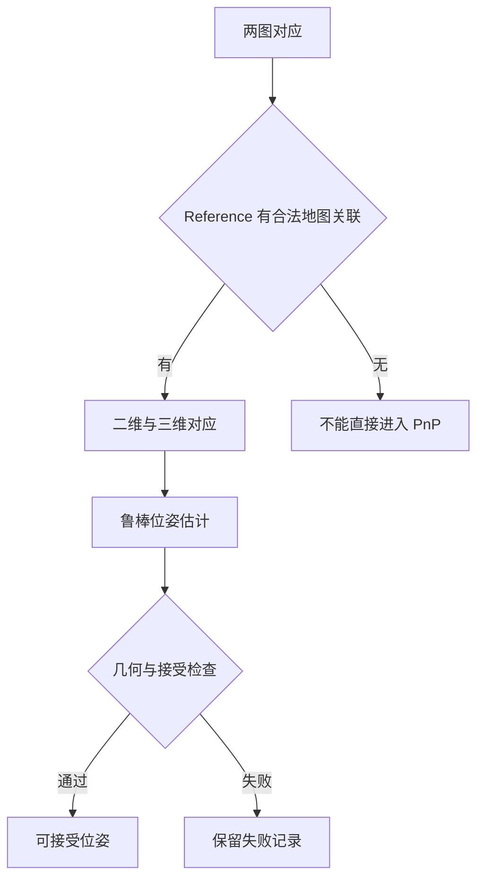

# 从图像对应到相机位姿

两张图像有很多匹配，为什么仍不能可靠定位？因为图像对应提供的是几何约束，并没有直接给出深度、世界坐标和相机位姿。对应是否正确、空间分布如何、地图点是否可信，都决定约束能否解出稳定的六自由度运动。

本文采用列向量。$T_{A\leftarrow B}$ 把 B 系坐标变到 A 系；世界点为 $P_W$，相机位姿为 $T_{W\leftarrow C}$。几何公式默认已正确处理畸变，使用针孔像素或归一化射线；原始鱼眼像素不能直接代入针孔公式。

## 1. 从像素到射线

### 1.1 针孔投影

世界点先变到相机坐标：

$$
P_C=R_{C\leftarrow W}P_W+t_{C\leftarrow W}
=\begin{bmatrix}X&Y&Z\end{bmatrix}^{\mathsf T}.
$$

内参和像素投影为：

$$
K=\begin{bmatrix}f_x&s&c_x\\0&f_y&c_y\\0&0&1\end{bmatrix},
\qquad \tilde p\sim KP_C.
$$

常见零 skew 情况下，$u=f_xX/Z+c_x$、$v=f_yY/Z+c_y$。$\sim$ 表示齐次比例等价；投影丢掉了深度尺度。

给定像素 $\tilde p=(u,v,1)^{\mathsf T}$，$x=K^{-1}\tilde p$ 是归一化射线，$P_C=\lambda x$。一张图只知道点在射线上，不能知道 $\lambda$。

相机中心在世界中的坐标是：

$$
C_W=-R_{C\leftarrow W}^{\mathsf T}t_{C\leftarrow W}.
$$

因此 world-to-camera 的平移向量不是世界中的相机位置。位姿方向弄反时，图像匹配可能正常，轨迹却完全错误。

### 1.2 像素空间与门槛单位

raw 像素、rectified 像素、归一化相机坐标和网络归一化坐标是四种不同对象。模型输出的 $[-1,1]$ 图像坐标通常用于采样，需要按接口约定还原；$K^{-1}\tilde p$ 则是相机射线坐标，二者不能混淆。

若图像缩放 $s_x,s_y$，焦距和主点也应同步变换。含裁剪和平移时，可以写成 $K'=AK$，A 是像素坐标的仿射变换。实际 resize 的像素中心约定可能包含半像素偏移，接入时要与图像库一致。

“2 px”必须说明是哪张图、哪个分辨率的像素。归一化坐标下不应沿用数值 2。

## 2. 两视图几何约束了什么

令第二相机相对第一相机的变换为：

$$
P_2=RP_1+t.
$$

同一个点、两个光心构成极平面，它与图像平面的交线称极线。第一张图的一个点在第二张图中的对应必须位于相应极线上。

### 2.1 Essential matrix：已知内参的几何

由 $P_1=\lambda_1x_1$、$P_2=\lambda_2x_2$ 得：

$$
\lambda_2x_2=R\lambda_1x_1+t.
$$

$x_2,t,Rx_1$ 共面，所以：

$$
x_2^{\mathsf T}[t]_\times Rx_1=0,
\qquad E=[t]_\times R.
$$

E 称本质矩阵，作用于已去畸变的归一化坐标。理论上 rank 为 2，两个非零奇异值相等。E 只有五个独立自由度：旋转三个、平移方向两个；平移大小不能从普通单目两视图恢复。

这也说明“恢复了两图相对位姿”不等于恢复米制轨迹。尺度需要双目基线、深度、惯性约束或其他来源。

### 2.2 Fundamental matrix：像素域约束

$$
\tilde p_2^{\mathsf T}F\tilde p_1=0,
\qquad F=K_2^{-\mathsf T}EK_1^{-1}.
$$

F 称基础矩阵，作用于针孔像素，理论上 rank 为 2、七个自由度。已知内参时，估计 E 可以利用更多物理约束；不知道内参时，F 仍可验证两视图对应。

$\tilde p_2^{\mathsf T}F\tilde p_1$ 是代数残差，受 F 的尺度影响，不能直接当作像素距离。常用 Sampson 近似距离为：

$$
d_S^2=\frac{(\tilde p_2^{\mathsf T}F\tilde p_1)^2}
{(F\tilde p_1)_1^2+(F\tilde p_1)_2^2+(F^{\mathsf T}\tilde p_2)_1^2+(F^{\mathsf T}\tilde p_2)_2^2}.
$$

它是几何误差的一阶近似，仍要注意畸变、噪声和模型假设。

### 2.3 Homography：特殊场景的二维映射

若点在第一相机中的平面满足 $n^{\mathsf T}P_1=d$，则：

$$
H=K_2\left(R+\frac{tn^{\mathsf T}}d\right)K_1^{-1},
\qquad \tilde p_2\sim H\tilde p_1.
$$

这里正号来自所声明的平面方程；使用 $n^{\mathsf T}P+d=0$ 时相应出现负号。

纯旋转且 $t=0$ 时，$H=K_2RK_1^{-1}$，可描述整个静态场景的映射，却不能产生平移基线来恢复深度。普通三维场景有不同深度和视差，通常不存在统一 H。

| 模型 | 输入坐标 | 主要约束 | 重要限制 |
| --- | --- | --- | --- |
| E | 归一化射线 | 已标定两视图运动 | 单目平移尺度未知 |
| F | 去畸变针孔像素 | 两视图极线关系 | 不直接提供米制深度 |
| H | 对应像素 | 平面或纯旋转映射 | 一般三维场景不能用单个 H 覆盖 |

## 3. 从 E 恢复运动，不止一个答案

E 分解通常得到两个候选旋转和两个平移符号，组合成四组候选。通过三角化，选择让足够多点在两个相机前方的解，即 cheirality 检查。

这不是无条件唯一恢复。低视差、错误对应、平面结构和噪声可能让判别不稳定。检查正深度的同时，还要检查三角化角和重投影误差。纯旋转时 $E=0$，没有有效平移信息，不应期待一般 E 分解恢复可靠深度。

F 的八点法需要至少八组对应，并应做坐标归一化提高数值稳定性；七点法和 E 的五点法属于不同最小求解器。最小样本数不是部署中推荐使用的点数，更不是“满足数量就有可靠位姿”。

## 4. 三角化：两条射线交会得到三维点

已知投影矩阵 $P_i=K_i[R_i\mid t_i]$，由 $\tilde p_i\times P_i\tilde P_W=0$ 可构造线性系统：

$$
A\tilde P_W=0.
$$

通常取 SVD 的最小奇异值对应向量，再除以最后一个齐次分量。噪声下两条射线不严格相交，线性结果只是初值，可进一步最小化多视图重投影误差。

### 4.1 为什么弱基线容易出远点

整流双目在理想条件下：

$$
Z=\frac{fb}{d},
\qquad \left|\frac{\partial Z}{\partial d}\right|=\frac{fb}{d^2}.
$$

f 是像素焦距、b 是米制基线、d 是像素视差。若 $f=400$ px、$b=0.1$ m：视差 8 px 对应 5 m，视差 2 px 对应 20 m。在 20 m 处，0.5 px 视差噪声的一阶深度标准差约 5 m。

这是示意计算，不是某个设备的实测参数。它说明远点可能有不错的像素匹配，却提供很弱的平移约束。

### 4.2 一个点进入地图前的检查

检查多视图正深度、有效三角化角、重投影残差、深度范围、track 一致性和观测覆盖。不要只检查“三角化函数返回了有限坐标”。

共面点并非一概不能定位，存在专门的平面求解方法；但某些几何布置会产生多解或较差条件数。应说明具体退化，而不是把所有平面场景统称不可解。

## 5. 为什么定位时变成 2D–3D

离线地图已存三维 landmark，以及它在 Reference 图像里的观测。Query 与 Reference 匹配后，沿观测关系查找三维点：

$$
p_Q\leftrightarrow p_R,
\qquad p_R\leftrightarrow P_W
\quad\Rightarrow\quad p_Q\leftrightarrow P_W.
$$

这一步是地图关联，不是重新估计 E。Reference 某个像素附近没有地图观测时，一个正确 2D–2D 匹配也未必能转成 PnP 输入。

## 6. PnP 求解与相机中心

PnP 的问题是给定 $P_{W,j}$ 与图像观测 $p_j$，估计 $R_{C\leftarrow W},t_{C\leftarrow W}$：

$$
p_j\approx\pi(K(RP_{W,j}+t)).
$$

P3P 的几何最小问题使用三点，可产生多解；具体 API 和 RANSAC 实现常增加一个点来判别。EPnP 通过控制点表达提高求解效率，迭代法可从初值最小化重投影误差。不同求解器的最小输入、退化处理和精化方式需要按实际实现确认。

PnP 输出通常是 world-to-camera；要画相机轨迹需取逆。OpenCV 的 `rvec` 是 Rodrigues 旋转向量，不是三个欧拉角。四元数还要分清 xyzw/wxyz、主动/被动旋转和坐标变换方向。

## 7. RANSAC：从含外点对应中找几何共识

每次抽最小样本、求候选模型、对全部对应计算残差、统计内点，再保留高质量模型并重估。它降低错误匹配影响，但不保证避开所有系统性错误。

若内点比例为 w、最小样本大小为 s，希望至少一次全内点抽样的概率为 p：

$$
N\ge\frac{\log(1-p)}{\log(1-w^s)}.
$$

以 $s=4,p=0.99$ 为示例，$w=0.5$ 时约 72 次，$w=0.2$ 时约 2876 次。真实采样可能非独立、存在退化，现代鲁棒估计也可能采用排序或局部优化，所以该式解释趋势，不预测精确运行时间。

门槛太小会拒绝正常噪声，太大会混入外点。原像素尺度、畸变处理与对应精化精度要一致。不能因一帧困难就临时放宽门槛，然后把结果纳入同一冻结比较。

### 7.1 多个二维观测不等于多个独立地图点

多个 Reference 可匹配到同一个 landmark。汇总对应时，需处理重复 Point3D、同一 Query 点对应多个 landmark 的歧义，以及空间覆盖。唯一三维点内点数比原始匹配数更接近独立几何支持，但仍不是可靠性的充分条件。

重复纹理可能产生很强的错误共识；RANSAC 在这些错误对应上也可能拟合出低残差模型。

## 8. 位姿精化与 BA 的区别

固定地图的位姿精化只优化相机：

$$
\min_T\sum_j\rho\left(\|p_j-\pi(TP_{W,j})\|_{\Sigma_j^{-1}}^2\right).
$$

BA 则可联合优化多个相机和地图点：

$$
\min_{\{T_i\},\{P_j\}}\sum_{(i,j)\in\mathcal O}
\rho\left(\|p_{ij}-\pi(T_iP_j)\|_{\Sigma_{ij}^{-1}}^2\right).
$$

两者都有重投影残差，但优化变量不同。known-pose 实验若承诺 Reference Pose 固定，就不能通过相机 BA 悄悄改变参考几何；允许的点精化也要明确配置。

位姿属于 SE(3)，可用局部扰动 $T'=\exp(\delta\xi^\wedge)T$。左扰动和右扰动定义不同，雅可比不能混用。优化细节见[状态估计与不确定性](./状态估计与不确定性.md)。

## 9. 怎样解释有限但极大的位姿

投影涉及 $X/Z,Y/Z$，约束不足时，巨大的坐标或弱约束运动方向可能仍在数值上产生有限投影。其他可能原因包括错误尺度、病态点分布、关联错误、初始化失败、坐标方向错误或实现缺陷。

发现异常后，应先检查输入单位与坐标，统计唯一内点和覆盖，查看深度/三角化角及求解器状态，再检查优化条件和候选歧义。不能只凭结果巨大就指定一个根因。

本轮工程里有 $10^{14}$–$10^{15}$ m 量级的有限 solver output，被内点门槛拒绝。这个经历支持“finite pose 与 accepted pose 必须分开”，不能证明其他通过门槛的解全部正确。

## 10. 一次定位应记录的几何证据

| 层级 | 建议记录 | 解决的问题 |
| --- | --- | --- |
| 匹配 | 原始数、过滤数、置信度、二维分布 | 是没有对应，还是对应集中 |
| 关联 | 可关联数、唯一 Point3D、歧义与重复数 | 匹配能否接到地图 |
| 求解 | 模型、迭代、内点、残差、输出状态 | 几何是否成立 |
| 接受 | 固定规则与拒绝原因 | 输出是否被系统采用 |
| 评价 | eligible mask、独立参考与误差 | 接受结果是否满足任务精度 |

[OpenCV calib3d](https://docs.opencv.org/4.x/d9/d0c/group__calib3d.html)提供投影、两视图和位姿求解接口；接入时尤其要核对输入空间与输出方向。[COLMAP](https://colmap.github.io/)组织多视图地图，[PoseLib](https://github.com/PoseLib/PoseLib)提供位姿求解工具。库替代的是实现工作，不替代问题定义。

地图结构见[地图到底存了什么](./地图到底存了什么.md)，图像检索与匹配表征见[视觉地点识别与几何定位](./视觉地点识别与几何定位.md)。
