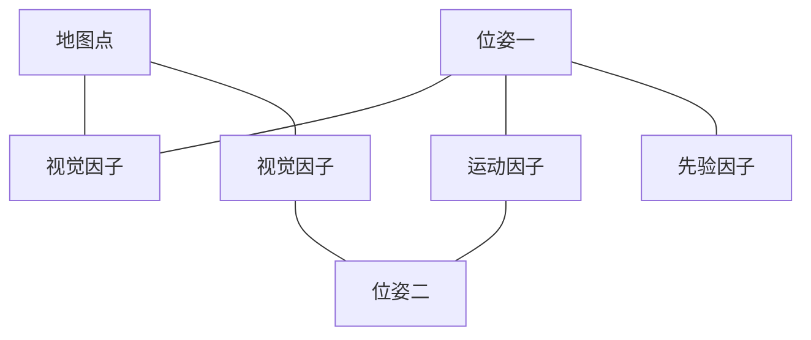

# 状态估计与不确定性

SLAM 的观测带噪声、关联可能错误，几何约束也可能不足。我们得到的位姿、地图和外参都是估计。理解估计过程，才能分清优化收敛、几何自洽、数值稳定与真实准确。

本文用 $x$ 表示待估状态，z 表示测量。位姿方向沿用 $T_{A\leftarrow B}$，李代数扰动采用平移在前、旋转在后的六维向量，除非另有说明。

## 1. 状态、测量与模型

机器人状态可包括位姿、速度、IMU 偏置、地图点、外参和时间偏移。最一般的状态/测量关系为：

$$
x_k=f(x_{k-1},u_k)+w_k,
\qquad z_k=h(x_k)+v_k.
$$

u 是模型使用的输入；在惯性系统中常来自 IMU，并非必须是电机控制命令。w/v 是过程与测量噪声。位姿等流形变量的加法应理解为局部扰动，不能无条件逐元素相加。

固定地图 PnP 只估当前相机 Pose；BA 同时估相机与点；VIO 还涉及速度、偏置等。增加变量让模型更完整，也可能引入更多不可观测方向。

## 2. 先验、似然与后验

Bayes 公式：

$$
p(x\mid z)=\frac{p(z\mid x)p(x)}{p(z)}.
$$

先验描述测量之前的知识，似然描述某状态产生测量的可能性，后验结合两者。MAP 最大化后验，ML 最大化似然：

$$
x_{MAP}=\arg\max_xp(z\mid x)p(x),
\qquad x_{ML}=\arg\max_xp(z\mid x).
$$

没有有效先验或先验近似常量时，MAP 与 ML 才可能一致。给粗外参一个先验不是错误，关键是可信度要合理；把粗参数当精确常量锁死会低估不确定性。

## 3. Gaussian 模型怎样得到最小二乘

测量模型 $z_i=h_i(x)+n_i$，若 $n_i\sim\mathcal N(0,\Sigma_i)$，定义残差：

$$
r_i(x)=z_i-h_i(x).
$$

对数似然去掉与 x 无关常数后：

$$
-\log p(z_i\mid x)=\frac12r_i^{\mathsf T}\Sigma_i^{-1}r_i+\text{const}.
$$

在给定 x 条件下各测量独立、协方差已知且不随 x 改变时，ML 化为加权最小二乘：

$$
\min_x\frac12\sum_i r_i^{\mathsf T}\Sigma_i^{-1}r_i.
$$

若协方差随状态变化，对数行列式项也可能影响目标；相关观测要联合建模，不能无条件逐项相加。

### 3.1 Mahalanobis 距离与白化

$$
\|r\|_{\Sigma^{-1}}^2=r^{\mathsf T}\Sigma^{-1}r.
$$

它衡量残差相对于噪声尺度有多异常。例如 1 px 与 10 cm 属于不同单位，不能直接等权拼接。取 $W^{\mathsf T}W=\Sigma^{-1}$，白化残差 $\tilde r=Wr$ 后便是普通平方范数。

如果位置两个方向噪声不同，同样 10 cm 的偏差可有不同惩罚。交叉协方差还表示两个误差方向共同变化。

## 4. 非线性最小二乘如何迭代

在当前估计附近：

$$
r(x\boxplus\delta)\approx r(x)+J\delta.
$$

$\boxplus$ 表示状态局部更新。对普通向量就是加法，对位姿则通过流形更新。

### 4.1 Gauss–Newton

对白化残差，求：

$$
J^{\mathsf T}J\delta=-J^{\mathsf T}r.
$$

$J^{\mathsf T}J$ 是 Hessian 的近似。每次求增量并更新，再重新线性化。它是局部方法，初值差、非线性强或条件差时可能失败。

### 4.2 Levenberg–Marquardt

常见阻尼形式：

$$
(J^{\mathsf T}J+\lambda D)\delta=-J^{\mathsf T}r.
$$

D 可取单位阵或对角尺度等。根据实际下降与预测下降调整阻尼，平衡局部二次模型和更保守的更新。大阻尼不是保证正确解的开关，也不能修复错误观测模型。

### 4.3 线性求解与数值条件

实际应解线性系统，避免显式计算矩阵逆。Cholesky 适用于合适的正定系统，QR 可直接处理线性最小二乘，SVD 有助于识别秩亏。形成正规方程会平方条件数，精度与速度之间需按问题选择。

meters、radians、pixels 和时间参数的尺度会影响条件数；白化和变量尺度设计可以改善，但不能创造缺失信息。

## 5. 位姿为什么用流形更新

旋转满足 $R^{\mathsf T}R=I$、$\det R=1$。直接更新九个矩阵元素会破坏约束；四元数也有单位范数和双覆盖问题。

定义 $\delta\xi=(\delta\rho,\delta\phi)$，左扰动为：

$$
T'=\exp(\delta\xi^\wedge)T,
\qquad
\delta\xi^\wedge=\begin{bmatrix}[\delta\phi]_\times&\delta\rho\\0&0\end{bmatrix}.
$$

右扰动则为 $T'=T\exp(\delta\xi^\wedge)$，扰动表达的坐标不同。雅可比、先验和协方差必须配套；李代数平移分量在一般有限旋转下也不是简单等于矩阵中的 t。

### 5.1 一个投影雅可比

针孔投影对相机点的雅可比为：

$$
J_\pi=\begin{bmatrix}
f_x/Z&0&-f_xX/Z^2\\
0&f_y/Z&-f_yY/Z^2
\end{bmatrix}.
$$

若 world-to-camera 位姿采用左扰动，则一阶：

$$
P_C'\approx P_C+\delta\rho-[P_C]_\times\delta\phi.
$$

对预测投影的雅可比为 $J_\pi[I\; -[P_C]_\times]$；若残差定义为观测减预测，需加负号。改变扰动或残差符号后不能直接复制该式。

这解释远点、深度分布与旋转/平移约束为什么不同。

## 6. 鲁棒核：减轻异常残差

平方损失使大残差影响迅速增加。鲁棒目标写成：

$$
\min_x\frac12\sum_i\rho(\|\tilde r_i\|^2).
$$

以残差范数 a 为自变量，一种 Huber 写法：

$$
L_\delta(a)=\begin{cases}
\frac12a^2,&|a|\le\delta,\\
\delta(|a|-\frac12\delta),&|a|>\delta.
\end{cases}
$$

小残差使用二次惩罚，大残差近似线性。其他核如 Cauchy 有不同尾部行为；阈值应对应白化残差或声明单位。

鲁棒核不等于删除外点，也不保证抵抗大量一致的错误关联。IRLS 通过残差相关权重迭代解释这类优化，但协方差计算不能直接无条件套普通 Gaussian 公式。

RANSAC 在离散候选和共识上处理外点，鲁棒核在连续优化中减轻异常影响，两者常配合使用。

## 7. 因子图：把测量组织成稀疏问题

$$
p(X\mid Z)\propto\prod_a\psi_a(X_a).
$$

每个因子只涉及少量变量。视觉因子连接一个相机与一个点，IMU 因子连接相邻状态及偏置，回环因子连接远隔时间的位姿，先验因子提供锚定。

图中因子是测量约束，不是网络神经元；边表示变量参与关系，不是时间流程。稀疏结构使大问题能利用块矩阵和稀疏分解。

### 7.1 BA 中的 Schur complement

按相机 c 与点 p 分块：

$$
\begin{bmatrix}H_{cc}&H_{cp}\\H_{pc}&H_{pp}\end{bmatrix}
\begin{bmatrix}\delta c\\\delta p\end{bmatrix}
=-\begin{bmatrix}g_c\\g_p\end{bmatrix}.
$$

消去点增量得到相机系统：

$$
(H_{cc}-H_{cp}H_{pp}^{-1}H_{pc})\delta c
=-g_c+H_{cp}H_{pp}^{-1}g_p.
$$

在通常的 BA 结构中，点之间不直接连接，$H_{pp}$ 便于分块处理。公式写逆只是数学表达，实现通常是块求解。先解相机再回代点，可以降低主系统规模。

### 7.2 滑窗边缘化

滑窗系统移除旧状态时，可以通过消元将信息留作先验。边缘化不是简单删除旧约束；形成的先验可能更稠密，而且依赖当时线性化点。

反复重线性化、不可观测方向与先验一致性需谨慎处理。因子图是组织方式，不自动保证估计一致。

## 8. 可观测性、规范自由度与病态

单目重建没有外部锚定时，整体相似变换通常不改变图像投影，包括世界原点、方向和尺度。米制纯视觉地图仍常有整体 SE(3) 坐标自由度；VIO 的可观测性还依赖重力、运动和传感器模型。

这些方向叫 gauge freedom。固定一个 Pose 或加入合适先验能选择坐标规范，但不是获得真实世界精度。

局部信息矩阵 $H=J^{\mathsf T}J$ 的小特征值对应弱约束方向。秩亏代表某些变量组合无法由当前观测确定；近似秩亏则导致噪声被大幅放大。

低基线、远点、集中观测、单轴标定运动都可能形成弱约束。很多重复观测若相关，也不会按数量等比例增加独立信息。

## 9. 协方差到底表示什么

在局部线性、正确噪声模型、固定关联和适当锚定等条件下：

$$
\Sigma_x\approx(J^{\mathsf T}\Sigma_z^{-1}J)^{-1}.
$$

它描述当前解附近的局部不确定性，而不是全局所有候选位姿的分布。秩亏需要先处理规范自由度或明确可观测子空间；不能只加很小正则后宣称所有方向都有精确置信度。

若噪声方差未知，有时可用残差与有效自由度估计尺度；但残差可能含外点、相关性、模型偏差，不能机械地套同一公式。

[Ceres 的协方差文档](https://ceres-solver.readthedocs.io/latest/nnls_covariance.html)强调测量尺度与秩亏问题。协方差功能返回矩阵，不意味着所有统计假设已满足。

### 9.1 精密与准确

精密描述重复结果集中，准确描述接近真实值。相同 seed 或多 seed 结果一致，主要支持求解稳定；共同偏差可以让所有结果稳定地错误。

重投影误差低描述模型与观测自洽。地图点和相机同时偏移，仍可能保持投影；共享错误标定也可能让拟合和评价表现一致。

### 9.2 多峰不确定性

重复走廊可能有两个完全不同、各自残差都低的位姿候选。单个解附近的小协方差无法描述“选错了地点”这种离散歧义。需要保留多候选、上下文或额外传感器验证。

所以 learned match confidence、PnP inlier count、优化 covariance 分别描述不同层面，不能互相转换为相同的正确概率。

## 10. 误差传播与相关性

对于 $y=f(x)$：

$$
\Sigma_y\approx J\Sigma_xJ^{\mathsf T}.
$$

若 $y=f(a,b)$：

$$
\Sigma_y\approx J_a\Sigma_aJ_a^{\mathsf T}
+J_b\Sigma_bJ_b^{\mathsf T}
+J_a\Sigma_{ab}J_b^{\mathsf T}
+J_b\Sigma_{ba}J_a^{\mathsf T}.
$$

交叉项在共享数据和状态时可能重要。地图与 Query Proxy 都依赖同一内参、参考轨迹时，误差可能相关，不能将“评价端不读被测预测”解释为所有误差完全独立。

SE(3) 中还要先统一扰动坐标，再传播。米制协方差与弧度协方差的尺度不同。

## 11. 一个小例子：加权与融合

假设两个独立无偏一维测量为 $z_1=1.0$ m、$\sigma_1=0.1$ m，$z_2=1.4$ m、$\sigma_2=0.2$ m。加权解：

$$
\hat x=\frac{z_1/\sigma_1^2+z_2/\sigma_2^2}
{1/\sigma_1^2+1/\sigma_2^2}=1.08\ \text{m},
$$

$$
\sigma_{\hat x}^2=\left(1/\sigma_1^2+1/\sigma_2^2\right)^{-1}=0.008\ \text{m}^2.
$$

标准差约 0.089 m。更可靠测量权重更大。但若二者都来自同一个有偏传感器，独立无偏假设不成立，这个融合结果可能过于自信。

## 12. 参考不确定性怎样影响 benchmark

设位置预测为 $p$，真实位置为 $g$，参考候选为 $\tilde g$，诊断误差 $d=\|p-\tilde g\|$。若有经过验证的确定性参考误差上界 $\|g-\tilde g\|\le\epsilon$：

$$
\max(0,d-\epsilon)\le\|p-g\|\le d+\epsilon.
$$

对阈值 $\tau$，若 $d+\epsilon\le\tau$，可以认证位置通过；若 $d-\epsilon>\tau$，可以认证位置不通过；其他情况存在不确定区间。旋转还要用相应角距离单独判断。

**留出残差中位数不是这样的上界。**它也可能混入两个轨迹的误差，不能拿中位 0.4 m 当每帧参考最多错 0.4 m。概率区间则需要明确分布与覆盖概率，不能伪装成确定性界。

这解释为什么参考链的米级留出差会阻碍 0.5 m 档位正式评分，即使计算程序能输出精确到小数点的 Recall。

## 13. 工程接受规则与统计验证

finite Pose、内点数、覆盖、残差、正深度和候选一致性可以组成工程 gate。阈值需预先冻结，记录拒绝原因，并用有资格的验证数据评估。

在正确 Gaussian 模型等条件下，创新残差可通过 Mahalanobis 距离与卡方门槛检验；实际匹配残差受关联选择、RANSAC 和非线性影响，不能默认严格满足该分布。

ATE/RPE 是结果误差，协方差是估计的不确定性。只有独立可靠参考才能进一步评估一致性，如误差是否与预测协方差相符；不能用同一内部残差既估计置信度又证明绝对精度。

## 14. 从当前工程学习什么

本次 fixed-pose 地图保持相机矩阵不变，支持“实验约束被执行”；不支持“相机 Pose 准确”。PCD 正反注册一致，支持世界地图关系的重复性；不能消除外参和时间链误差。

三 seed 支持随机求解稳定性；常州正反向不是独立场景。B0/C0 可以 engineering-benchmark-ready，同时 formal quality-score 仍未获资格。把这些层次分开，才不会把一个漂亮数值解释成超出证据的结论。

[GTSAM](https://gtsam.org/)适合组织因子图与平滑估计，[Ceres](https://ceres-solver.org/)适合非线性最小二乘实现。选择工具之前，先定义状态、残差、噪声、先验、关联和坐标规范。

几何求解见[从图像对应到相机位姿](./从图像对应到相机位姿.md)，标定参数见[多传感器时空标定](./多传感器时空标定.md)，工程指标见[如何完成一次评估](./hloc/如何完成一次评估.md)。
